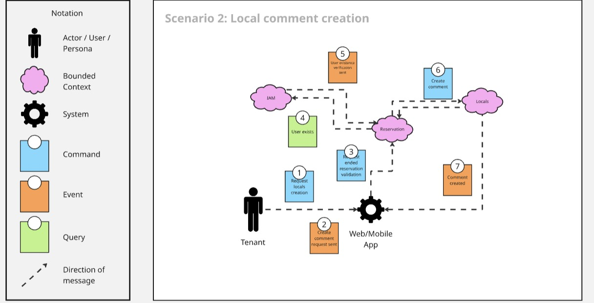

<div align="center"><strong>Informe del Trabajo Final</strong></div>

<p align="center">
    <strong>Universidad Peruana de Ciencias Aplicadas</strong><br>
    </img><br>
    <strong>Ingeniería de Software</strong><br>
    <strong>Arquitecturas De Software Emergentes</strong><br>
    <strong>Profesor: Richard Leonardo Berrocal Navarro
</strong><br>
    <br>INFORME
</p>

<div align="center">

#### Startup: **AlquilaEZ**

#### Product: **AlquilaFácil**

</div>

## Team Members:

<div align="center">

|              Member                |    Code    |
| :-------------------------------:  | :--------: |
| Ames Oviedo, Mariano José | U202211371 |
| Cachis Gonzales, Sebastian Nicolas | U202210846 |
| Lecca Choccare, Christopher Bryan  | U202211399 |
| Llamo Sánchez, Amner Levi           | U20221C376 |
| Morales Montalvo, Omar Andrew      | U202212383 |


</div>

# Registro de Versiones del Informe

<table>
    <thead>
    <tr>
        <th>Version</th>
        <th>Fecha</th>
        <th>Autor</th>
        <th>Descripción de modificación</th>
    </tr>
    </thead>
    <tbody>
    <tr>
        <td>1era </td>
        <td>18/09/2025 </td>
        <td>
          - Ames Oviedo, Mariano José<br>
          - Cachis Gonzales, Sebastian Nicolas<br>
          - Lecca Choccare, Christopher Bryan<br>
          - Llamo Sánchez,Amner Levi<br>
          - Morales Montalvo, Omar Andrew<br>
        </td>
        <td>
        <ul>
        <li>Capítulo I</li>
        <li>Capítulo II</li>
        <li>Capítulo III</li>
        <li>Capítulo IV</li>
        </ul>
        </td>
    </tr>
    <tr>
    <td>2da </td>
        <td>07/10/2025 </td>
        <td>
          - Ames Oviedo, Mariano José<br>
          - Cachis Gonzales, Sebastian Nicolas<br>
          - Lecca Choccare, Christopher Bryan<br>
          - Llamo Sánchez,Amner Levi<br>
          - Morales Montalvo, Omar Andrew<br>
        </td>
        <td>
        <ul>
        <li>Capítulo V</li>
        <li>Capítulo VI</li>
        </ul>
        </td>
    </tr>
    </tbody>
</table>

---

# Project Report Collaboration Insights

Repositorio del proyecto: [https://github.com/Emergentez/alquilafacil-document-report](https://github.com/Emergentez/alquilafacil-document-report)


<strong>TB1:</strong>

Para este entregable, se mantuvo un orden trabajando los capítulos por ramas:


<strong>TP1:</strong>

Para este entregable, se continuó trabajando los capítulos por ramas, añadiendo el capítulo 5 y 6:


---

# Student Outcome

**ABET – EAC – Student Outcome 3**
Criterio: Capacidad de comunicarse efectivamente con un rango de audiencias.

En el siguiente cuadro se describe las acciones realizadas y enunciados de
conclusiones por parte del grupo, que permiten sustentar el haber alcanzado el logro
del ABET – EAC - Student Outcome 3.

<table border="1" cellspacing="0" cellpadding="8">
  <thead>
    <tr>
      <th><strong>Criterio específico</strong></th>
      <th><strong>Acciones realizadas</strong></th>
      <th><strong>Conclusiones</strong></th>
    </tr>
  </thead>
  <tbody>
    <tr>
      <td>Comunica oralmente sus ideas y/o resultados con objetividad a público de diferentes especialidades y niveles jerarquicos, en el marco del desarrollo de un proyecto en ingeniería.</td>
      <td>
      <strong>Ames Oviedo, Mariano José <br>(TB1):</strong> Expuse los avances de la fase de análisis de requerimientos, aclarando dudas del equipo y utilizando ejemplos prácticos para facilitar la comprensión de las funcionalidades.<br><br>
      <strong>Cachis Gonzales, Sebastian Nicolas <br>(TB1):</strong> Presenté la propuesta de arquitectura del sistema, explicando de manera clara el flujo de datos y la interacción de módulos ante un público con distintos niveles de experiencia.<br><br>
      <strong>Lecca Choccare, Christopher Bryan <br>(TB1):</strong> Lideré sesiones de Event Storming y Context Mapping, guiando al equipo en la identificación de bounded contexts y adaptando el lenguaje técnico según la audiencia.<br><br>
      <strong>Llamo Sánchez, Amner Levi <br>(TB1):</strong> Expliqué los diagramas UML al grupo, destacando las relaciones entre clases y casos de uso, simplificando conceptos técnicos para que todos pudieran entenderlos.<br><br>
      <strong>Morales Montalvo, Omar Andrew<br>(TB1):</strong> Expuse la justificación del uso de metodologías ágiles, mostrando cómo Scrum permite adaptarse a cambios y ejemplificando con la organización de sprints.<br><br>
      <strong>Ames Oviedo, Mariano José <br>(TP1):</strong> Presenté los Wireflows y User Flows del sistema, explicando el recorrido completo de los usuarios y cómo cada flujo responde a las necesidades identificadas, facilitando la comprensión del equipo.<br><br>
      <strong>Cachis Gonzales, Sebastian Nicolas <br>(TP1):</strong> Expuse el trabajo realizado en Profiles (SC) y el agregado de enlaces de herramientas usadas (SC), explicando la estructura de perfiles de usuario y justificando las decisiones de diseño.<br><br>
      <strong>Lecca Choccare, Christopher Bryan <br>(TP1):</strong> Presenté los desarrollos de Booking (CL), Subscriptions (CL), Monitoring (CL), Mockups (CL) y Wireframes (CL), articulando la funcionalidad de cada módulo y su integración en el sistema completo.<br><br>
      <strong>Llamo Sánchez, Amner Levi <br>(TP1):</strong> Expuse el trabajo en Notifications (AS), Information Architecture (AS) y Landing Page UI Design (AS), explicando las decisiones de arquitectura de información y diseño de interfaz de manera clara.<br><br>
      <strong>Morales Montalvo, Omar Andrew<br>(TP1):</strong> Presenté los avances en Locales (OM), Style Guidelines (OM) y Prototypes (OM), mostrando la coherencia visual del sistema y las guías de estilo establecidas para el proyecto.<br>
      </td>
      <td>
      <strong>TB1:</strong> Los integrantes del equipo demostraron capacidad de comunicación oral al exponer ideas y resultados con objetividad, adaptando el lenguaje a públicos con diferentes especialidades y niveles jerárquicos.<br><br>
      <strong>TP1:</strong> El equipo fortaleció sus habilidades para presentar elementos de diseño de interfaz y experiencia de usuario, logrando transmitir conceptos visuales y de interacción de manera clara y efectiva. Los integrantes mejoraron su capacidad de articular decisiones de diseño justificando cada elección desde una perspectiva técnica y de usabilidad, lo que facilitó la comprensión y alineación del equipo en la fase de prototipado.
      </td>
    </tr>
    <tr>
      <td>Comunica en forma escrita ideas y/o resultados con objetividad a público de diferentes especialidades y niveles jerarquicos, en el marco del desarrollo de un proyecto en ingeniería</td>
      <td>
      <strong>Ames Oviedo, Mariano José <br>(TB1):</strong> Redacté la documentación del análisis de requerimientos y los criterios de aceptación, asegurando claridad en el uso de términos técnicos y su comprensión general.<br><br>
      <strong>Cachis Gonzales, Sebastian Nicolas <br>(TB1):</strong> Elaboré la sección del informe sobre diseño arquitectónico, integrando diagramas y resúmenes técnicos para hacer el contenido accesible a distintos públicos.<br><br>
      <strong>Lecca Choccare, Christopher Bryan <br>(TB1):</strong> Participé en la redacción de las descripciones del modelo C4 y de las User Stories, estructurando el Product Backlog con un lenguaje claro y comprensible.<br><br>
      <strong>Llamo Sánchez, Amner Levi <br>(TB1):</strong> Documenté los diagramas UML y su interpretación funcional, conectando lo visual con lo técnico y garantizando la coherencia del informe final.<br><br>
      <strong>Morales Montalvo, Omar Andrew<br>(TB1):</strong> Redacté la sección metodológica del informe, justificando el uso de Scrum y explicando la organización de los sprints con un estilo formal y accesible.<br><br>
      <strong>Ames Oviedo, Mariano José <br>(TP1):</strong> Documenté los Wireflows y User Flows con descripciones detalladas, explicando cada paso del recorrido del usuario y su relación con los requisitos funcionales del sistema.<br><br>
      <strong>Cachis Gonzales, Sebastian Nicolas <br>(TP1):</strong> Redacté la documentación de Profiles (SC) y elaboré el enlace de herramientas usadas, estructurando la información de manera clara y accesible para diferentes audiencias.<br><br>
      <strong>Lecca Choccare, Christopher Bryan <br>(TP1):</strong> Documenté los módulos de Booking, Subscriptions, Monitoring (CL), además de Mockups y Wireframes, integrando descripciones funcionales con elementos visuales de diseño.<br><br>
      <strong>Llamo Sánchez, Amner Levi <br>(TP1):</strong> Elaboré la documentación de Notifications (AS), Information Architecture (AS) y Landing Page UI Design (AS), estructurando la arquitectura de información con claridad y coherencia.<br><br>
      <strong>Morales Montalvo, Omar Andrew<br>(TP1):</strong> Redacté las secciones de Locales (OM), Style Guidelines (OM) y Prototypes (OM), estableciendo estándares visuales y de diseño con documentación clara y profesional.<br>
      </td>
      <td>
      <strong>TB1:</strong> El equipo evidenció solidez en la comunicación escrita al elaborar documentación técnica clara y estructurada, comprensible para distintos públicos y útil para la gestión del proyecto.<br><br>
      <strong>TP1:</strong> Los integrantes consolidaron su capacidad de documentar elementos de diseño, arquitectura de información y prototipos con un nivel profesional de detalle y claridad. El equipo desarrolló habilidades para integrar elementos visuales (mockups, wireframes) con descripciones textuales coherentes, creando documentación técnica que sirve tanto como referencia para desarrolladores como guía comprensible para stakeholders no técnicos. Esta competencia resultó fundamental para mantener la trazabilidad entre los requisitos iniciales y las soluciones de diseño propuestas.
      </td>
    </tr>
  </tbody>
</table>
---

# Contenido

- [Capítulo I: Introducción](#capítulo-i-introducción)

  - [1.1. Startup Profile](#11-startup-profile)
    - [1.1.1. Descripción de la Startup](#111-descripción-de-la-startup)
    - [1.1.2. Perfiles de integrantes del equipo](#112-perfiles-de-integrantes-del-equipo)
  - [1.2. Solution Profile](#12-solution-profile)
    - [1.2.1. Antecedentes y problemática](#121-antecedentes-y-problemática)
    - [1.2.2. Lean UX Process](#122-lean-ux-process)
      - [1.2.2.1. Lean UX Problem Statements](#1221-lean-ux-problem-statements)
      - [1.2.2.2. Lean UX Assumptions](#1222-lean-ux-assumptions)
      - [1.2.2.3. Lean UX Hypothesis Statements](#1223-lean-ux-hypothesis-statements)
      - [1.2.2.4. Lean UX Canvas](#1224-lean-ux-canvas)
  - [1.3. Segmentos objetivo](#13-segmentos-objetivo)

- [Capítulo II: Requirements Elicitation & Analysis](#capítulo-ii-requirements-elicitation--analysis)

  - [2.1. Competidores](#21-competidores)
    - [2.1.1. Análisis competitivo](#211-análisis-competitivo)
    - [2.1.2. Estrategias y tácticas frente a competidores](#212-estrategias-y-tácticas-frente-a-competidores)
  - [2.2. Entrevistas](#22-entrevistas)
    - [2.2.1. Diseño de entrevistas](#221-diseño-de-entrevistas)
    - [2.2.2. Registro de entrevistas](#222-registro-de-entrevistas)
    - [2.2.3. Análisis de entrevistas](#223-análisis-de-entrevistas)
  - [2.3. Needfinding](#23-needfinding)
    - [2.3.1. User Personas](#231-user-personas)
    - [2.3.2. User Task Matrix](#232-user-task-matrix)
    - [2.3.3. Empathy Mapping](#233-empathy-mapping)
    - [2.3.4. As-is Scenario Mapping](#234-as-is-scenario-mapping)
  - [2.4. Ubiquitous Language](#24-ubiquitous-language)

- [Capítulo III: Requirements Specification](#capítulo-iii-requirements-specification)

  - [3.1. To-Be Scenario Mapping](#31-to-be-scenario-mapping)
  - [3.2. User Stories](#32-user-stories)
  - [3.3. Impact Mapping](#33-impact-mapping)
  - [3.4. Product Backlog](#34-product-backlog)

- [Capítulo IV: Strategic-Level Software Design](#capítulo-iv-strategic-level-software-design)

  - [4.1. Strategic-Level Attribute-Driven Design](#41-strategic-level-attribute-driven-design)
    - [4.1.1. Design Purpose](#411-design-purpose)
    - [4.1.2. Attribute-Driven Design Inputs](#412-attribute-driven-design-inputs)
      - [4.1.2.1. Primary Functionality (Primary User Stories)](#4121-primary-functionality-primary-user-stories)
      - [4.1.2.2. Quality attribute Scenarios](#4122-quality-attribute-scenarios)
      - [4.1.2.3. Constraints](#4123-constraints)
    - [4.1.3. Architectural Drivers Backlog](#413-architectural-drivers-backlog)
    - [4.1.4. Architectural Design Decisions](#414-architectural-design-decisions)
    - [4.1.5. Quality Attribute Scenario Refinements](#415-quality-attribute-scenario-refinements)
  - [4.2. Strategic-Level Domain-Driven Design](#42-strategic-level-domain-driven-design)
    - [4.2.1. EventStorming](#421-eventstorming)
    - [4.2.2. Candidate Context Discovery](#422-candidate-context-discovery)
    - [4.2.3. Domain Message Flows Modeling](#423-domain-message-flows-modeling)
    - [4.2.4. Bounded Context Canvases](#424-bounded-context-canvases)
    - [4.2.5. Context Mapping](#425-context-mapping)
  - [4.3. Software Architecture](#43-software-architecture)
    - [4.3.1. Software Architecture System Landscape Diagram](#431-software-architecture-system-landscape-diagram)
    - [4.3.2. Software Architecture Context Level Diagrams](#432-software-architecture-context-level-diagrams)
    - [4.3.3. Software Architecture Container Level Diagrams](#433-software-architecture-container-level-diagrams)
    - [4.3.4. Software Architecture Deployment Diagrams](#434-software-architecture-deployment-diagrams)

- [Capítulo V: Tactical-Level Software Design](#capítulo-v-tactical-level-software-design)

  - [Capítulo V: Tactical-Level Software Design](#capítulo-v-tactical-level-software-design)

  - [5.1. Bounded Context:](#51-bounded-context-iam-context)
    - [5.1.1. Domain Layer](#511-domain-layer)
    - [5.1.2. Interface Layer](#512-interface-layer)
    - [5.1.3. Application Layer](#513-application-layer)
    - [5.1.4. Infrastructure Layer](#514-infrastructure-layer)
    - [5.1.6. Bounded Context Software Architecture Component Level Diagrams](#516-bounded-context-software-architecture-component-level-diagrams)
    - [5.1.7. Bounded Context Software Architecture Code Level Diagrams](#517-bounded-context-software-architecture-code-level-diagrams)
      - [5.1.7.1. Bounded Context Domain Layer Class Diagrams](#5171-bounded-context-domain-layer-class-diagrams)
      - [5.1.7.2. Bounded Context Database Design Diagram](#5172-bounded-context-database-design-diagram)


- [5.2. Bounded Context: Profile Context](#52-bounded-context-profile-context)
  - [5.2.1. Domain Layer](#521-domain-layer)
  - [5.2.2. Interface Layer](#522-interface-layer)
  - [5.2.3. Application Layer](#523-application-layer)
  - [5.2.4. Infrastructure Layer](#524-infrastructure-layer)
  - [5.2.6. Bounded Context Software Architecture Component Level Diagrams](#526-bounded-context-software-architecture-component-level-diagrams)
  - [5.2.7. Bounded Context Software Architecture Code Level Diagrams](#527-bounded-context-software-architecture-code-level-diagrams)
    - [5.2.7.1. Bounded Context Domain Layer Class Diagrams](#5271-bounded-context-domain-layer-class-diagrams)
    - [5.2.7.2. Bounded Context Database Design Diagram](#5272-bounded-context-database-design-diagram)


- [5.3. Bounded Context: Locals Context](#53-bounded-context-locals-context)
  - [5.3.1. Domain Layer](#531-domain-layer)
  - [5.3.2. Interface Layer](#532-interface-layer)
  - [5.3.3. Application Layer](#533-application-layer)
  - [5.3.4. Infrastructure Layer](#534-infrastructure-layer)
  - [5.3.6. Bounded Context Software Architecture Component Level Diagrams](#536-bounded-context-software-architecture-component-level-diagrams)
  - [5.3.7. Bounded Context Software Architecture Code Level Diagrams](#537-bounded-context-software-architecture-code-level-diagrams)
    - [5.3.7.1. Bounded Context Domain Layer Class Diagrams](#5371-bounded-context-domain-layer-class-diagrams)
    - [5.3.7.2. Bounded Context Database Design Diagram](#5372-bounded-context-database-design-diagram)


- [5.4. Bounded Context: Booking Context](#54-bounded-context-booking-context)
  - [5.4.1. Domain Layer](#541-domain-layer)
  - [5.4.2. Interface Layer](#542-interface-layer)
  - [5.4.3. Application Layer](#543-application-layer)
  - [5.4.4. Infrastructure Layer](#544-infrastructure-layer)
  - [5.4.6. Bounded Context Software Architecture Component Level Diagrams](#546-bounded-context-software-architecture-component-level-diagrams)
  - [5.4.7. Bounded Context Software Architecture Code Level Diagrams](#547-bounded-context-software-architecture-code-level-diagrams)
    - [5.4.7.1. Bounded Context Domain Layer Class Diagrams](#5471-bounded-context-domain-layer-class-diagrams)
    - [5.4.7.2. Bounded Context Database Design Diagram](#5472-bounded-context-database-design-diagram)


- [5.5. Bounded Context: Notifications Context](#55-bounded-context-notifications-context)
  - [5.5.1. Domain Layer](#551-domain-layer)
  - [5.5.2. Interface Layer](#552-interface-layer)
  - [5.5.3. Application Layer](#553-application-layer)
  - [5.5.4. Infrastructure Layer](#554-infrastructure-layer)
  - [5.5.6. Bounded Context Software Architecture Component Level Diagrams](#556-bounded-context-software-architecture-component-level-diagrams)
  - [5.5.7. Bounded Context Software Architecture Code Level Diagrams](#557-bounded-context-software-architecture-code-level-diagrams)
    - [5.5.7.1. Bounded Context Domain Layer Class Diagrams](#5571-bounded-context-domain-layer-class-diagrams)
    - [5.5.7.2. Bounded Context Database Design Diagram](#5572-bounded-context-database-design-diagram)

- [5.6. Bounded Context: Subscription Context](#56-bounded-context-subscription-context)
  - [5.6.1. Domain Layer](#561-domain-layer)
  - [5.6.2. Interface Layer](#562-interface-layer)
  - [5.6.3. Application Layer](#563-application-layer)
  - [5.6.4. Infrastructure Layer](#564-infrastructure-layer)
  - [5.6.6. Bounded Context Software Architecture Component Level Diagrams](#566-bounded-context-software-architecture-component-level-diagrams)
  - [5.6.7. Bounded Context Software Architecture Code Level Diagrams](#567-bounded-context-software-architecture-code-level-diagrams)
    - [5.6.7.1. Bounded Context Domain Layer Class Diagrams](#5671-bounded-context-domain-layer-class-diagrams)
    - [5.6.7.2. Bounded Context Database Design Diagram](#5672-bounded-context-database-design-diagram)


- [5.7. Bounded Context: Monitoring Context](#57-bounded-context-monitoring-context)
  - [5.7.1. Domain Layer](#571-domain-layer)
  - [5.7.2. Interface Layer](#572-interface-layer)
  - [5.7.3. Application Layer](#573-application-layer)
  - [5.7.4. Infrastructure Layer](#574-infrastructure-layer)
  - [5.7.6. Bounded Context Software Architecture Component Level Diagrams](#576-bounded-context-software-architecture-component-level-diagrams)
  - [5.7.7. Bounded Context Software Architecture Code Level Diagrams](#577-bounded-context-software-architecture-code-level-diagrams)
    - [5.7.7.1. Bounded Context Domain Layer Class Diagrams](#5771-bounded-context-domain-layer-class-diagrams)
    - [5.7.7.2. Bounded Context Database Design Diagram](#5772-bounded-context-database-design-diagram)

- [Capítulo VI: Solution UX Design](#capítulo-vi-solution-ux-design)

  - [6.1. Style Guidelines](#61-style-guidelines)
    - [6.1.1. General Style Guidelines](#611-general-style-guidelines)
    - [6.1.2. Web, Mobile & Devices Style Guidelines](#612-web-mobile--devices-style-guidelines)
  - [6.2. Information Architecture](#62-information-architecture)
    - [6.2.2. Labeling Systems](#622-labeling-systems)
    - [6.2.3. Searching Systems](#623-searching-systems)
    - [6.2.4. SEO Tags and Meta Tags](#624-seo-tags-and-meta-tags)
    - [6.2.5. Navigation Systems](#625-navigation-systems)
  - [6.3. Landing Page UI Design](#63-landing-page-ui-design)
    - [6.3.1. Landing Page Wireframe](#631-landing-page-wireframe)
    - [6.3.2. Landing Page Mock-up](#632-landing-page-mock-up)
  - [6.4. Applications UX/UI Design](#64-applications-uxui-design)
    - [6.4.1. Applications Wireframes](#641-applications-wireframes)
    - [6.4.2. Applications Wireflow Diagrams](#642-applications-wireflow-diagrams)
    - [6.4.3. Applications Mock-ups](#643-applications-mock-ups)
    - [6.4.4. Applications User Flow Diagrams](#644-applications-user-flow-diagrams)
  - [6.5. Applications Prototyping](#65-applications-prototyping)

- [Capítulo VII: Product Implementation, Validation & Deployment](#capítulo-vii-product-implementation-validation--deployment)

  - [7.1. Software Configuration Management](#71-software-configuration-management)
    - [7.1.1. Software Development Environment Configuration](#711-software-development-environment-configuration)
    - [7.1.2. Source Code Management](#712-source-code-management)
    - [7.1.3. Source Code Style Guide & Conventions](#713-source-code-style-guide--conventions)
    - [7.1.4. Software Deployment Configuration](#714-software-deployment-configuration)
  - [7.2. Solution Implementation](#72-solution-implementation)
    - [7.2.X. Sprint n](#72x-sprint-n)
      - [7.2.X.1. Sprint Planning n](#72x1-sprint-planning-n)
      - [7.2.X.2. Sprint Backlog n](#72x2-sprint-backlog-n)
      - [7.2.X.3. Development Evidence for Sprint Review](#72x3-development-evidence-for-sprint-review)
      - [7.2.X.4. Testing Suite Evidence for Sprint Review](#72x4-testing-suite-evidence-for-sprint-review)
      - [7.2.X.5. Execution Evidence for Sprint Review](#72x5-execution-evidence-for-sprint-review)
      - [7.2.X.6. Services Documentation Evidence for Sprint Review](#72x6-services-documentation-evidence-for-sprint-review)
      - [7.2.X.7. Software Deployment Evidence for Sprint Review](#72x7-software-deployment-evidence-for-sprint-review)
      - [7.2.X.8. Team Collaboration Insights during Sprint](#72x8-team-collaboration-insights-during-sprint)
  - [7.3. Validation Interviews](#73-validation-interviews)
    - [7.3.1. Diseño de Entrevistas](#731-diseño-de-entrevistas)
    - [7.3.2. Registro de Entrevistas](#732-registro-de-entrevistas)
    - [7.3.3. Evaluaciones según heurísticas](#733-evaluaciones-según-heurísticas)
  - [7.4. Video About-the-Product](#74-video-about-the-product)

- [Conclusiones y recomendaciones](#conclusiones-y-recomendaciones)
- [Bibliografía](#bibliografía)
- [Anexos](#anexos)

---

# Capítulo I: Introducción

## 1.1. Startup Profile

### 1.1.1. Descripción de la Startup

AlquilaFácil es un startup fundado en el 2025, por un grupo de estudiantes de la carrera de Ingeniería de Software de la Universidad Peruana de Ciencias Aplicadas (UPC). Nuestra empresa emergente se enfoca en la simplificación del proceso de búsqueda de alquiler de espacios para eventos, así como la administración de los mismos.

**Misión:** Revolucionar el alquiler de espacios para eventos con una plataforma intuitiva que une a arrendadores y arrendatarios de manera rápida y sencilla. 

**Visión:** Consolidarnos como la referencia global en alquiler de espacios para eventos, redefiniendo el sector con soluciones inteligentes y una experiencia excepcional.

### 1.1.2. Perfiles de integrantes del equipo

|<!-- -->|<!-- -->|
|--------|--------|
|Nombre|Ames Oviedo, Mariano José (U202211371)|
|Mi nombre es Mariano Ames, tengo 20 años y me encuentro cursando el 8vo ciclo de la carrera de Ingeniería de Software en la Universidad Peruana de Ciencias aplicadas. Soy una persona e intento colaborar en lo más posible dentro del equipo de trabajo, también me llama la atención el aprendizaje de nuevas tecnologías que puedan ayudarme a mejorar mi ayuda en el equipo.| |
|Nombre|Cachis Gonzales, Sebastian Nicolas  (U202210846)|
|Mi nombre es Sebastian Nicolas Cachis Gonzales, soy estudiante de octavo ciclo de ingeniería de software en la UPC. Me considero una persona proactiva, organizada, meticulosa y muy enfocada en mis estudios, tanto grupales como individuales. Tengo facilidad para entender y ejemplificar los distintos temas que vemos, teniendo soltura para explicar. | |
|Nombre|Lecca Choccare, Christopher Bryan (U202211399)|
|Mi nombre es Christopher, tengo 20 años y actualmente me encuentro cursando el 8vo ciclo de la carrera de Ingeniería de Software en la Universidad Peruana de Ciencias Aplicadas (UPC). Considero que mi compromiso con el equipo de trabajo designado y mi capacidad de aprendizaje rápida aportarán de buena manera al desarrollo del producto final.||
|Nombre|Llamo Sánchez, Amner Levi (U20221C376)|
|Mi nombre es Amner Levi Llamo Sánchez, soy estudiante del octavo ciclo de ingeniería de software en la UPC. Me gusta jugar fútbol y videojuegos, por eso estoy constantemente investigando sobre nuevas tecnologías. Soy responsable con los trabajos que se me asignan; además soy tolerante y me adapto a las circunstancias del equipo.||
|Nombre|Morales Montalvo, Omar Andrew (U202212383)|
|Mi nombre es Omar, tengo 19 años y actualmente estoy cursando el séptimo ciclo de la carrera de Ingeniería de Software en la Universidad Peruana de Ciencias Aplicadas (UPC). Me considero una persona comprometida con lo que hace, además de ser responsable y dedicada. Me gusta aprender constantemente y trabajar en equipo, siempre buscando mejorar y aportar en cada proyecto.||

## 1.2. Solution Profile

### 1.2.1. Antecedentes y problemática

Hoy en día, las personas cuentan con múltiples herramientas tecnológicas que facilitan el proceso de reservar y alquilar locales para eventos, ya sea a través de páginas web o aplicaciones móviles. Esto ha impulsado un aumento de la demanda en el mercado peruano de reservas en línea. Este crecimiento se ve reforzado por el incremento en el acceso a internet y al uso de dispositivos digitales. Según datos del INEI, durante los primeros tres meses del 2022, 73 de cada 100 personas mayores de seis años accedieron a internet en el país, lo que representa un crecimiento de 5,1 y 17,7 puntos porcentuales en comparación con el mismo periodo en 2021 (67,4%) y en 2019 (54,8%) respectivamente (Jasin, 2023).

De igual manera, las marcas apuestan cada vez más por la organización de eventos como estrategia para acercarse a su público y transmitir sus valores. Como indica Mañas (2024), estas experiencias son vistas como una vía efectiva para fortalecer el vínculo con los clientes y construir relaciones más duraderas.

Por otro lado, las empresas que ofrecen espacios para eventos enfrentan desafíos al momento de gestionar reservas, promocionar sus locales o coordinar con los arrendatarios. Muchas veces recurren a procesos manuales, canales informales o herramientas dispersas que generan fricciones en la experiencia de usuario.

En este contexto, se evidencia que en el Perú el número de usuarios con acceso a internet ha aumentado de manera significativa en los últimos años, lo que respalda la necesidad de contar con una plataforma digital centralizada y confiable que agilice la búsqueda, comparación, reserva y monitoreo de espacios para eventos. Este tipo de solución se vuelve especialmente relevante frente a la creciente demanda, especialmente por parte de empresas, emprendimientos y usuarios que organizan eventos corporativos, sociales o culturales.

#### 5W's y 2H's:

| Elemento      | Respuesta                                                                                                                                                                                                                                                                                                                                                                                                          |
|---------------|----------------------------------------------------------------------------------------------------------------------------------------------------------------------------------------------------------------------------------------------------------------------------------------------------------------------------------------------------------------------------------------------------------------------|
| **Who**       | Usuarios con acceso a internet en el Perú interesados en alquilar u ofrecer espacios para eventos.                                                                                                                                                                                                                                                                                                                  |
| **What**      | Desarrollo de una plataforma digital (web y app móvil) para facilitar la búsqueda, publicación, reserva y monitoreo de espacios para eventos.                                                                                                                                                                                                                                                                       |
| **When**      | En un contexto actual (2025), donde el acceso a internet y la demanda de servicios digitales siguen en crecimiento.                                                                                                                                                                                                                                                                                                |
| **Where**     | Perú, especialmente en zonas urbanas con mayor acceso a internet y actividad empresarial.                                                                                                                                                                                                                                                                                                                           |
| **Why**       | Porque existe una creciente necesidad de plataformas que conecten a arrendadores y arrendatarios de espacios para eventos, facilitando la gestión, seguridad y visibilidad de los locales en un mercado cada vez más competitivo.                                                                                                                                                                                  |
| **How**       | A través del desarrollo de una aplicación móvil y una landing page web responsiva, con funciones como publicación de espacios, filtros de búsqueda, calendario de reservas, monitoreo mediante sensores, notificaciones y sección de ayuda.                                                                                                                                                                        |
| **How much**  | El costo estimado para la publicación en Google Play es de 25 dólares más 30% de ingresos, mientras que en App Store la tasa se encuentra entre 99 y 299 dólares anuales. Este rango está basado en fuentes como:<br>- [DoApps](https://doapps.pe/blog/cuanto-cuesta-desarrollar-una-app/)<br>- [GoApps](https://gooapps.es/2022/02/21/cuanto-cuesta-subir-una-aplicacion-a-una-app-store/)<br> |

### 1.2.2. Lean UX Process

En esta parte, hacemos el proceso Lean UX que cubre la visión de un modelo de negocio que respalda nuestro producto de software. Este enfoque metodológico nos permite centrarnos en desarrollar nuestra solución y la solución al problema identificado al pensar en el diseño.

#### 1.2.2.1. Lean UX Problem Statements

Nuestro entorno se sitúa en el mercado peruano de alquiler de espacios para eventos, un rubro que ha mostrado un crecimiento constante en los últimos años. El incremento de la demanda por ambientes versátiles y ajustables a distintas necesidades también ha traído consigo retos en la forma en que interactúan arrendadores y arrendatarios dentro de este ecosistema.

Detectamos que, dentro de este mercado, los usuarios enfrentan complicaciones debido a la falta de integración en las distintas etapas del proceso. La dispersión en la búsqueda, la gestión de reservas y la organización genera ineficiencias y una experiencia poco satisfactoria.

Surge entonces la pregunta: ¿cómo lograr una mejor conexión entre arrendadores y arrendatarios, optimizando el proceso de alquiler de espacios para eventos y garantizando una experiencia más ágil y eficiente?

#### 1.2.2.2. Lean UX Assumptions

#### Business Outcomes

- Facilitar la gestión de mínimo 1,000 reservaciones durante el primer año operativo, mejorando la comunicación y administración entre ambas partes.
- Alcanzar un índice de satisfacción superior al 90% mediante herramientas que permitan verificar ratings e historial de propiedades, facilitando decisiones informadas.
- Conseguir un 80% de renovación en suscripciones al finalizar el primer año, demostrando satisfacción y fidelización efectiva.

#### User Assumptions

###### ¿Quién es el usuario?

- Usuarios que buscan espacios (arrendatarios)
- Propietarios de espacios (arrendadores)

###### ¿Dónde entra nuestro producto en su trabajo o su vida?

- **Para arrendatarios:** La plataforma AlquilaFácil optimiza la localización y reserva de espacios, facilitando la organización de eventos y reduciendo tiempo y recursos invertidos.
- **Para arrendadores:** AlquilaFácil potencia la promoción de propiedades y mejora la administración, incrementando exposición y volumen de reservas.

###### ¿Cuál es el problema que nuestro producto soluciona?

- Comunicación deficiente entre las partes involucradas
- Complejidad en la localización y reserva de espacios apropiados
- Ausencia de transparencia y credibilidad respecto a calidad y disponibilidad
- Carencia de una herramienta unificada para administrar reservas y promocionar propiedades

###### ¿Cómo y cuándo nuestro producto es usado?

- **Arrendatarios:** Utilizan la plataforma para localizar, filtrar y reservar espacios durante las etapas de planificación y ejecución de eventos.
- **Arrendadores:** Emplean la plataforma para dar visibilidad a sus espacios y administrar las reservaciones.

###### ¿Qué características son importantes?

- Interface intuitiva para búsqueda y reserva eficiente
- Sistema robusto de promoción y visibilidad de espacios
- Herramientas integradas para gestión de reservas y comunicación efectiva
- Sistema de calificaciones y reseñas para decisiones fundamentadas

#### User Outcomes

- **Eficiencia para arrendatarios:** Reducción del 20% en tiempo promedio de búsqueda y reserva durante los primeros seis meses de uso.
- **Crecimiento para arrendadores:** Incremento del 25% en reservas y consultas recibidas durante el primer año de implementación.
- **Satisfacción mejorada:** Aumento del 30% en satisfacción con calidad y adecuación de espacios reservados, medido através del sistema de reseñas y calificaciones durante el primer año.

#### 1.2.2.3. Lean UX Hypothesis Statements

Para la elaboración de los Hypothesis Statements se utilizó el formato Lean UX: [We believe that], [This will achieve] y [We will have demostrated this when]

**Hipótesis 1**

Creemos que, al simplificar el proceso de búsqueda y comparación de espacios para eventos en nuestra plataforma, aumentaremos la fidelización de clientes y la recurrencia de uso.

Esto permitirá que los usuarios encuentren más fácilmente opciones adecuadas a sus necesidades, mejorando su experiencia.

Sabremos que estamos en lo correcto cuando observemos un incremento del 25% en la cantidad de reservas realizadas por clientes recurrentes en los primeros seis meses tras la implementación.
<br>

**Hipótesis 2**

Creemos que, al mejorar la función de búsqueda avanzada, incorporando filtros detallados como capacidad, ubicación y servicios incluidos, optimizaremos la experiencia de exploración y selección de espacios.

Esto facilitará que los usuarios encuentren rápidamente opciones relevantes y reduzcan la necesidad de soporte.

Sabremos que estamos en lo correcto cuando se registre una disminución del 25% en las consultas al área de soporte relacionadas con la búsqueda, y un aumento en el tiempo promedio de navegación en la plataforma.
<br>

**Hipótesis 3**

Creemos que, al implementar un dashboard personalizado para los arrendadores, donde puedan monitorear en tiempo real el estado de sus espacios (reservas activas, ingresos generados, evaluaciones, disponibilidad, etc.), mejoraremos la gestión de los locales y el compromiso de los arrendadores con la plataforma.

Esto permitirá a los arrendadores tomar decisiones informadas y ofrecer un mejor servicio.

Sabremos que estamos en lo correcto cuando observemos un aumento del 30% en la actividad de los arrendadores dentro del panel, así como una mejora en la tasa de respuesta y actualización de disponibilidad en sus publicaciones, dentro de los primeros seis meses.
<br>

**Hipótesis 4**

Creemos que, al habilitar un sistema de calificación y comentarios para los espacios, incrementaremos la confianza de los usuarios y la percepción de calidad de los servicios ofrecidos.

Esto ayudará a generar transparencia y a tomar decisiones basadas en la experiencia de otros clientes.

Sabremos que estamos en lo correcto cuando se evidencie un aumento del 20% en la cantidad de reservas completadas y una mejora progresiva en la calidad de los comentarios dentro de los primeros tres meses tras la implementación.
<br>

**Hipótesis 5**

Creemos que, al implementar un sistema de notificaciones en tiempo real que alerte a los arrendadores y al equipo de soporte sobre posibles infracciones o comportamientos indebidos en los locales (como exceder la capacidad, ruido excesivo o uso indebido del espacio), reforzaremos la seguridad y el control sobre los espacios alquilados.

Esto contribuirá a mejorar la reputación de la plataforma y a reducir conflictos entre usuarios.

Sabremos que estamos en lo correcto cuando se registre una reducción del 40% en reportes de incidentes posteriores a las reservas, así como una mejora en las calificaciones promedio de los espacios afectados, dentro de los primeros tres meses de implementación.

#### 1.2.2.4. Lean UX Canvas

Este Lean UX Canvas representa la propuesta integral de valor de AlquilaFácil, sintetiza los problemas detectados, los objetivos de negocio, los supuestos sobre los usuarios y las hipótesis de diseño que guían el desarrollo de la solución. Cada sección del canvas refleja cómo la solución aborda los retos de eficiencia, comunicación y confianza para arrendadores y arrendatarios, y cómo mediremos el éxito de nuestras acciones a través de métricas concretas.


## 1.3. Segmentos objetivo

En esta sección, identificamos los segmentos de clientes específicos a los que se dirige AlquilaFácil, basándonos en características demográficas, comportamientos y necesidades compartidas. 

**Arrendatarios:** 

- Descripción: Individuos que planifican eventos sociales como bodas, fiestas de cumpleaños, reuniones familiares, entre otros, y aquellos que organizan eventos regularmente, ya sea social o corporativo. 

- Características: Buscan espacios que se adapten a sus necesidades específicas, como capacidad, ubicación y servicios disponibles. Realizan múltiples reservas de espacios a lo largo del año. 

- Necesidades: Facilidad de búsqueda y reserva de espacios, acceso a información detallada sobre las instalaciones y servicios ofrecidos, programas de fidelización y alertas de acontecimientos que puedan afectar el desarrollo de su evento. 

**Arrendadores:**

- Descripción: Individuos o empresas que poseen espacios aptos para eventos, como salones de banquetes, jardines, locales comerciales, etc. 

- Características: Ofrecen una variedad de espacios con diferentes capacidades y servicios. 

- Necesidades: Promoción efectiva de sus espacios, gestión eficiente de reservas, acceso a herramientas para administrar sus listados y proyectos de eventos. 


---

# Capítulo II: Requirements Elicitation & Analysis

## 2.1. Competidores

### 2.1.1. Análisis competitivo

<table border="1" style="border-collapse: collapse; width: 100%;">
    <thead>
        <tr>
            <th colspan="6" style="text-align: center;">Competitive Analysis Landscape</th>
        </tr>
        <tr>
            <td colspan="2">¿Por qué llevar a cabo este análisis?</td>
            <td colspan="4">Este análisis se realizó con la finalidad de poder identificar a nuestros potenciales competidores e idear estrategias y tácticas para diferenciarnos de estos.</td>
        </tr>
    </thead>
    <tbody>
        <tr style="text-align: center;">
            <td colspan="2">Empresas</td>
            <td><strong>AlquilaFácil</strong></td>
            <td><strong>Airbnb</strong></td>
            <td><strong>Vrbo</strong></td>
            <td><strong>Booking.com</strong></td>
        </tr>
        <tr>
            <td rowspan="2" style="writing-mode: vertical-lr; text-align: center;">Perfil</td>
            <td>Overview</td>
            <td>Es una plataforma en línea que facilita el alquiler de una amplia gama de espacios para eventos, desde salones de eventos hasta casas y alojamientos temporales. Con una interfaz fácil de usar, conecta a arrendadores con arrendatarios, ofreciendo una solución conveniente y eficiente para satisfacer las necesidades de ambos. Asimismo, presenta una interfaz para poder recibir reportes de eventos ocurridos en el local.</td>
            <td>Plataforma en línea que revoluciona el alquiler de alojamientos a corto plazo, conectando anfitriones y huéspedes en todo el mundo. Ofrece una amplia variedad de opciones de alojamiento, desde habitaciones individuales hasta casas completas.</td>
            <td>Plataforma en línea que permite a los usuarios buscar y reservar alojamientos vacacionales directamente a través de arrendadores. Ofrece una variedad de opciones de alojamiento, como casas, apartamentos, cabañas y villas, en diferentes destinos, adaptándose a las necesidades y preferencias de los viajeros.</td>
            <td>Booking.com es una plataforma líder para reservar alojamiento y actividades turísticas en todo el mundo. Ofrece una amplia variedad de opciones, desde hoteles hasta apartamentos, y facilita la búsqueda y reserva según las preferencias y presupuesto de los usuarios.</td>
        </tr>
        <tr>
            <td>¿Qué valor ofrece a los clientes?</td>
            <td>Proporciona una solución completa para la planificación de eventos, ofreciendo una amplia gama de espacios para eventos y una plataforma intuitiva para gestionar reservas y espacios. Con características como registro gratuito de espacios, búsqueda avanzada y servicio al cliente dedicado, ArrendaFácil simplifica el proceso de planificación de eventos para arrendatarios y arrendadores.</td>
            <td>Ofrece una amplia variedad de alojamientos en todo el mundo, desde habitaciones individuales hasta casas completas, junto con experiencias locales únicas organizadas por anfitriones. Esto permite a los viajeros personalizar su experiencia y sumergirse en la cultura local.</td>
            <td>Se especializa en alquileres vacacionales directamente a través de arrendadores, brindando a los viajeros la oportunidad de disfrutar de una experiencia más auténtica y personalizada. Con una amplia selección de alojamientos vacacionales, Vrbo ofrece opciones para todos los gustos y presupuestos.</td>
            <td>Destaca por su amplia oferta de alojamiento y servicios, que incluyen hoteles, vuelos, alquiler de coches y actividades turísticas. La plataforma fácil de usar permite a los usuarios encontrar y reservar alojamiento de manera rápida y sencilla, ofreciendo una solución integral para los viajeros.</td>
        </tr>
        <tr>
            <td rowspan="2" style="writing-mode: vertical-lr; text-align: center;">Perfil de Marketing</td>
            <td>Mercado objetivo</td>
            <td>Dirigido a arrendatarios adultos de 18 años en adelante que buscan espacios para eventos sociales, corporativos o especiales, como bodas, conferencias, fiestas de empresa, entre otros. Además, atrae a empresas y organizaciones que buscan espacios para eventos corporativos y reuniones profesionales dirigidas a un público adulto.</td>
            <td>Se centra en viajeros adultos de 18 años en adelante, ofreciendo una amplia variedad de alojamientos en todo el mundo, desde habitaciones individuales hasta casas completas, para adaptarse a diferentes necesidades y preferencias de viaje. Además, apunta a grupos de amigos, parejas y familias adultas que buscan opciones de alojamiento que se ajusten a sus requerimientos y presupuestos durante sus vacaciones o escapadas.</td>
            <td>Está dirigido a familias y grupos de amigos adultos de 18 años en adelante que buscan alquilar casas, villas o cabañas para vacaciones o escapadas grupales. Además, atrae a parejas y grupos de amigos adultos que buscan alquilar alojamientos vacacionales para eventos especiales, como bodas, reuniones familiares o celebraciones de cumpleaños.</td>
            <td>Orientado a viajeros adultos de 18 años en adelante, busca ofrecer una amplia gama de opciones de alojamiento para adaptarse a diversas necesidades y preferencias durante sus viajes. También se dirige a personas que viajan por negocios, parejas en escapadas románticas, grupos de amigos en vacaciones y familias en busca de opciones de alojamiento cómodas y convenientes.</td>
        </tr>
        <tr>
            <td>Estrategias de marketing</td>
            <td>ArrendaFácil destaca con marketing de contenidos, participación en eventos de la industria y alianzas con proveedores de servicios de eventos para ofrecer soluciones completas a arrendatarios.</td>
            <td>Airbnb emplea campañas publicitarias en redes sociales y colaboraciones con influencers para promocionar destinos y experiencias únicas. También utiliza programas de referidos para aumentar su base de usuarios.</td>
            <td>Vrbo se centra en contenido educativo en su sitio web, colaboraciones con agencias de viajes y ofertas exclusivas para atraer a familias y grupos de amigos a reservar a través de su plataforma.</td>
            <td>Booking.com utiliza estrategias de SEO y SEM, junto con programas de fidelización, para atraer tráfico y fomentar la lealtad del cliente a través de una experiencia personalizada.</td>
        </tr>
        <tr>
            <td rowspan="3" style="writing-mode: vertical-lr; text-align: center;">Perfil de Producto</td>
            <td>Productos & Servicios</td>
            <td>Aplicación web que conecta a arrendadores de diversos espacios, como salones de eventos, jardines y locales comerciales, con arrendatarios que buscan alquilar estos espacios para celebrar eventos sociales, corporativos o especiales. Proporciona una variedad de herramientas y servicios para facilitar la búsqueda, reserva y gestión de espacios para eventos.</td>
            <td>Plataforma en línea donde los usuarios pueden alquilar una variedad de alojamientos a corto plazo, desde habitaciones individuales hasta casas completas, en todo el mundo. Además de alojamiento, Airbnb también proporciona experiencias locales únicas organizadas por anfitriones, como recorridos gastronómicos, clases de cocina y excursiones.</td>
            <td>Plataforma para alquilar alojamientos vacacionales directamente a través de los arrendadores. Los usuarios pueden encontrar y reservar una amplia gama de propiedades, que van desde casas y apartamentos hasta cabañas y villas, para sus vacaciones o escapadas en todo el mundo.</td>
            <td>Plataforma en línea que permite a los usuarios reservar una variedad de alojamientos, incluyendo hoteles, hostales, apartamentos y otros tipos de hospedaje en todo el mundo. Además de alojamiento, Booking.com ofrece la posibilidad de reservar vuelos, alquilar coches y reservar actividades turísticas para completar la experiencia de viaje del usuario.</td>
        </tr>
        <tr>
            <td>Precios & Costos</td>
            <td>Los precios de ArrendaFácil varían dependiendo del lugar, el tamaño de la propiedad, servicios, y el tiempo de uso.</td>
            <td>El costo promedio puede variar significativamente dependiendo de varios factores, como la ubicación, el tipo de alojamiento, la época del año y la demanda local.</td>
            <td>Los precios en VRBO pueden variar significativamente dependiendo de la ubicación, el tamaño de la propiedad, las comodidades ofrecidas y la temporada del año.</td>
            <td>Los precios pueden variar significativamente según la ubicación, la temporada, la demanda y el tipo de alojamiento.</td>
        </tr>
        <tr>
            <td>Canales de distribución (Web y/o móvil)</td>
            <td>Redes sociales y aplicación web donde los usuarios pueden poner en renta su espacio o alquilar un espacio para eventos.</td>
            <td>Sitio web de Airbnb, aplicación móvil de Airbnb, socios afiliados y asociaciones, redes sociales y marketing digital.</td>
            <td>Principalmente su sitio web y su aplicación móvil, así como acuerdos de distribución con otros sitios web de viajes o agencias de viajes en línea.</td>
            <td>Sitio web de Booking.com, aplicación móvil de Booking, agencias de viajes en línea, alianzas con compañías de viajes, afiliados y asociados.</td>
        </tr>
        <tr>
            <td rowspan="4" style="writing-mode: vertical-lr; text-align: center;">Análisis SWOT</td>
            <td>Fortalezas</td>
            <td>Solución completa para la planificación de eventos.</td>
            <td>Gran comunidad de anfitriones y usuarios.</td>
            <td>Variedad de alojamientos en todo el mundo.</td>
            <td>Interfaz fácil de usar y experiencia intuitiva del usuario.</td>
        </tr>
        <tr>
            <td>Debilidades</td>
            <td>Dependencia de la disponibilidad de espacios para eventos.</td>
            <td>Dependencia de la reputación y opiniones de los usuarios.</td>
            <td>Posible saturación del mercado de alquiler vacacional.</td>
            <td>Competencia intensa con otras plataformas de alquiler de alojamiento.</td>
        </tr>
        <tr>
            <td>Oportunidades</td>
            <td>Expansión mediante aplicaciones integradas para mejorar la comunicación entre sus usuarios.</td>
            <td>Desarrollo de nuevas características y servicios para mejorar la experiencia del usuario.</td>
            <td>Alianzas estratégicas con proveedores de servicios de eventos.</td>
            <td>Aprovechamiento de la tendencia creciente del turismo y los viajes.</td>
        </tr>
        <tr>
            <td>Amenazas</td>
            <td>Cambios en la regulación de alquileres vacacionales y eventos.</td>
            <td>Posible disminución de la demanda de viajes debido a crisis económicas o sanitarias.</td>
            <td>Innovaciones tecnológicas que podrían ser adoptadas por competidores.</td>
            <td>Posible pérdida de confianza del usuario debido a problemas de seguridad o calidad del servicio.</td>
        </tr>
    </tbody>
</table>

### 2.1.2. Estrategias y tácticas frente a competidores

### 2.1.2. Estrategias y tácticas frente a competidores

<div align="justify">

En esta sección se analizarán las estrategias y tácticas que se implementarán para aprovechar las debilidades de la competencia y enfrentar sus fortalezas, así como para abordar las amenazas y oportunidades del mercado. Para ello, hemos empleado un análisis FODA que nos ha permitido identificar nuestras fortalezas y debilidades internas, así como las oportunidades y amenazas externas, todo en función de nuestros dos segmentos objetivos: arrendadores y arrendatarios.

**Estrategia de diferenciación:**

**Para los arrendadores:** A diferencia de otras plataformas de alquiler de espacios para eventos, AlquilaFácil ofrecerá dispositivos IoT para la gestión de sus propiedades durante la realización de algún evento, de modo que el arrrendador esté al tanto de lo que está sucediendo en todo momento.

**Para los arrendatarios:** Nuestra interfaz será fácil de usar y estará diseñada para simplificar todo el proceso de búsqueda, comparación y reserva de espacios. Además, gracias a los dispositivos IoT, no tendrán que preocuparse por romper alguna regla de seguridad, debido a que serán notificados en el momento de cometer la infracción.

**Estrategia de liderazgo en Costos:**

AlquilaFácil buscará ofrecer un modelo flexible y competitivo en costos. Si bien se mantendrán tarifas estándar por el uso de la plataforma, se explorarán modelos de monetización creativa que permitan diversificar los ingresos sin afectar la accesibilidad. Se ofrecerán servicios premium opcionales para arrendadores que deseen destacar sus listados o acceder a herramientas avanzadas de gestión. También se considerará la inclusión de servicios adicionales bajo demanda, así como publicidad no intrusiva y patrocinios de eventos como fuentes complementarias de ingreso.

**Estrategia de marketing:**

El marketing de AlquilaFácil estará enfocado en construir una comunidad activa y comprometida de arrendadores y arrendatarios. Se buscará destacar los beneficios de la plataforma no solo desde el punto de vista funcional, sino también como un espacio para compartir experiencias, generar confianza y fidelizar usuarios.

**Tácticas:**

- **Campañas segmentadas:** Se lanzarán campañas digitales específicas para arrendadores y otras para arrendatarios, empleando publicidad en redes sociales, colaboraciones con influencers del sector de eventos y alianzas con proveedores de servicios relacionados.
- **Fomento de comunidad:** Se habilitarán espacios dentro de la plataforma para que los usuarios compartan sus experiencias, recomienden espacios o servicios, e interactúen entre sí, fortaleciendo así el sentido de comunidad.
- **Eventos y participación activa:** AlquilaFácil participará en ferias comerciales, eventos del sector y actividades colaborativas que aumenten la visibilidad de la marca y fomenten la interacción directa con los usuarios.

</div>

## 2.2. Entrevistas

### 2.2.1. Diseño de entrevistas

Se definieron preguntas por segmento objetivo para obtener información cualitativa que apoye el desarrollo de nuestra solución.

**Preguntas generales:**

1. ¿Cuál es tu nombre?
2. ¿Qué edad tienes?
3. ¿Dónde vives actualmente?
4. ¿A qué te dedicas?

**Preguntas segmento de arrendadores de espacios para eventos:**

El objetivo de entrevistar a los arrendadores es comprender sus necesidades, expectativas y preocupaciones en la gestión de propiedades para eventos. Buscamos conocer su disposición a usar una plataforma como AlquilaFácil que centralice reservas, pagos, comunicación y solución de conflictos, así como su interés en herramientas que les den mayor control y visibilidad de sus espacios.

Con esta información podremos diseñar funciones que respondan a sus prioridades, como aprobación de usuarios, monitoreo, pagos integrados y soporte ante imprevistos. De esta manera, buscamos generar confianza y ofrecer un valor añadido que mejore su experiencia como anfitriones.

1. ¿Qué tan útil te parecería tener una sola plataforma como AlquilaFácil para gestionar reservas, pagos y comunicación con los usuarios?

2. ¿Te gustaría que los usuarios puedan dejar calificaciones y comentarios sobre tu espacio? ¿Por qué?

3. ¿Qué tan importante es para ti poder aprobar o rechazar reservas según el perfil o reputación del usuario?

4. ¿Te serviría ver reportes o estadísticas sobre las reservas y uso de tu espacio?

5. ¿Cómo te gustaría recibir los pagos de tus alquileres? ¿Todo desde la misma plataforma?

6. ¿Cuánto valorás tener una app que te ayude a resolver reclamos o problemas con arrendatarios de forma rápida?

7. ¿Qué tan importante es para vos poder tener visibilidad de lo que ocurre en tu espacio durante un evento?

8. ¿Te gustaría recibir alertas si algo inusual sucede mientras alguien está usando tu espacio?

9. ¿Qué tipo de herramientas o soluciones tecnológicas creés que te ayudarían a gestionar mejor tu propiedad?

10. ¿Te interesaría usar tecnología que te permita tener más control sobre el uso de tu espacio sin necesidad de estar presente?

**Preguntas segmento de arrendatarios sociales / usuarios frecuentes de espacios para eventos:**

El objetivo de entrevistar a este segmento es identificar sus hábitos de búsqueda, reserva y uso de espacios para eventos, además de sus expectativas en relación con la seguridad, la transparencia y la facilidad de los procesos. También nos interesa conocer la importancia que le dan a las calificaciones, su nivel de comodidad con el sistema de alquiler actual y el valor que otorgan a funciones como reclamos o notificaciones durante el evento.

Con estos hallazgos podremos diseñar una experiencia enfocada en el usuario, que simplifique la búsqueda de espacios confiables e integre herramientas para reforzar la seguridad, la reputación compartida y la comunicación efectiva, logrando así una plataforma clara, accesible y funcional.

1. ¿Qué tan útil te parecería una app como AlquilaFácil que te permita ver espacios disponibles, comparar precios y reservar en el mismo lugar?

2. ¿Qué tanto valoras poder leer opiniones y calificaciones de otros usuarios antes de alquilar un espacio?

3. ¿Cómo te gustaría que sea el proceso de reserva: rápido, seguro, desde la misma plataforma?

4. ¿Qué tan importante sería para vos poder reportar problemas o hacer reclamos directamente desde la app?

5. ¿Qué tan fácil te resulta hoy en día encontrar espacios adecuados para tus eventos?

6. ¿Te sentirías más cómodo/a alquilando si la app tuviera un sistema de reputación tanto para arrendadores como para arrendatarios?

7. ¿Te interesaría recibir notificaciones sobre el estado del lugar durante tu evento? (por ejemplo, si algo se sale de control)

8. ¿Qué tan importante es para ti saber que el espacio cuenta con herramientas que ayuden a garantizar tu seguridad durante el evento?

9. ¿Prefieres lugares que cuenten con tecnología que permita controlar ciertas situaciones mientras se alquila?

10. ¿Qué tipo de herramientas tecnológicas te gustaría que tuvieran los espacios que alquilás para sentirte más tranquilo/a?

### 2.2.2. Registro de entrevistas

<div align="justify">

Se llevarán a cabo tres entrevistas por segmento, sumando un total de seis. El registro será en formato mp4, y cada entrevista será independiente, ya que las preguntas y respuestas varían según los entrevistados de cada grupo.

**Segmento 1: Arrendadores de espacios para eventos**
<br>

<table>
<colgroup>
</colgroup>
<thead>
  <tr>
    <th colspan="2"> <div align="center">Entrevista #1<br></div></th>
  </tr>
</thead>
<tbody>
  <tr>
    <td>Nombre</td>
    <td>Luis David</td>
  </tr>
  <tr>
    <td>Apellidos</td>
    <td>Garcia Días</td>
  </tr>
  <tr>
    <td>Edad</td>
    <td>21 años</td>
  </tr>
  <tr>
    <td>Distrito</td>
    <td>Magdalena</td>
  </tr>
  <tr>
    <td>Aplicaciones usadas</td>
    <td>Instagram, Excel.</td>
  </tr>
  <tr>
    <td>Motivación</td>
    <td>Ver crecer su negocio y convertir su local en un lugar de referencia para eventos en su comunidad.</td>
  </tr>
  <tr>
    <td>Frustración</td>
    <td>Posibles accidentes dentro de su local por falta de herramientas para gestionarlo.</td>
  </tr>
  <tr>
    <td>Tecnologías</td>
    <td>Android, Windows.</td>
  </tr>
  <tr>
    <td>Browsers</td>
    <td>Opera GX</td>
  </tr>
  <tr>
    <td>Entrevistador</td>
    <td>Mariano Ames</td>
  </tr>
  <tr>
    <td>Evidencia</td>
    <td><div align="center"></div></td>
  </tr>
  <tr>
    <td>Enlace</td>
    <td><p><a target="_blank"  href="https://upcedupe-my.sharepoint.com/:v:/g/personal/u202211371_upc_edu_pe/EUg-UGOfyf5DhMaq2BzCWdsBczDlAhLR1hoa4TqlnBsXVQ?nav=eyJyZWZlcnJhbEluZm8iOnsicmVmZXJyYWxBcHAiOiJTdHJlYW1XZWJBcHAiLCJyZWZlcnJhbFZpZXciOiJTaGFyZURpYWxvZy1MaW5rIiwicmVmZXJyYWxBcHBQbGF0Zm9ybSI6IldlYiIsInJlZmVycmFsTW9kZSI6InZpZXcifX0%3D&e=bTJ250" title="Title">Microsoft Stream</a></p></td>
  </tr>
  <tr>
    <td>Duración<br></td>
    <td>00:00 min - 03:42 min </td>
  </tr>
  <tr>
    <td>Resumen</td>
    <td style="text-align: justify;">
    El entrevistado señaló que estaría interesado en la aplicación, ya que le permitiría gestionar de manera más sencilla tanto sus locales como a los arrendatarios, mejorando así su negocio. Comentó que en el pasado enfrentó dificultades al organizar reservas por no contar con una herramienta especializada para llevar un control adecuado. También indicó que tuvo inconvenientes con ciertos clientes, los cuales podrían haberse evitado si hubiera tenido acceso a un perfil previo de ellos.
    Finalmente, expresó su interés en contar con una solución que integre todo el proceso en una sola aplicación, desde la promoción del local y la gestión de reservas y pagos, hasta el control y administración del espacio.
    </td>
  </tr>
</tbody>
</table>
<br>
<table>
<colgroup>
</colgroup>
<thead>
  <tr>
    <th colspan="2"> <div align="center">Entrevista #2<br></div></th>
  </tr>
</thead>
<tbody>
  <tr>
    <td>Nombre</td>
    <td>Manuel Jesús</td>
  </tr>
  <tr>
    <td>Apellidos</td>
    <td>Chávez Cuba</td>
  </tr>
  <tr>
    <td>Edad</td>
    <td>21</td>
  </tr>
  <tr>
    <td>Distrito</td>
    <td>San Martín de Porres</td>
  </tr>
  <tr>
    <td>Aplicaciones usadas</td>
    <td>Facebook Marketplace</td>
  </tr>
  <tr>
    <td>Motivación</td>
    <td>Ofrecer experiencias únicas y memorables para sus clientes.</td>
  </tr>
  <tr>
    <td>Frustración</td>
    <td>Limitaciones presupuestarias que puedan afectar la calidad de los eventos.</td>
  </tr>
  <tr>
    <td>Tecnologías</td>
    <td>iOS, Android, Windows.</td>
  </tr>
  <tr>
    <td>Browsers</td>
    <td>Google Chrome, Brave</td>
  </tr>
  <tr>
    <td>Entrevistador</td>
    <td>Christopher Lecca</td>
  </tr>
  <tr>
    <td>Evidencia</td>
    <td><div align="center"></div></td>
  </tr>
  <tr>
    <td>Enlace</td>
    <td><p><a target="_blank"  href="https://upcedupe-my.sharepoint.com/:v:/g/personal/u202211399_upc_edu_pe/Ee9MaUzmJ5hPk0YB-kw-ERQBNO0VLVXAIT09XaFW9QAGHg?e=e30Aax" title="Title">Microsoft Stream</a></p></td>
  </tr>
  <tr>
    <td>Duración<br></td>
    <td>00:00 min - 06:31 min </td>
  </tr>
  <tr>
    <td>Resumen</td>
    <td style="text-align: justify;">
    El entrevistado se presenta como Manuel Chavez, un estudiante de Ingeniería de 21 años. Manuel nos comentó que se encuentra viendo la manera de generar ingresos, por lo que se lo ocurrió adentrarse al mercado de alquiler de espacios para organizar eventos.
    Durante la entrevista, resaltó la necesidad de una aplicación que facilite la reserva de este tipo de espacios, enfocándose en la gestión del local por parte del arrendador, de modo que pueda estar al tanto de aquellas ocurrencias que puedan perjudicar el desarrollo de su evento.
    Para finalizar, nos comentó su experiencia previa con otras herramientas similares y cómo es que estas no cuentan con herramientas de gestión inteligentes que faciliten el control del aforo o detección de riesgos.
    </td>
  </tr>
</tbody>
</table>

<br>

<table>
<colgroup>
</colgroup>
<thead>
  <tr>
    <th colspan="2"> <div align="center">Entrevista #3<br></div></th>
  </tr>
</thead>
<tbody>
  <tr>
    <td>Nombre</td>
    <td>Angello Rodolfo</td>
  </tr>
  <tr>
    <td>Apellidos</td>
    <td>Sosa Colca</td>
  </tr>
  <tr>
    <td>Edad</td>
    <td>20</td>
  </tr>
  <tr>
    <td>Distrito</td>
    <td>San Borja</td>
  </tr>
  <tr>
    <td>Aplicaciones usadas</td>
    <td>Facebook Marketplace</td>
  </tr>
  <tr>
    <td>Motivación</td>
    <td>Maximizar el uso de sus espacios y generar ingresos adicionales mediante alquileres frecuentes.</td>
  </tr>
  <tr>
    <td>Frustración</td>
    <td>La falta de control y visibilidad sobre el comportamiento de los inquilinos y posibles daños en los espacios alquilados.</td>
  </tr>
  <tr>
    <td>Tecnologías</td>
    <td>Android, Windows</td>
  </tr>
  <tr>
    <td>Browsers</td>
    <td>Brave</td>
  </tr>
  <tr>
    <td>Entrevistador</td>
    <td>Omar Morales</td>
  </tr>
  <tr>
    <td>Evidencia</td>
    <td><div align="center"></div></td>
  </tr>
  <tr>
    <td>Enlace</td>
    <td><p><a target="_blank" href="https://upcedupe-my.sharepoint.com/:v:/g/personal/u202212383_upc_edu_pe/EU3VSEXzIcRGirzqTJsQ7j0BB1NowarJyA5Qrxhwf7GB-g?e=EITSCV&nav=eyJyZWZlcnJhbEluZm8iOnsicmVmZXJyYWxBcHAiOiJTdHJlYW1XZWJBcHAiLCJyZWZlcnJhbFZpZXciOiJTaGFyZURpYWxvZy1MaW5rIiwicmVmZXJyYWxBcHBQbGF0Zm9ybSI6IldlYiIsInJlZmVycmFsTW9kZSI6InZpZXcifX0%3D" title="Entrevista Angello">Microsoft Stream</a></p></td>
  </tr>
  <tr>
    <td>Duración<br></td>
    <td>00:00 min - 04:58 min </td>
  </tr>
  <tr>
    <td>Resumen</td>
    <td style="text-align: justify;">
    El entrevistado, Angello Sosa, comentó que ve con entusiasmo la propuesta de una aplicación enfocada en la gestión de alquileres de espacios. Considera que esta herramienta es innovadora porque facilitaría el control y la administración de sus propiedades, reduciendo riesgos y optimizando la experiencia tanto para arrendadores como para arrendatarios. Mencionó que la idea le parece acertada, ya que podría marcar la diferencia frente a otras alternativas poco prácticas del mercado actual.
    </td>
  </tr>
</tbody>
</table>


**Segmento 2: Arrendatarios sociales frecuentes de espacios para eventos**

<table>
<colgroup>
</colgroup>
<thead>
  <tr>
    <th colspan="2"> <div align="center">Entrevista #1<br></div></th>
  </tr>
</thead>
<tbody>
  <tr>
    <td>Nombre</td>
    <td>Ricardo Rafael</td>
  </tr>
  <tr>
    <td>Apellidos</td>
    <td>Rivas Carrillo</td>
  </tr>
  <tr>
    <td>Edad</td>
    <td>20</td>
  </tr>
  <tr>
    <td>Distrito</td>
    <td>Callao</td>
  </tr>
  <tr>
    <td>Aplicaciones usadas</td>
    <td>Facebook Marketplace</td>
  </tr>
  <tr>
    <td>Motivación</td>
    <td>Realizar practicar en espacio adecuados para su grupo de baile</td>
  </tr>
  <tr>
    <td>Frustración</td>
    <td>Limitaciones para encontrar espacios que cumplan las necesidades de su grupo de baile.</td>
  </tr>
  <tr>
    <td>Tecnologías</td>
    <td>Android, Windows.</td>
  </tr>
  <tr>
    <td>Browsers</td>
    <td>Opera, Edge</td>
  </tr>
  <tr>
    <td>Entrevistador</td>
    <td>Sebastian Cachis</td>
  </tr>
  <tr>
    <td>Evidencia</td>
    <td><div align="center"></div></td>
  </tr>
  <tr>
    <td>Enlace</td>
    <td><p><a target="_blank"  href="https://upcedupe-my.sharepoint.com/:v:/g/personal/u202210846_upc_edu_pe/ERWyw8fUHNROuTWYe4s3Pl8BGYaEe71s3EVcS5fHitocSA?nav=eyJyZWZlcnJhbEluZm8iOnsicmVmZXJyYWxBcHAiOiJPbmVEcml2ZUZvckJ1c2luZXNzIiwicmVmZXJyYWxBcHBQbGF0Zm9ybSI6IldlYiIsInJlZmVycmFsTW9kZSI6InZpZXciLCJyZWZlcnJhbFZpZXciOiJNeUZpbGVzTGlua0NvcHkifX0&e=UEpMcx" title="Title">Microsoft Stream</a></p></td>
  </tr>
  <tr>
    <td>Duración<br></td>
    <td>00:00 min - 07:44 min </td>
  </tr>
  <tr>
    <td>Resumen</td>
    <td style="text-align: justify;">
    En la entrevista, Ricardo Rivas, estudiante de 20 años de ciencias de la computación, expresó que una aplicación como Alquila Fácil le resultaría muy útil para organizar eventos de baile o actuación, ya que actualmente es complicado encontrar y reservar espacios adecuados, con información clara sobre costos, capacidad y disponibilidad. Destacó la importancia de poder comparar precios, ver fotos, leer opiniones y calificaciones, ya que le permitiría ahorrar tiempo y confiar en la calidad del lugar, incluso al alquilar con poca anticipación. Considera fundamental que el proceso de reserva sea rápido, seguro y con contacto directo con el arrendador, y que la app funcione como intermediario en caso de reclamos, brindando respaldo y confianza. También valoró un sistema de reputación tanto para arrendadores como arrendatarios, así como recibir notificaciones durante el evento ante imprevistos. Para él, la seguridad es prioritaria, por lo que aprecia que los espacios cuenten con herramientas como cámaras de vigilancia, sistemas de control de ingreso y tecnología que garantice protección. En resumen, su visión resalta la necesidad de una plataforma confiable, segura y tecnológica que simplifique el acceso a espacios para eventos, brinde transparencia y fortalezca la experiencia de los usuarios.
    </td>
  </tr>
</tbody>
</table>


<br>
<table>
<colgroup>
</colgroup>
<thead>
  <tr>
    <th colspan="2"> <div align="center">Entrevista #2<br></div></th>
  </tr>
</thead>
<tbody>
  <tr>
    <td>Nombre</td>
    <td>Walther</td>
  </tr>
  <tr>
    <td>Apellidos</td>
    <td>Cachay Villar</td>
  </tr>
  <tr>
    <td>Edad</td>
    <td>27</td>
  </tr>
  <tr>
    <td>Distrito</td>
    <td>Surco</td>
  </tr>
  <tr>
    <td>Aplicaciones usadas</td>
    <td>Facebook Marketplace</td>
  </tr>
  <tr>
    <td>Motivación</td>
    <td>Ahorrar tiempo y esfuerzo al buscar espacios adecuados, con precios claros y disponibilidad inmediata.</td>
  </tr>
  <tr>
    <td>Frustración</td>
    <td>Tener que revisar múltiples páginas o redes sociales sin información confiable ni opiniones verificadas.</td>
  </tr>
  <tr>
    <td>Tecnologías</td>
    <td>Android, Windows.</td>
  </tr>
  <tr>
    <td>Browsers</td>
    <td>Chrome, Brave</td>
  </tr>
  <tr>
    <td>Entrevistador</td>
    <td>Amner Llamo</td>
  </tr>
  <tr>
    <td>Evidencia</td>
    <td><div align="center"></div></td>
  </tr>
  <tr>
    <td>Enlace</td>
    <td><p><a target="_blank"  href="https://upcedupe-my.sharepoint.com/:v:/g/personal/u20221c376_upc_edu_pe/EZlqVACTfwpLplWreJA7dfcBL5gCzJyGQrH9NU7Wp3Ofmg?e=p8gpJe&nav=eyJyZWZlcnJhbEluZm8iOnsicmVmZXJyYWxBcHAiOiJTdHJlYW1XZWJBcHAiLCJyZWZlcnJhbFZpZXciOiJTaGFyZURpYWxvZy1MaW5rIiwicmVmZXJyYWxBcHBQbGF0Zm9ybSI6IldlYiIsInJlZmVycmFsTW9kZSI6InZpZXcifX0%3D" title="Title">Microsoft Stream</a></p></td>
  </tr>
  <tr>
    <td>Duración<br></td>
    <td>00:00 min - 08:25 min </td>
  </tr>
  <tr>
    <td>Resumen</td>
    <td style="text-align: justify;">
    Walther Kevin, de 27 años y organizador de eventos en Santiago de Surco, considera que una aplicación como AlquilaFácil sería muy útil porque centralizaría la búsqueda, comparación y reserva de espacios, ahorrando tiempo y brindando confianza. Para él, las opiniones de otros usuarios son fundamentales, y valora que el proceso de reserva sea rápido, seguro y dentro de la misma plataforma, con pagos en línea y confirmación inmediata.Actualmente, encuentra difícil localizar espacios adecuados debido a la fragmentación de la información en redes sociales y páginas web. Destaca la importancia de contar con un sistema de reputación, canales de reclamo directos y notificaciones en tiempo real sobre seguridad o fallas técnicas. Además, prefiere lugares con tecnología de control (acceso digital, cámaras, sensores, monitoreo de aforo, internet estable y botón de emergencia), ya que considera la seguridad y la transparencia como factores clave en la experiencia de alquiler.
    </td>
  </tr>
</tbody>
</table>

<br>

<table>
<colgroup>
</colgroup>
<thead>
  <tr>
    <th colspan="2"> <div align="center">Entrevista #3<br></div></th>
  </tr>
</thead>
<tbody>
  <tr>
    <td>Nombre</td>
    <td>Alonso Rafael</td>
  </tr>
  <tr>
    <td>Apellidos</td>
    <td>Castro</td>
  </tr>
  <tr>
    <td>Edad</td>
    <td>25</td>
  </tr>
  <tr>
    <td>Distrito</td>
    <td>Miraflores</td>
  </tr>
  <tr>
    <td>Aplicaciones usadas</td>
    <td>Airbnb, Facebook Marketplace</td>
  </tr>
  <tr>
    <td>Motivación</td>
    <td>Acceder de manera rápida a espacios adecuados para eventos sociales y familiares.</td>
  </tr>
  <tr>
    <td>Frustración</td>
    <td>La poca transparencia en precios y condiciones de alquiler, así como la dificultad para comparar opciones confiables.</td>
  </tr>
  <tr>
    <td>Tecnologías</td>
    <td>Android, Windows</td>
  </tr>
  <tr>
    <td>Browsers</td>
    <td>Google Chrome</td>
  </tr>
  <tr>
    <td>Entrevistador</td>
    <td>Mariano Ames</td>
  </tr>
  <tr>
    <td>Evidencia</td>
    <td><div align="center"></div></td>
  </tr>
  <tr>
    <td>Enlace</td>
    <td><p><a target="_blank" href="https://upcedupe-my.sharepoint.com/:v:/g/personal/u202211371_upc_edu_pe/ESQltFXU8tFAuwSbkq6_F3IBR9otieA9wHrLG2m191c3lw?e=ZaTgkw&nav=eyJyZWZlcnJhbEluZm8iOnsicmVmZXJyYWxBcHAiOiJTdHJlYW1XZWJBcHAiLCJyZWZlcnJhbFZpZXciOiJTaGFyZURpYWxvZy1MaW5rIiwicmVmZXJyYWxBcHBQbGF0Zm9ybSI6IldlYiIsInJlZmVycmFsTW9kZSI6InZpZXcifX0%3D" title="Entrevista Alonso">Microsoft Stream</a></p></td>
  </tr>
  <tr>
    <td>Duración<br></td>
    <td>00:00 min - 03:53 min </td>
  </tr>
  <tr>
    <td>Resumen</td>
    <td style="text-align: justify;">
    El entrevistado, Alonso Castro, pertenece al segmento de arrendatarios y compartió su experiencia buscando espacios para eventos. Comentó que la aplicación le resulta una propuesta útil y novedosa, ya que facilitaría encontrar lugares disponibles con mayor rapidez y transparencia. Resaltó que el principal valor estaría en centralizar la información de precios y condiciones, evitando la pérdida de tiempo en negociaciones poco claras. Finalmente, expresó que le parece una idea con gran potencial para mejorar la experiencia de los usuarios que alquilan espacios.
    </td>
  </tr>
</tbody>
</table>

</div>

### 2.2.3. Análisis de entrevistas

<div align="justify">

Las entrevistas realizadas ofrecen una perspectiva clara y detallada sobre las expectativas y necesidades de los distintos actores que participan en el proceso de alquiler de espacios para eventos. En términos generales, tanto arrendadores como arrendatarios coinciden en la importancia de contar con plataformas que garanticen la seguridad en las transacciones financieras, la transparencia en los acuerdos contractuales y una comunicación directa, clara y eficiente.

---

**Arrendadores de espacios para eventos**

Los arrendadores priorizan la seguridad en los pagos y la validez de los contratos como factores críticos. Además, valoran la posibilidad de promocionar sus locales de manera efectiva, llegando a un público más amplio y relevante. También consideran indispensable una comunicación fluida con los arrendatarios para evitar conflictos o malentendidos. De hecho, algunos están dispuestos a invertir en planes premium que les brinden beneficios adicionales, como una mayor visibilidad en la plataforma.  
En conclusión, los arrendadores esperan que la plataforma les proporcione seguridad, visibilidad, canales de comunicación confiables y herramientas que potencien el rendimiento de sus espacios.


| **Característica objetiva**                                   | **Frecuencia** | **Porcentaje** | **Sustento desde entrevistas**                   |
| ------------------------------------------------------------- | -------------- | -------------- | ------------------------------------------------ |
| **Utiliza redes sociales para captar clientes**               | 3 de 3         | 100%           | Se mencionan principalmente Instagram y Facebook |
| **Gestiona reservas manualmente**                             | 3 de 3         | 100%           | Utilizan agenda física o Excel                   |
| **Recibe consultas por WhatsApp**                             | 3 de 3         | 100%           | Todo el proceso se coordina vía WhatsApp         |
| **Necesita un sistema de agenda para evitar dobles reservas** | 3 de 3         | 100%           | Reportaron problemas por doble reserva           |


---

**Arrendatarios para eventos**

Por su parte, los arrendatarios valoran sobre todo la facilidad para encontrar y reservar espacios adecuados, especialmente en situaciones imprevistas o de última hora. La claridad en los contratos y una comunicación transparente con los arrendadores también son aspectos determinantes para garantizar experiencias satisfactorias. Además, esperan encontrar una amplia variedad de locales que se adapten a distintos tipos de actividades y horarios. La disponibilidad de filtros y herramientas de búsqueda avanzada resulta clave para optimizar la elección del espacio ideal.  
En resumen, los arrendatarios demandan plataformas fáciles de usar, con procesos transparentes, comunicación eficiente y una oferta amplia y diversificada de espacios.

| **Característica objetiva**                                            | **Frecuencia** | **Porcentaje** | **Sustento desde entrevistas**                                   |
| ---------------------------------------------------------------------- | -------------- | -------------- | ---------------------------------------------------------------- |
| **Usa redes sociales o sitios web para buscar espacios**               | 3 de 3         | 100%           | Todos señalaron estas herramientas como su primera opción        |
| **Realiza reservas de forma habitual**                                 | 3 de 3         | 100%           | Mencionan alquilar espacios regularmente                         |
| **Busca espacios para actividades familiares o recreativas**           | 3 de 3         | 100%           | Los eventos más frecuentes son de carácter recreativo o familiar |
| **Valora herramientas de organización del tiempo (agenda/calendario)** | 3 de 3         | 100%           | Reconocen la utilidad de agendas digitales para evitar desorden  |


---

**Determinación de Personas**

- **Persona Principal: Arrendatarios**  
  **Justificación:** Son quienes interactúan de manera más constante con la plataforma y dependen de ella para encontrar y reservar espacios. Sus necesidades (usabilidad, transparencia, comunicación y variedad) son determinantes para el éxito del producto, por lo que constituyen el foco principal del diseño y desarrollo.

- **Persona Secundaria: Arrendadores**  
  **Justificación:** Aunque fundamentales para el funcionamiento de la plataforma, los arrendadores cumplen un rol complementario en comparación con los arrendatarios. Sus prioridades giran en torno a la seguridad en transacciones, la promoción de sus espacios y la eficiencia en la gestión, pero su nivel de interacción es menos frecuente que el de los usuarios que reservan.

</div>

## 2.3. Needfinding

### 2.3.1. User Personas

<p align="justify">
Presentaremos los User Persona por cada segmento objetivo, en los cuales nos basamos en los usuarios ideales de cada segmento: Sergio Aguirre (Arrendatario), Claudia Camareño (Arrendador).
</p>

**Segmento 1: Arrendatario**

Este perfil representa a Sergio, un joven emprendedor de 19 años estudiante de Ingeniería de Software, ubicado en San Isidro, Lima. Como arrendatario que representa el 60% del mercado objetivo, Sergio se especializa en la organización de eventos, habiendo expandido su negocio desde pequeñas reuniones sociales hasta eventos corporativos y lanzamientos de productos. Sus principales fortalezas incluyen la planificación de eventos y el diseño creativo de experiencias, aunque enfrenta desafíos relacionados con limitaciones presupuestarias y la gestión eficiente de recursos durante el desarrollo de sus eventos.


<br>

**Segmento 2: Arrendador**

Claudia es una podóloga de 46 años de Surco, Lima, que representa el 40% del mercado como arrendador. Después de más de 10 años en su profesión, ha decidido aventurarse en el negocio del alquiler de espacios para generar ingresos adicionales. Su perfil destaca por sus habilidades en organización, comunicación y adaptabilidad. Su principal motivación es convertir su local en un lugar de referencia para eventos comunitarios, aunque enfrenta desafíos en la promoción efectiva de su espacio y la gestión de reservas durante períodos de alta demanda.


### 2.3.2. User Task Matrix

<br>

**User Persona Principal**

**Nombre:** Sergio Aguirre  
**Rol:** Arrendatario

<table align="center">
  <thead>
    <tr>
      <th>Task</th>
      <th>Frequency</th>
      <th>Importance</th>
    </tr>
  </thead>
  <tbody>
    <tr>
      <td>Buscar y reservar espacios para eventos</td>
      <td>High</td>
      <td>High</td>
    </tr>
    <tr>
      <td>Comunicarse con los arrendadores de los espacios</td>
      <td>High</td>
      <td>High</td>
    </tr>
    <tr>
      <td>Buscar variedad en los tipos de espacios disponibles</td>
      <td>High</td>
      <td>High</td>
    </tr>
    <tr>
      <td>Reservar espacios para diferentes tipos de eventos</td>
      <td>High</td>
      <td>High</td>
    </tr>
    <tr>
      <td>Estar dispuesto a pagar por una mejor experiencia</td>
      <td>Medium</td>
      <td>Medium</td>
    </tr>
    <tr>
      <td>Utilizar una plataforma fácil de usar e intuitiva</td>
      <td>High</td>
      <td>High</td>
    </tr>
  </tbody>
</table>

<br>

**User Persona Secundaria**

**Nombre:** Claudia Cañamero  
**Rol:** Arrendadora

<table align="center">
  <thead>
    <tr>
      <th>Task</th>
      <th>Frequency</th>
      <th>Importance</th>
    </tr>
  </thead>
  <tbody>
    <tr>
      <td>Gestionar reservas y coordinar eventos</td>
      <td>High</td>
      <td>High</td>
    </tr>
    <tr>
      <td>Promocionar el local en redes sociales y otros canales de marketing</td>
      <td>High</td>
      <td>High</td>
    </tr>
    <tr>
      <td>Mantener el local en óptimas condiciones de limpieza y mantenimiento</td>
      <td>High</td>
      <td>High</td>
    </tr>
    <tr>
      <td>Establecer comunicación efectiva con clientes y proveedores</td>
      <td>High</td>
      <td>High</td>
    </tr>
    <tr>
      <td>Explorar nuevas oportunidades de negocio y crecimiento</td>
      <td>Medium</td>
      <td>Medium</td>
    </tr>
  </tbody>
</table> 
<br>

### 2.3.3. Empathy Mapping

**Persona Principal: Arrendatarios de eventos sociales**

Este mapa de empatía profundiza en la experiencia del usuario arrendatario, mostrando cómo Sergio busca espacios para sus eventos a través de recomendaciones y plataformas online. Sus principales dolores incluyen el tiempo dedicado a la búsqueda y evaluación de espacios, así como los esfuerzos de comunicación con propietarios. Por otro lado, valora el acceso a una variedad de opciones y la conveniencia de las plataformas digitales para reservas rápidas y seguras, expresando satisfacción cuando encuentra espacios que cumplen con todas sus expectativas y necesidades específicas.


**Persona Secundaria: Arrendadores de espacios para eventos**

El mapa de empatía de Claudia ilustra la perspectiva del propietario que busca generar ingresos adicionales alquilando su espacio. Escucha sobre oportunidades a través de redes sociales y recibe sugerencias de plataformas online para promocionar su local. Sus principales desafíos incluyen la dedicación de tiempo y recursos para mantener y promocionar su espacio, así como el esfuerzo por ofrecer experiencias excepcionales. Sus beneficios se centran en obtener ingresos extra y la satisfacción de proporcionar un espacio funcional para organizadores de eventos, lo que puede generar recomendaciones y reservas futuras.


### 2.3.4. As-is Scenario Mapping

**Persona Principal: Arrendatarios**

Este mapa de experiencia ilustra el proceso actual que atraviesan los arrendatarios al buscar y reservar espacios para eventos. El journey comienza con la búsqueda y selección de espacios a través de plataformas online, donde los usuarios evalúan diferentes opciones según el tipo de evento que planean organizar. Durante las fases de lectura de opiniones y negociación, experimentan una mezcla de expectativas positivas y ansiedad por encontrar el espacio perfecto. El proceso se vuelve más complejo durante la confirmación y programación de la reserva, donde deben coordinar múltiples detalles logísticos. A lo largo del journey, los arrendatarios enfrentan incertidumbre sobre estándares mínimos, preocupaciones por malentendidos en términos de alquiler, y la necesidad constante de planificación logística para garantizar una experiencia exitosa.

<div style="text-align: center;">
  
</div><br>

**Persona Secundaria: Arrendadores**

Arrendadores Este mapa muestra la experiencia actual de los propietarios de espacios que buscan alquilar sus locales para eventos. El proceso inicia con la promoción del espacio en diferentes medios y plataformas, donde los arrendadores enfrentan incertidumbre sobre cómo encontrar clientes adecuados para su espacio. Durante el contacto inicial y la negociación, deben evaluar cuidadosamente las solicitudes de los posibles clientes mientras manejan la tensión de las negociaciones. Las fases de confirmación y programación generan alivio, pero también requieren una coordinación detallada y la preocupación por no olvidar aspectos importantes del acuerdo. Finalmente, durante la gestión del evento, los arrendadores deben mantener comunicación constante con los arrendatarios y enfrentar la preocupación de que el local pueda resultar dañado, mientras buscan asegurar opiniones positivas para futuras reservas.

<div style="text-align: center;">
  
</div><br>

## 2.4. Ubiquitous Language

| Término      | Definición                                                                                 |
| ------------ | ------------------------------------------------------------------------------------------ |
| **Tenant**   | Arrendatario, quien realiza la reserva de un espacio.                                      |
| **Landlord** | Arrendador, quien publica sus espacios para ser reservados.                                |
| **Local**    | Espacio para eventos que contiene diferentes características de acuerdo con el arrendador. |
| **Booking**  | Reserva de un espacio, con identificación de arrendatario, fecha y hora de inicio y fin.   |
| **Comment**  | Comentario acerca de un local anexado a su reseña con calificación.                        |
| **Calendar** | Agenda de reservas presentadas tanto para arrendador como arrendatario.                    |
| **Report**   | Denuncia hacia algún espacio publicada por un arrendatario de este mismo.                  |
| **District** | Distrito de ubicación del espacio publicado.                                               |
| **Features** | Características adicionales del espacio publicado.                                         |

---


# Capítulo III: Requirements Specification

## 3.1. To-Be Scenario Mapping

**Persona Principal: Arrendatarios**

Este mapa representa la experiencia optimizada para los arrendatarios utilizando la plataforma AlquilaFácil. El journey mejorado comienza con una navegación intuitiva y filtros personalizados que permiten a los usuarios encontrar espacios que se adapten específicamente a sus necesidades. Durante la fase de evaluación, los arrendatarios experimentan mayor seguridad al contar con información detallada sobre cada espacio y una comunidad activa de reseñas de otros organizadores. El proceso de reserva se simplifica significativamente con la selección automática de fechas y horarios, precios transparentes basados en horas reservadas, y un sistema de pago establecido. La experiencia emocional evoluciona desde el asombro inicial por la variedad de opciones disponibles hasta la tranquilidad final de poder ahorrar tiempo en la planificación del evento, eliminando la incertidumbre y ansiedad del proceso tradicional.


**Persona Secundaria: Arrendadores**

Este mapa muestra cómo la plataforma AlquilaFácil transforma la experiencia de los propietarios de espacios. El proceso optimizado permite a los arrendadores publicar información detallada de sus locales directamente en la aplicación, eliminando la necesidad de promoción en múltiples canales. La plataforma facilita el contacto directo con arrendatarios interesados y automatiza gran parte del proceso de negociación mediante precios preestablecidos por hora de reserva. Las confirmaciones se manejan a través de notificaciones automáticas, y las reservas se integran seamlessly en un sistema de calendario. La experiencia emocional mejora considerablemente, pasando de la ansiedad inicial por encontrar clientes a la tranquilidad de saber que el proceso está bien estructurado. Los arrendadores sienten alivio al no perder tiempo en búsquedas activas de clientes y experimentan alegría por la simplicidad del sistema de reservas, culminando con la tranquilidad de recibir notificaciones automáticas sobre cualquier novedad en sus espacios.


## 3.2. User Stories

**Epics**

| Epic / Story ID | Título                                 | Descripción                                                                                                                                                                   | Historias de Usuario Relacionadas       |
|-----------------|----------------------------------------|-------------------------------------------------------------------------------------------------------------------------------------------------------------------------------|-----------------------------------------|
| EP01            | Gestión de usuarios y autenticación    | Como usuario de AlquilaFácil, quiero poder registrarme fácilmente en la aplicación y acceder a mi cuenta, para poder utilizar las funcionalidades principales sin complicaciones. | US01, US02, US14, US17                  |
| EP02            | Registro y gestión de espacios         | Como arrendador de AlquilaFácil, quiero poder registrar, modificar y promocionar mis espacios en la plataforma para asegurarme de que los arrendatarios puedan ver y reservar mis propiedades de manera fácil y rápida. | US03, US12, US13                        |
| EP03            | Búsqueda y reserva de espacios         | Como arrendatario de AlquilaFácil, quiero poder buscar y reservar espacios de acuerdo con mis necesidades (por capacidad, categoría, y ubicación), para encontrar el lugar perfecto para mi evento y asegurar su disponibilidad. | US04, US05, US06, US07, US11, US15, US16 |
| EP04            | Gestión de agenda de usuario           | Como usuario de AlquilaFácil, quiero poder gestionar mis reservas y recibir notificaciones sobre cambios y actividades relacionadas con mis espacios, para mantenerme organizado y al tanto de todo en tiempo real. | US08, US09, US10                        |
| EP05            | Seguridad y monitoreo de eventos |Como arrendador, quiero contar con sensores que me alerten sobre aforo, ruido, humo o movimiento no autorizado, para garantizar la seguridad durante los eventos. | US18, US19, US20, US21, US22
| EP06            | Experiencia de visitante y landing page | Como visitante de AlquilaFácil, quiero acceder a una landing clara, informativa y navegable, para comprender rápidamente los beneficios de la plataforma y cómo interactuar con ella sin necesidad de registrarme. | US23, US24, US25

**User Stories**

| ID de la user story | Título| Descripción|Criterios de aceptación| Relacionado con (Epic ID)
|---------------------|-------------------------------------------|---------------------------------------------------------------------------------------------------------------------------------------------------|--------------------------------------------------------------------------------------------------------------------------------------------------------------------------------------------------------------------------------------------------------------------------------------------------------------------------------------------------------------------------------------------------------------------------------------------------------------------------------------------------------------------|-----------------|
| US01                | Registrar usuario                         | Como usuario de la aplicación móvil de AlquilaFácil de un espacio para eventos, quiero poder registrarme fácilmente en AlquilaFácil para ofrecer mi espacio en alquiler y llegar a más clientes potenciales. | Escenario 01: Registro exitoso  <br> **Dado** que un usuario desea registrar su espacio en AlquilaFácil. **Cuando** el usuario completa el formulario de registro con la información requerida. **Entonces** el usuario recibe una confirmación de registro y puede acceder a su cuenta. <br><br> Escenario 02: Validación de datos <br> **Dado** que un usuario completa el formulario de registro en AlquilaFácil. **Cuando** el usuario envía el formulario. **Entonces** los datos proporcionados se validan para garantizar la precisión y la autenticidad. | EP01 |
| US02                | Iniciar sesión                            | Como usuario registrado de la aplicación móvil de AlquilaFácil, quiero poder iniciar sesión fácilmente en mi cuenta, para gestionar mi espacio en alquiler y acceder a mis mensajes y notificaciones. | Escenario 01: Inicio de sesión exitoso <br> **Dado** que un usuario registrado desea acceder a su cuenta en AlquilaFácil. **Cuando** el usuario ingresa su correo electrónico y contraseña correctos en el formulario de inicio de sesión. **Entonces** el usuario es autenticado exitosamente y se le otorga acceso a su cuenta. <br><br> Escenario 02: Error en el inicio de sesión por credenciales incorrectas <br> **Dado** que un usuario registrado intenta acceder a su cuenta en AlquilaFácil. **Cuando** el usuario ingresa una combinación incorrecta de correo electrónico o contraseña. **Entonces** se le muestra un mensaje de error indicando que las credenciales son incorrectas y se le solicita que intente nuevamente. | EP01 |
| US03                | Registrar espacios                        | Como arrendador de un espacio para eventos en AlquilaFácil, quiero poder registrar mi espacio para comenzar a recibir solicitudes de reserva lo antes posible. | Escenario 01: Registro de datos básicos <br> **Dado** que un arrendador desea registrar su espacio en AlquilaFácil. **Cuando** completa distintos campos organizados en varios pasos detallados que incluyen información detallada sobre la propiedad. **Entonces** puede enviar el registro con éxito y recibir confirmación de su inclusión en la plataforma. <br><br> Escenario 02: Validación de datos requeridos en cada paso del registro <br> **Dado** que un arrendador está completando el registro de su espacio en AlquilaFácil. **Cuando** rellena todos los campos correspondientes a un paso en específico. **Entonces** se activa el botón que le permite continuar al siguiente paso. | EP02 |
| US04                | Buscar espacios disponibles               | Como arrendatario, quiero poder buscar fácilmente espacios disponibles en AlquilaFácil para encontrar el lugar perfecto para mi evento.            | Escenario 01: Búsqueda principal por ubicación <br> **Dado** que un arrendatario busca un espacio para eventos en una ubicación específica. **Cuando** el arrendatario ingresa la ubicación deseada en el campo de búsqueda. **Entonces** se muestran los espacios disponibles en esa ubicación. <br><br> Escenario 02: Búsqueda general de espacios <br> **Dado** que un arrendatario no ingresa algún texto en la barra de búsqueda. **Cuando** presiona sobre el ícono para buscar espacios. **Entonces** se muestran todos los espacios disponibles. | EP03 |
| US05                | Filtrar espacios disponibles              | Como arrendatario, quiero poder filtrar los espacios disponibles por capacidad y categoría, para encontrar uno que cumpla con mis criterios específicos. | Escenario 01: Filtrado por capacidad <br> **Dado** que un arrendatario desea un espacio con capacidad para un número específico de personas. **Cuando** el arrendatario aplica un filtro de capacidad en la búsqueda. **Entonces** se muestran solo los espacios que cumplen con ese criterio. <br><br> Escenario 02: Filtrado por categoría <br> **Dado** que un arrendatario desea un espacio de una categoría en específico. **Cuando** el arrendatario aplica un filtro de categoría en la búsqueda. **Entonces** se muestran solo los espacios que cumplen con ese criterio. | EP03 |
| US06                | Visualizar información del espacio        | Como arrendatario, quiero poder visualizar información detallada del espacio, para evaluar si cumple con los requisitos de mi evento antes de hacer una reserva. | Escenario 01: Visualización de información <br> **Dado** que el arrendatario selecciona un espacio en AlquilaFácil. **Cuando** accede a la página de detalles del espacio. **Entonces** puede visualizar información detallada como el aforo máximo, descripción del espacio y servicios disponibles. <br><br> Escenario 02: Visualización de reseñas del espacio <br> **Dado** que el arrendatario está revisando un espacio. **Cuando** accede a la página de comentarios. **Entonces** puede visualizar las reseñas y calificaciones dejadas por otros usuarios sobre ese espacio. |EP03 |
| US07                | Reservar espacios                         | Como arrendatario, quiero poder reservar un espacio para mi evento en AlquilaFácil para garantizar su disponibilidad en la fecha deseada. | Escenario 01: Proceso de Reserva <br> Dado que un arrendatario ha encontrado el espacio ideal en AlquilaFácil. Cuando selecciona un espacio y una fecha. Entonces se muestra un formulario de para completar los detalles de reserva. <br><br> Escenario 02: Pago de la reserva con PayPal <br> **Dado** que el usuario está a punto de culminar el proceso de reserva de un espacio. **Cuando** el usuario presione el botón de realizar reserva. **Entonces** el usuario realizará el pago de la reserva a través de PayPal. <br><br> Escenario 03: Confirmación de Reserva <br> Dado que un arrendatario ha realizado el pago de la reserva en AlquilaFácil. Cuando el arrendatario es redirigido a la aplicación. Entonces recibe una confirmación de reserva y los detalles se actualizan en su cuenta. | EP03 |
| US08                | Gestionar calendario de reservas          | Como usuario de AlquilaFácil, quiero poder controlar una agenda de reservas para tener un horario organizado y evitar conflictos futuros. | Escenario 01: Existencia de reserva de usuario normal <br> Dado que un arrendatario ha realizado una reserva   de uno de mis espacios. Cuando el propietario accede al calendario. Entonces puede ver el día de la reserva resaltada en color rojo. <br><br> Escenario 02: Existencia de reserva de usuario premium <br> Dado que un arrendatario con suscripción premium ha realizado una reserva   de uno de mis espacios. Cuando el propietario accede al calendario. Entonces puede ver el día de la reserva resaltada en color amarillo. <br><br> Escenario 03: Existencia de reserva de espacio ajeno <br> Dado que un arrendatario ha realizado una reserva de espacio. Cuando este accede al calendario. Entonces puede ver el día de su reserva resaltada en color azul. | EP04 |
| US09                | Calificar y comentar sobre espacios       | Como arrendatario, quiero poder publicar mi reseña sobre un espacio que he reservado para que otros usuarios puedan conocer mi experiencia sobre este. | Escenario 01: Permiso para opinar sobre un espacio <br> Dado que un arrendatario tiene una reserva culminada de un espacio. Cuando accede a su información a través del calendario. Entonces se presenta la opción habilitada para que pueda publicar su reseña sobre este. <br><br> Escenario 02: Aporte de reseña <br> Dado que un arrendatario ha rellenado todos los campos de reseña. Cuando presiona el campo de realizar reseña. Entonces esta se publica para que todos los usuarios la puedan ver. | EP04 |
| US10                | Notificar sobre actividades de arrendatarios | Como arrendador de un espacio para eventos en AlquilaFácil, quiero recibir notificaciones **Cuando** un arrendatario ha realizado cierta acción sobre mi espacio para estar al tanto de su estado y tomar las acciones pertinentes.  | Escenario 01: Notificación de reserva <br> **Dado** que el arrendador ha publicado un espacio en AlquilaFácil. **Cuando** un arrendatario realiza una reserva para dicho espacio. **Entonces** el arrendador recibe una notificación en la aplicación indicando que el espacio ha sido reservado, con detalles de la fecha y el nombre del arrendatario.  <br><br> Escenario 02: Notificación de reseña <br> **Dado** que el arrendador ha publicado un espacio en AlquilaFácil. **Cuando** un arrendatario realiza una reseña sobre dicho espacio. **Entonces** el arrendador recibe una notificación en la aplicación que le permite ver el comentario y la calificación otorgada, ayudándole a monitorear la satisfacción del cliente.  |  EP04 |
| US11                | Controlar espacios favoritos              | Como arrendatario en AlquilaFácil, quiero poder agregar un espacio a mis favoritos para guardar y acceder rápidamente a los lugares de interés para futuras reservas. | Escenario 01: Agregar a favoritos <br> **Dado** que el arrendatario está visualizando la página de detalles de un espacio. **Cuando** selecciona la opción de "Agregar a favoritos". **Entonces** el espacio se guarda en la lista de favoritos de forma local. <br><br> Escenario 02: Eliminar de favoritos <br> **Dado** que el arrendatario ha guardado un espacio como favorito. **Cuando** selecciona la opción de "Eliminar de favoritos" en dicho espacio. **Entonces** el espacio se elimina de la lista de favoritos, y ya no se mostrará al realizar el filtrado.  | EP03 |
| US12                | Visualizar espacios propios publicados    | Como arrendador en AlquilaFácil, quiero poder visualizar todos los espacios que he publicado en la plataforma, para gestionar fácilmente la información de mis propiedades.  | Escenario 01: Listado de espacios publicados <br> **Dado** que el arrendador ha iniciado sesión en su cuenta de AlquilaFácil. **Cuando** accede a la sección "Mis espacios". **Entonces** puede ver una lista de todos los espacios que ha publicado, incluyendo información básica como nombre del espacio, ubicación. <br><br> Escenario 02: Acceso a detalles y edición <br> **Dado** que el arrendador visualiza la lista de espacios publicados. **Cuando** selecciona un espacio específico. **Entonces** puede acceder a la página de detalles de ese espacio donde tiene la opción de editar la información. | EP02 |
| US13                | Modificar espacios publicados             | Como arrendador de un espacio en AlquilaFácil, quiero poder modificar la información de los espacios que he publicado, incluyendo detalles como la descripción, aforo, servicios disponibles, tarifas y visibilidad temporal, para asegurar que los datos sean precisos y estén actualizados.  | Escenario 01: Edición de detalles del espacio <br> **Dado** que el arrendador desea actualizar la información de su espacio. **Cuando** accede a la sección de edición de su espacio y realiza modificaciones en campos como descripción, aforo, servicios disponibles y tarifas. **Entonces** puede guardar los cambios, y estos se reflejan en la página de detalles del espacio para todos los usuarios una vez finalizada la edición. <br><br> Escenario 02: Modificación de visibilidad Temporal del espacio <br> **Dado** que el arrendador está realizando modificaciones en su espacio. **Cuando** activa la opción de "No disponible temporalmente" para realizar cambios. **Entonces** el espacio se muestra como no disponible para reservas. | EP02 |
| US14                | Actualizar perfil y sesión de usuario     | Como usuario de AlquilaFácil, quiero poder modificar mi perfil, incluyendo la opción de cambiar mi nombre de usuario y cerrar sesión, para mantener actualizada mi información personal y gestionar mi acceso a la aplicación de manera conveniente. | Escenario 01: Modificación del nombre de usuario <br> **Dado** que el usuario ha iniciado sesión en su cuenta de AlquilaFácil. **Cuando** accede a la sección de configuración de perfil y edita el campo "Nombre de usuario". **Entonces** puede guardar los cambios, y el nuevo nombre de usuario se refleja en su perfil y en todas las interacciones futuras en la plataforma. <br><br> Escenario 02: Cierre de sesión <br> **Dado** que el usuario desea salir de su cuenta en AlquilaFácil. **Cuando** selecciona la opción "Cerrar sesión" en la configuración de perfil. **Entonces** es desconectado de su cuenta y redirigido a la pantalla de inicio de sesión, asegurando que su sesión se haya cerrado de manera segura.| EP01 |
| US15                | Reportar espacios inseguros               | Como usuario de AlquilaFácil, quiero poder reportar espacios inseguros, para contribuir a la seguridad de la comunidad y alertar sobre situaciones que puedan poner en riesgo a otros usuarios.  |Escenario 01: Selección del espacio inseguro <br> **Dado** que el usuario ha iniciado sesión en su cuenta de AlquilaFácil. **Cuando** accede a la sección de "Reportar espacio" y selecciona el espacio desde la lista de reservas activas o buscando un espacio específico. **Entonces** puede ingresar un asunto y descripción del problema. <br><br> Escenario 02: Confirmación del reporte <br> **Dado** que el usuario ha completado el formulario de reporte con todos los detalles requeridos. **Cuando** envía el reporte mediante el botón "Enviar". **Entonces** el reporte será registrado y revisado por el equipo de soporte de AlquilaFácil. | EP03 |
| US16                | Visualizar espacios reportados por el usuario | Como usuario de AlquilaFácil, quiero poder visualizar los espacios que he reportado, para realizar un seguimiento de mis reportes y gestionarlos.  | Escenario 01: Navegar a la sección de "Ver Espacios Reportados" <br> **Dado** que el usuario ha iniciado sesión en su cuenta de AlquilaFácil. **Cuando** accede a la sección de "Ver Espacios Reportados" desde el panel de control. **Entonces** puede ver una lista de los espacios que ha reportado, incluyendo información como el nombre del espacio, la fecha del reporte, y el motivo del reporte. <br><br> Escenario 02: Eliminar un reporte deslizando hacia la izquierda <br> **Dado** que el usuario se encuentra en la lista de espacios reportados. **Cuando** desliza uno de los reportes hacia la izquierda. **Entonces** aparece una opción para confirmar la eliminación del reporte. Y si confirma, el reporte se elimina de la lista. | EP03 |
| US17                | Acceder a información de ayuda            | Como usuario de AlquilaFácil, quiero poder acceder fácilmente a una sección de preguntas frecuentes e información de contacto para resolver mis dudas o comunicarme con el soporte **Cuando** lo necesite. | Escenario 01: Consultar preguntas frecuentes <br> **Dado** que un usuario tiene una duda común sobre el funcionamiento de la plataforma. **Cuando** selecciona la opción de "Preguntas frecuentes" en el menú de ayuda. **Entonces** se muestra una lista de preguntas con sus respuestas para ayudar al usuario. <br><br> Escenario 02: Acceder a información de contacto <br> **Dado** que un usuario necesita comunicarse con el soporte. **Cuando** selecciona la opción de "Información de contacto" en el menú de ayuda. **Entonces** se muestra la información de contacto, incluyendo el correo electrónico y número de teléfono del soporte. | EP01 |
| US18                | Control de Aforo                          | Como arrendador, quiero recibir información en tiempo real sobre el número de personas presentes en mi local durante un evento, para asegurarme de que no se exceda el aforo permitido. | Escenario 01: Alerta de aforo<br>**Dado** que hay un evento activo, **cuando** se detecta que el número de personas se acerca al límite permitido, **entonces** se muestra una alerta en la app del arrendador.<br><br>Escenario 02: Aforo excedido<br>**Dado** que se ha superado el aforo máximo permitido, **cuando** esto ocurre, **entonces** el sistema debe notificar al arrendador inmediatamente por notificación push **y** correo electrónico. | EP05 |
| US19                | Monitoreo de Niveles de Ruido             | Como arrendador, quiero que el sistema me notifique si el nivel de ruido supera un umbral establecido, para poder tomar acciones preventivas. | Escenario 01: Umbral de ruido excedido<br> **Dado** que se ha configurado un umbral de ruido, **cuando** los decibeles exceden ese límite, **entonces** el sistema envía una notificación al arrendador.<br><br>Escenario 02: Actualización de umbral <br> **Dado** que el evento sigue en curso, **cuando** los niveles de ruido vuelven a la normalidad, **entonces** el sistema registra automáticamente el tiempo total del exceso. |
| US20                | Detección de Humo                         | Como arrendador, quiero que se active una alerta automática si se detecta humo en el local durante un evento, para verificar si hay una situación de riesgo. | Escenario 01: Presencia de humo detectada<br>**Dado** que hay sensores de humo activos, **cuando** se detecta presencia de humo, **entonces** se envía una notificación crítica al arrendador.<br><br>Escenario 02: Visualización de incidente<br> **Dado** que se ha enviado una alerta de humo, **cuando** el usuario accede a la app, **entonces** debe visualizar el evento en un panel de incidentes con la hora exacta de detección. | EP05 |
| US21                | Movimiento en Áreas No Autorizadas        | Como arrendador, quiero recibir notificaciones si se detecta movimiento en zonas restringidas, para asegurar que los arrendatarios respeten los espacios delimitados. | Escenario 01: Movimiento detectado en zona retringida<br>**Dado** que se ha definido una zona como restringida, **cuando** se detecta movimiento en esa área, **entonces** el arrendador recibe una alerta inmediata con la ubicación del incidente.<br><br>Escenario 02: Registro de movimientos detectados<br>**Dado** que ocurre una intrusión, **cuando** el evento es registrado, **entonces** debe quedar un historial con fecha, hora **y** duración del movimiento. | EP05 |
| US22                | Registro de Incidentes                    | Como arrendador, quiero acceder a un historial con todos los eventos registrados por sensores, para tener evidencia y mejorar la gestión. | Escenario 01: Historial de incidentes <br> **Dado** que han ocurrido incidentes durante un evento, **cuando** el arrendador accede al panel de historial, **entonces** puede ver un listado con fecha, tipo de incidente **y** duración.<br><br>Escenario 02: Detalle de incidente registrado <br>**Dado** que se selecciona un evento del historial, **cuando** el usuario lo abre, **entonces** debe poder ver detalles como gráfico de actividad, sensores involucrados **y** ubicación dentro del local. | EP05 |
| US23 | Explorar landing informativa | Como visitante, quiero acceder a una landing clara y atractiva para entender rápidamente los beneficios de usar AlquilaFácil como arrendador o arrendatario. | Escenario 01: Visualización de beneficios <br> **Dado** que el visitante accede a la landing page, **cuando** hace scroll hasta la sección de beneficios, **entonces** ve tarjetas explicativas con iconos, título corto y descripción concisa. <br><br> Escenario 02: Comprensión rápida de roles <br> **Dado** que el visitante no conoce la plataforma, **cuando** observa las secciones específicas por segmento, **entonces** entiende qué ofrece la plataforma para arrendadores y arrendatarios. | EP06 |
| US24 | Navegar por secciones clave desde el header | Como visitante, quiero usar el menú superior para desplazarme fácilmente a secciones como “Espacios”, “Publicar”, “Monitoreo” y “Beneficios”, para encontrar rápidamente lo que me interesa sin tener que hacer scroll interminable. | Escenario 01: Menú funcional <br> **Dado** que el visitante está en la landing, **cuando** hace clic en un ítem del header (por ejemplo “Beneficios”), **entonces** la página se desplaza de forma suave hasta la sección correspondiente. <br><br> Escenario 02: Responsive en móviles <br> **Dado** que el visitante usa un dispositivo móvil, **cuando** abre el menú del header, **entonces** ve un menú desplegable con los mismos ítems y todos son funcionales. | EP06 |
| US25 | Conocer los beneficios diferenciados | Como visitante, quiero ver tarjetas explicativas con los beneficios que ofrece AlquilaFácil tanto para arrendadores como arrendatarios, para valorar mejor si la plataforma se adapta a lo que busco. | Escenario 01: Visualización de tarjetas <br> **Dado** que el visitante llega a la sección de beneficios, **cuando** la sección carga, **entonces** se muestran tarjetas separadas para arrendadores y arrendatarios con título, icono y breve descripción. <br><br> Escenario 02: Diseño atractivo <br> **Dado** que el visitante revisa los beneficios, **cuando** pasa el cursor o toca una tarjeta, **entonces** esta responde con un efecto visual como sombreado o cambio de color. | EP06 |


## 3.3. Impact Mapping

###### Segmento Arrendador


###### Segmento Arrendatario


## 3.4. Product Backlog

<div align="center">
    <table>
        <thead>
            <tr>
                <th>User Stories ID</th>
                <th>Título</th>
                <th>Descripción</th>
                <th>Story Points (1/2/3/5/8)</th>
            </tr>
        </thead>
        <tbody>
            <tr>
                <td>US03</td>
                <td>Registrar espacios</td>
                <td>Como arrendador de un espacio para eventos en AlquilaFácil, quiero poder registrar mi espacio para comenzar a recibir solicitudes de reserva lo antes posible.</td>
                <td>8</td>
            </tr>
            <tr>
                <td>US04</td>
                <td>Buscar espacios disponibles</td>
                <td>Como arrendatario, quiero poder buscar fácilmente espacios disponibles en AlquilaFácil para encontrar el lugar perfecto para mi evento.</td>
                <td>5</td>
            </tr>
            <tr>
                <td>US05</td>
                <td>Filtrar espacios disponibles</td>
                <td>Como arrendatario, quiero poder filtrar los espacios disponibles por capacidad y categoría, para encontrar uno que cumpla con mis criterios específicos.</td>
                <td>5</td>
            </tr>
            <tr>
                <td>US06</td>
                <td>Visualizar información del espacio</td>
                <td>Como arrendatario, quiero poder visualizar información detallada del espacio, para evaluar si cumple con los requisitos de mi evento antes de hacer una reserva.</td>
                <td>5</td>
            </tr>
            <tr>
                <td>US07</td>
                <td>Reservar espacios</td>
                <td>Como arrendatario, quiero poder reservar un espacio para mi evento en AlquilaFácil para garantizar su disponibilidad en la fecha deseada.</td>
                <td>8</td>
            </tr>
            <tr>
                <td>US12</td>
                <td>Visualizar espacios propios publicados</td>
                <td>Como arrendador en AlquilaFácil, quiero poder visualizar todos los espacios que he publicado en la plataforma, para gestionar fácilmente la información de mis propiedades.</td>
                <td>3</td>
            </tr>
            <tr>
                <td>US13</td>
                <td>Modificar espacios publicados</td>
                <td>Como arrendador de un espacio en AlquilaFácil, quiero poder modificar la información de los espacios que he publicado, incluyendo detalles como la descripción, aforo, servicios disponibles, tarifas y visibilidad temporal, para asegurar que los datos sean precisos y estén actualizados.</td>
                <td>3</td>
            </tr>
            <tr>
                <td>US08</td>
                <td>Gestionar calendario de reservas</td>
                <td>Como usuario de AlquilaFácil, quiero poder controlar una agenda de reservas para tener un horario organizado y evitar conflictos futuros.</td>
                <td>5</td>
            </tr>
            <tr>
                <td>US18</td>
                <td>Control de aforo</td>
                <td>Como arrendador, quiero recibir información en tiempo real sobre el número de personas presentes en mi local durante un evento, para asegurarme de que no se exceda el aforo permitido.</td>
                <td>3</td>
            </tr>
            <tr>
                <td>US19</td>
                <td>Monitoreo de niveles de ruido</td>
                <td>Como arrendador, quiero que el sistema me notifique si el nivel de ruido supera un umbral establecido, para poder tomar acciones preventivas.</td>
                <td>3</td>
            </tr>
            <tr>
                <td>US20</td>
                <td>Detección de humo</td>
                <td>Como arrendador, quiero que se active una alerta automática si se detecta humo en el local durante un evento, para verificar si hay una situación de riesgo.</td>
                <td>5</td>
            </tr>
            <tr>
                <td>US21</td>
                <td>Movimiento en áreas No autorizadas</td>
                <td>Como arrendador, quiero recibir notificaciones si se detecta movimiento en zonas restringidas, para asegurar que los arrendatarios respeten los espacios delimitados.</td>
                <td>5</td>
            </tr>
            <tr>
                <td>US22</td>
                <td>Registro de incidentes</td>
                <td>Como arrendador, quiero acceder a un historial con todos los eventos registrados por sensores, para tener evidencia y mejorar la gestión.</td>
                <td>5</td>
            </tr>
            <tr>
                <td>US09</td>
                <td>Calificar y comentar sobre espacios</td>
                <td>Como arrendatario, quiero poder publicar mi reseña sobre un espacio que he reservado para que otros usuarios puedan conocer mi experiencia sobre este.</td>
                <td>3</td>
            </tr>
            <tr>
                <td>US11</td>
                <td>Controlar espacios favoritos</td>
                <td>Como arrendatario en AlquilaFácil, quiero poder agregar un espacio a mis favoritos para guardar y acceder rápidamente a los lugares de interés para futuras reservas.</td>
                <td>3</td>
            </tr>
            <tr>
                <td>US15</td>
                <td>Reportar espacios inseguros</td>
                <td>Como usuario de AlquilaFácil, quiero poder reportar espacios inseguros, para contribuir a la seguridad de la comunidad y alertar sobre situaciones que puedan poner en riesgo a otros usuarios.</td>
                <td>3</td>
            </tr>
            <tr>
                <td>US16</td>
                <td>Visualizar espacios reportados</td>
                <td>Como usuario de AlquilaFácil, quiero poder visualizar los espacios que he reportado, para realizar un seguimiento de mis reportes y gestionarlos.</td>
                <td>3</td>
            </tr>
            <tr>
                <td>US01</td>
                <td>Registrar usuario</td>
                <td>Como usuario de la aplicación móvil de AlquilaFácil de un espacio para eventos, quiero poder registrarme fácilmente en AlquilaFácil para ofrecer mi espacio en alquiler y llegar a más clientes potenciales.</td>
                <td>3</td>
            </tr>
            <tr>
                <td>US02</td>
                <td>Iniciar sesión</td>
                <td>Como usuario registrado de la aplicación móvil de AlquilaFácil, quiero poder iniciar sesión fácilmente en mi cuenta, para gestionar mi espacio en alquiler y acceder a mis mensajes y notificaciones.</td>
                <td>3</td>
            </tr>
            <tr>
                <td>US10</td>
                <td>Notificar sobre actividades de arrendatarios</td>
                <td>Como arrendador de un espacio para eventos en AlquilaFácil, quiero recibir notificaciones Cuando un arrendatario ha realizado cierta acción sobre mi espacio para estar al tanto de su estado y tomar las acciones pertinentes.</td>
                <td>3</td>
            </tr>
            <tr>
                <td>US14</td>
                <td>Actualizar perfil y sesión de usuario</td>
                <td>Como usuario de AlquilaFácil, quiero poder modificar mi perfil, incluyendo la opción de cambiar mi nombre de usuario y cerrar sesión, para mantener actualizada mi información personal y gestionar mi acceso a la aplicación de manera conveniente.</td>
                <td>2</td>
            </tr>
            <tr>
                <td>US17</td>
                <td>Acceder a información de ayuda</td>
                <td>Como usuario de AlquilaFácil, quiero poder acceder fácilmente a una sección de preguntas frecuentes e información de contacto para resolver mis dudas o comunicarme con el soporte Cuando lo necesite.</td>
                <td>5</td>
            </tr>
                        <tr>
                <td>US23</td>
                <td>Explorar landing informativa	</td>
                <td>	Como visitante, quiero acceder a una landing clara y atractiva para entender rápidamente los beneficios de usar AlquilaFácil como arrendador o arrendatario.</td>
                <td>5</td>
            </tr>
                        <tr>
                <td>US24</td>
                <td>	Navegar por secciones clave desde el header</td>
                <td>Como visitante, quiero usar el menú superior para desplazarme fácilmente a secciones como “Espacios”, “Publicar”, “Monitoreo” y “Beneficios”.</td>
                <td>5</td>
            </tr>
                        <tr>
                <td>US25</td>
                <td>	Conocer los beneficios diferenciados</td>
                <td>Como visitante, quiero ver tarjetas explicativas con los beneficios que ofrece AlquilaFácil tanto para arrendadores como arrendatarios.</td>
                <td>5</td>
            </tr>
        </tbody>
    </table>
</div>

---

# Capítulo IV: Strategic-Level Software Design

## 4.1. Strategic-Level Attribute-Driven Design

### 4.1.1. Design Purpose

El propósito del proceso de diseño de la solución **Alquila Facil** es diseñar una arquitectura de software que resuelva la problemática de dispersión de la oferta y demanda de alquileres en múltiples canales desconectados, así como la complejidad de los procesos de búsqueda y gestión identificada previamente.

- **Arrendadores**: Requieren una plataforma que maximice la visibilidad de sus propiedades y simplifique la gestión de arrendatarios potenciales.
- **Arrendatarios**: Necesitan un punto centralizado para búsqueda eficiente de propiedades y comunicación directa con arrendadores.

El diseño busca generar valor para el negocio mediante la creación de un ecosistema digital que conecte eficientemente a ambos segmentos, reduciendo fricciones en el proceso de alquiler y posibilitando la monetización a través de transacciones exitosas facilitadas por la plataforma.

### 4.1.2 Attribute-Driven Design Inputs

El diseño arquitectónico de AlquilaFácil se basa en la metodología Attribute-Driven Design (ADD), que prioriza la definición sistemática de inputs arquitectónicos críticos. Esta sección presenta los elementos fundamentales que orientarán las decisiones de diseño: Primary Functionality (historias de usuario de mayor impacto), Quality Attribute Scenarios (escenarios cuantificables de rendimiento, seguridad y escalabilidad), y Constraints (restricciones técnicas y regulatorias no negociables). Esta aproximación asegura que la arquitectura resultante satisfaga los requisitos funcionales, los atributos de calidad esperados y las limitaciones del contexto operativo.

#### 4.1.2.1. Primary Functionality (Primary User Stories)

En esta sección se presentan las historias de usuario que representan la **funcionalidad primaria** de AlquilaFácil. Estas historias son consideradas de mayor relevancia, ya que reflejan los **requisitos funcionales esenciales** del sistema y tienen un **impacto directo sobre la arquitectura de la solución**. La selección se centra en aquellas funcionalidades que permiten a los usuarios interactuar con la plataforma de manera clave: búsqueda y reserva de espacios, gestión de espacios por parte de arrendadores y monitoreo de eventos para garantizar la seguridad.

A continuación, se detallan las historias de usuario seleccionadas, con su descripción, criterios de aceptación y la Epic a la que están relacionadas:

| ID de la user story | Título| Descripción|Criterios de aceptación| Relacionado con (Epic ID)
|---------------------|-------------------------------------------|---------------------------------------------------------------------------------------------------------------------------------------------------|--------------------------------------------------------------------------------------------------------------------------------------------------------------------------------------------------------------------------------------------------------------------------------------------------------------------------------------------------------------------------------------------------------------------------------------------------------------------------------------------------------------------|-----------------|
| US04                | Buscar espacios disponibles               | Como arrendatario, quiero poder buscar fácilmente espacios disponibles en AlquilaFácil para encontrar el lugar perfecto para mi evento.            | Escenario 01: Búsqueda principal por ubicación <br> **Dado** que un arrendatario busca un espacio para eventos en una ubicación específica. **Cuando** el arrendatario ingresa la ubicación deseada en el campo de búsqueda. **Entonces** se muestran los espacios disponibles en esa ubicación. <br><br> Escenario 02: Búsqueda general de espacios <br> **Dado** que un arrendatario no ingresa algún texto en la barra de búsqueda. **Cuando** presiona sobre el ícono para buscar espacios. **Entonces** se muestran todos los espacios disponibles. | EP03 |
| US05                | Filtrar espacios disponibles              | Como arrendatario, quiero poder filtrar los espacios disponibles por capacidad y categoría, para encontrar uno que cumpla con mis criterios específicos. | Escenario 01: Filtrado por capacidad <br> **Dado** que un arrendatario desea un espacio con capacidad para un número específico de personas. **Cuando** el arrendatario aplica un filtro de capacidad en la búsqueda. **Entonces** se muestran solo los espacios que cumplen con ese criterio. <br><br> Escenario 02: Filtrado por categoría <br> **Dado** que un arrendatario desea un espacio de una categoría en específico. **Cuando** el arrendatario aplica un filtro de categoría en la búsqueda. **Entonces** se muestran solo los espacios que cumplen con ese criterio. | EP03 |
| US07                | Reservar espacios                         | Como arrendatario, quiero poder reservar un espacio para mi evento en AlquilaFácil para garantizar su disponibilidad en la fecha deseada. | Escenario 01: Proceso de Reserva <br> Dado que un arrendatario ha encontrado el espacio ideal en AlquilaFácil. Cuando selecciona un espacio y una fecha. Entonces se muestra un formulario de para completar los detalles de reserva. <br><br> Escenario 02: Pago de la reserva con PayPal <br> **Dado** que el usuario está a punto de culminar el proceso de reserva de un espacio. **Cuando** el usuario presione el botón de realizar reserva. **Entonces** el usuario realizará el pago de la reserva a través de PayPal. <br><br> Escenario 03: Confirmación de Reserva <br> Dado que un arrendatario ha realizado el pago de la reserva en AlquilaFácil. Cuando el arrendatario es redirigido a la aplicación. Entonces recibe una confirmación de reserva y los detalles se actualizan en su cuenta. | EP03 |
| US08                | Gestionar calendario de reservas          | Como usuario de AlquilaFácil, quiero poder controlar una agenda de reservas para tener un horario organizado y evitar conflictos futuros. | Escenario 01: Existencia de reserva de usuario normal <br> Dado que un arrendatario ha realizado una reserva   de uno de mis espacios. Cuando el propietario accede al calendario. Entonces puede ver el día de la reserva resaltada en color rojo. <br><br> Escenario 02: Existencia de reserva de usuario premium <br> Dado que un arrendatario con suscripción premium ha realizado una reserva   de uno de mis espacios. Cuando el propietario accede al calendario. Entonces puede ver el día de la reserva resaltada en color amarillo. <br><br> Escenario 03: Existencia de reserva de espacio ajeno <br> Dado que un arrendatario ha realizado una reserva de espacio. Cuando este accede al calendario. Entonces puede ver el día de su reserva resaltada en color azul. | EP04 |
| US18                | Control de Aforo                          | Como arrendador, quiero recibir información en tiempo real sobre el número de personas presentes en mi local durante un evento, para asegurarme de que no se exceda el aforo permitido. | Escenario 01: Alerta de aforo<br>**Dado** que hay un evento activo, **cuando** se detecta que el número de personas se acerca al límite permitido, **entonces** se muestra una alerta en la app del arrendador.<br><br>Escenario 02: Aforo excedido<br>**Dado** que se ha superado el aforo máximo permitido, **cuando** esto ocurre, **entonces** el sistema debe notificar al arrendador inmediatamente por notificación push **y** correo electrónico. | EP05 |
| US19                | Monitoreo de Niveles de Ruido             | Como arrendador, quiero que el sistema me notifique si el nivel de ruido supera un umbral establecido, para poder tomar acciones preventivas. | Escenario 01: Umbral de ruido excedido<br> **Dado** que se ha configurado un umbral de ruido, **cuando** los decibeles exceden ese límite, **entonces** el sistema envía una notificación al arrendador.<br><br>Escenario 02: Actualización de umbral <br> **Dado** que el evento sigue en curso, **cuando** los niveles de ruido vuelven a la normalidad, **entonces** el sistema registra automáticamente el tiempo total del exceso. |
| US20                | Detección de Humo                         | Como arrendador, quiero que se active una alerta automática si se detecta humo en el local durante un evento, para verificar si hay una situación de riesgo. | Escenario 01: Presencia de humo detectada<br>**Dado** que hay sensores de humo activos, **cuando** se detecta presencia de humo, **entonces** se envía una notificación crítica al arrendador.<br><br>Escenario 02: Visualización de incidente<br> **Dado** que se ha enviado una alerta de humo, **cuando** el usuario accede a la app, **entonces** debe visualizar el evento en un panel de incidentes con la hora exacta de detección. | EP05 |
| US21                | Movimiento en Áreas No Autorizadas        | Como arrendador, quiero recibir notificaciones si se detecta movimiento en zonas restringidas, para asegurar que los arrendatarios respeten los espacios delimitados. | Escenario 01: Movimiento detectado en zona retringida<br>**Dado** que se ha definido una zona como restringida, **cuando** se detecta movimiento en esa área, **entonces** el arrendador recibe una alerta inmediata con la ubicación del incidente.<br><br>Escenario 02: Registro de movimientos detectados<br>**Dado** que ocurre una intrusión, **cuando** el evento es registrado, **entonces** debe quedar un historial con fecha, hora **y** duración del movimiento. | EP05 |
| US22                | Registro de Incidentes                    | Como arrendador, quiero acceder a un historial con todos los eventos registrados por sensores, para tener evidencia y mejorar la gestión. | Escenario 01: Historial de incidentes <br> **Dado** que han ocurrido incidentes durante un evento, **cuando** el arrendador accede al panel de historial, **entonces** puede ver un listado con fecha, tipo de incidente **y** duración.<br><br>Escenario 02: Detalle de incidente registrado <br>**Dado** que se selecciona un evento del historial, **cuando** el usuario lo abre, **entonces** debe poder ver detalles como gráfico de actividad, sensores involucrados **y** ubicación dentro del local. | EP05 |

#### 4.1.2.2. Quality attribute Scenarios

En esta sección se incluye la especificación de la primera versión de los escenarios de atributos de calidad que tienen mayor impacto en la arquitectura de la solución, los cuales sirven de input para el proceso de diseño. La sección inicia con un texto de introducción en el cual se resume los escenarios de atributos de calidad identificados en primera instancia y se incluye el siguiente cuadro para especificar los Quality Attribute Scenarios.

Los escenarios de atributos de calidad identificados para **Alquila Fácil** se centran en garantizar una experiencia de usuario óptima, seguridad de datos, disponibilidad del sistema y escalabilidad para soportar el crecimiento esperado de la plataforma.

| Atributo | Fuente | Estímulo | Artefacto | Entorno | Respuesta | Medida |
|----------|--------|----------|-----------|---------|-----------|---------|
| **Performance** | Usuario (arrendador/arrendatario) | Búsqueda de propiedades con filtros múltiples | Sistema de búsqueda | Operación normal con 1000 usuarios concurrentes | El sistema retorna resultados de búsqueda | Tiempo de respuesta ≤ 2 segundos |
| **Availability** | Usuario | Acceso a la plataforma | Sistema completo | Operación normal | El sistema permanece disponible y operativo | Disponibilidad ≥ 99.5% del tiempo |
| **Security** | Usuario malicioso | Intento de acceso no autorizado a datos personales | Módulo de autenticación | Operación normal | El sistema bloquea el acceso y registra el intento | 100% de intentos no autorizados bloqueados |
| **Scalability** | Carga del sistema | Incremento súbito de 500 usuarios simultáneos | Sistema completo | Pico de demanda | El sistema mantiene el rendimiento sin degradación | Tiempo de respuesta se mantiene ≤ 3 segundos |
| **Usability** | Arrendatario nuevo | Registro y primera búsqueda en la plataforma | Interfaz de usuario | Operación normal | El usuario completa el proceso sin asistencia | ≥ 90% de usuarios completan el proceso en ≤ 5 minutos |


#### 4.1.2.3. Constraints

En esta sección se incluye la especificación de restricciones, es decir características que no pueden ser negociadas y son impuestas por el cliente o el propio negocio como guía para la elaboración de la solución. La sección inicia con una introducción donde se resume los principales constraints a considerar. Luego de ello se incluye el cuadro de Constraints representados como Technical Stories, donde cada constraint considerado ocupa una fila.

Los constraints identificados para **Alquila Fácil** incluyen restricciones técnicas relacionadas con la seguridad de datos personales, compliance regulatorio, limitaciones presupuestarias y requerimientos de compatibilidad que son fundamentales para el éxito del proyecto.

| Technical Story ID | Título | Descripción | Criterios de Aceptación | Relacionado con (Epic ID) |
|-------------------|--------|-------------|------------------------|-------------------------|
| C-001 | Cumplimiento de Ley de Protección de Datos | El sistema debe cumplir con la normativa peruana de protección de datos personales | - Implementar consentimiento explícito para recolección de datos<br>- Permitir eliminación de datos bajo solicitud<br>- Cifrar datos personales sensibles | Epic EP01 |
| C-002 | Compatibilidad con Navegadores Web | La aplicación web debe ser compatible con navegadores principales | - Funcionar correctamente en Chrome, Firefox, Safari y Edge<br>- Versiones de los últimos 2 años<br>- Responsive design para dispositivos móviles | Epic EP02 |
| C-003 | Presupuesto de Infraestructura Cloud | Los costos de infraestructura no deben exceder el presupuesto inicial | - Utilizar servicios cloud con modelo de pricing escalable<br>- Implementar auto-scaling para optimizar costos<br>- Monitorear gastos mensuales | Epic EP03 |
| C-004 | Tiempo de Desarrollo Limitado | El MVP debe estar listo en 6 meses | - Priorizar funcionalidades core<br>- Utilizar frameworks y librerías existentes<br>- Implementar metodología ágil | Epic EP03 |

### 4.1.3. Architectural Drivers Backlog

La arquitectura de la solución AlquilaFácil está guiada por un conjunto de drivers que garantizan el cumplimiento de los objetivos funcionales del sistema, los atributos de calidad priorizados y las restricciones tecnológicas definidas. Estos drivers representan las decisiones críticas que orientan el diseño de los distintos componentes, desde la autenticación segura y la gestión de espacios, hasta la integración de sensores IoT y la escalabilidad en la nube, asegurando que la plataforma sea confiable, segura y consistente para todos los usuarios.


| Driver ID | Título de Driver | Descripción | Importancia para Stakeholders | Impacto en Architecture Technical Complexity |
|-----------|-----------------|-------------|-------------------------------|---------------------------------------------|
| FD-01 | Gestión de Usuarios y Autenticación Segura | Los usuarios deben registrarse e iniciar sesión de forma segura (JWT, hashing). Base para todas las demás interacciones. | High | High |
| FD-02 | Gestión de Espacios (Locals) | Permitir a arrendadores publicar y gestionar espacios, y a arrendatarios reservarlos. | High | Medium |
| FD-03 | Integración de Sensores IoT | Captura de datos de humo, sonido, aforo y movimiento en tiempo real mediante Edge Node y Embedded App. | High | High |
| FD-04 | Notificaciones en Tiempo Real | Enviar alertas (seguridad, reservas, estado de locales) a usuarios vía Web y Mobile. | High | High |
| QAD-01 | Seguridad de Datos | Proteger datos sensibles de usuarios y locales mediante cifrado, autenticación robusta y control de acceso por roles. | High | High |
| QAD-02 | Escalabilidad en la Nube | El sistema debe soportar un incremento de usuarios, locales y sensores sin degradar el rendimiento, aprovechando Azure Cloud. | High | High |
| QAD-03 | Disponibilidad y Resiliencia | El sistema debe garantizar alta disponibilidad y recuperación rápida ante fallos (despliegue distribuido, redundancia). | High | High |
| QAD-04 | Experiencia de Usuario Consistente | El diseño UX/UI debe ser consistente entre Landing, Web App y Mobile App, con flujos simples e inclusivos. | High | Medium |
| QAD-05 | Interoperabilidad con Servicios Externos | El sistema debe integrarse con APIs externas (ej. pasarela de pagos, mapas de localización). | Medium | High |
| C-01 | Restricción de Uso de Tecnologías | Todas las capas deben implementar soluciones basadas en tecnologías establecidas (.NET, Vue y Flutter). | High | Medium |
| C-02 | Restricción de Despliegue en Azure | Todos los componentes (Backend, Edge Node, Web) deben ser desplegados en Azure según lineamientos del curso. | High | Medium |
| C-03 | Restricción de Evidencias de Desarrollo | Deben generarse evidencias (commits, ramas GitFlow, videos, despliegues) en cada sprint para evaluación académica. | High | Low |

### 4.1.4. Architectural Design Decisions

### Introducción  
Durante el **Quality Attribute Workshop** se evaluaron los drivers arquitectónicos definidos previamente, identificando patrones candidatos y analizando ventajas y desventajas para cada caso. El objetivo fue asegurar que las decisiones arquitectónicas estuvieran alineadas con los objetivos de negocio, los atributos de calidad priorizados y las restricciones del proyecto, garantizando al mismo tiempo la viabilidad técnica de la solución **AlquilaFácil**.  

El análisis se organizó en torno a los principales *drivers*, considerando tres patrones candidatos por cada uno, evaluando sus beneficios y limitaciones, y seleccionando la alternativa más adecuada para el contexto del proyecto. El resultado se presenta en la siguiente **Candidate Pattern Evaluation Matrix**, seguida de una síntesis de las decisiones finales adoptadas.

---

### Candidate Pattern Evaluation Matrix

#### D1 — Gestión de Usuarios y Autenticación (FD-01)

| Driver ID | Título de Driver | Pattern 1: JWT Stateless (Spring Security) | Pattern 2: OAuth2/OIDC con IdP | Pattern 3: Session-Based Auth |
|-----------|------------------|-------------------------------------------|--------------------------------|-------------------------------|
| FD-01 | Autenticación segura | **Pro:** Simplicidad, escalabilidad horizontal, soporte Web/Mobile. **Con:** Gestión de refresh tokens es propia. | **Pro:** Estándar enterprise, SSO, scopes. **Con:** Alta complejidad y sobrecarga para un MVP. | **Pro:** Fácil de implementar. **Con:** No escala bien, requiere sticky sessions. |

**Decisión:** Se adopta **JWT stateless** con refresh tokens y hashing de contraseñas con BCrypt/Argon2, asegurando simplicidad y escalabilidad para el MVP.

---

#### D2 — Gestión de Espacios y Reservas (FD-02)

| Driver ID | Título de Driver | Pattern 1: Monolito modular DDD | Pattern 2: Microservicios | Pattern 3: Microkernel |
|-----------|------------------|---------------------------------|---------------------------|-------------------------|
| FD-02 | Locals & Bookings | **Pro:** Organización clara, bajo costo operativo, fácil evolución. **Con:** Requiere disciplina modular. | **Pro:** Aislamiento fuerte. **Con:** Sobrecoste en despliegue y monitoreo. | **Pro:** Extensibilidad. **Con:** Complejidad innecesaria para MVP. |

**Decisión:** Se mantiene un **monolito modular con bounded contexts** (IAM, Locals, Sensors, Notifications), listo para futura evolución hacia microservicios.

---

#### D3 — Integración IoT en Tiempo Real (FD-03)

| Driver ID | Título de Driver | Pattern 1: MQTT + Edge Processing | Pattern 2: HTTP Polling | Pattern 3: AMQP directo |
|-----------|------------------|----------------------------------|-------------------------|-------------------------|
| FD-03 | Sensores IoT | **Pro:** Eficiente, bajo consumo, QoS configurable. **Con:** Requiere broker. | **Pro:** Simplicidad. **Con:** Ineficiente, mayor latencia. | **Pro:** Fiable en enterprise. **Con:** Pesado para microcontroladores. |

**Decisión:** Se adopta **MQTT con Edge Processing**, asegurando eficiencia y filtrado de datos en tiempo real.

---

#### D4 — Notificaciones en Tiempo Real (FD-04)

| Driver ID | Título de Driver | Pattern 1: WebSocket | Pattern 2: SSE + FCM | Pattern 3: Polling |
|-----------|------------------|----------------------|----------------------|--------------------|
| FD-04 | Notificaciones | **Pro:** Bidireccional y baja latencia. **Con:** Mayor complejidad de conexión. | **Pro:** Simplicidad (SSE) + fiabilidad en Mobile (FCM). **Con:** SSE es unidireccional. | **Pro:** Fácil. **Con:** Ineficiente, mala UX. |

**Decisión:** Se implementa **SSE en Web** y **FCM en Mobile**, respaldados por un bus interno Pub/Sub para distribución de eventos.

---

#### D5 — Seguridad Transversal (QAD-01)

| Driver ID | Título de Driver | Pattern 1: API Gateway | Pattern 2: Zero-Trust con JWT | Pattern 3: Vault + TLS |
|-----------|------------------|------------------------|-------------------------------|------------------------|
| QAD-01 | Seguridad | **Pro:** Rate-limiting y control centralizado. **Con:** Capa extra a mantener. | **Pro:** Control granular de accesos. **Con:** Requiere gestión de claves. | **Pro:** Cifrado integral. **Con:** Administración de Vault. |

**Decisión:** Se adopta un **API Gateway** con limitación de peticiones, junto con **JWT con roles** y **TLS end-to-end**.

---

#### D6 — Escalabilidad (QAD-02)

| Driver ID | Título de Driver | Pattern 1: CQRS light | Pattern 2: Cache distribuido | Pattern 3: Sharding |
|-----------|------------------|-----------------------|------------------------------|---------------------|
| QAD-02 | Escalabilidad | **Pro:** Consultas optimizadas, separa lecturas/escrituras. **Con:** Mayor complejidad en sincronización. | **Pro:** Mejora de rendimiento. **Con:** Riesgo en invalidación. | **Pro:** Escala masiva. **Con:** Sobrecoste para MVP. |

**Decisión:** Se combina **CQRS light** con **Redis cache**, permitiendo escalabilidad horizontal en Azure.

---

#### D7 — Disponibilidad y Resiliencia (QAD-03)

| Driver ID | Título de Driver | Pattern 1: Resilience4j | Pattern 2: Health-checks | Pattern 3: Outbox Pattern |
|-----------|------------------|------------------------|--------------------------|---------------------------|
| QAD-03 | Alta disponibilidad | **Pro:** Evita cascadas de fallos. **Con:** Configuración detallada. | **Pro:** Recuperación automática. **Con:** Limitado frente a fallos lógicos. | **Pro:** Garantiza entrega de eventos. **Con:** Complejidad extra. |

**Decisión:** Se adopta **Resilience4j**, junto con **health-checks en Azure** y **Outbox Pattern** para asegurar consistencia eventual.

---

#### D8 — Experiencia de Usuario Consistente (QAD-04)

| Driver ID | Título de Driver | Pattern 1: Design System | Pattern 2: BFF (Backend for Frontends) | Pattern 3: GraphQL |
|-----------|------------------|--------------------------|---------------------------------------|--------------------|
| QAD-04 | Consistencia UX | **Pro:** Uniformidad visual y coherencia. **Con:** Requiere mantenimiento. | **Pro:** APIs adaptadas a cada cliente. **Con:** Nuevos servicios por canal. | **Pro:** Flexibilidad de consultas. **Con:** Complejidad añadida. |

**Decisión:** Se implementa un **Design System común** y un **BFF por canal (Web/Mobile)** para asegurar consistencia.

---

#### D9 — Interoperabilidad con Servicios Externos (QAD-05)

| Driver ID | Título de Driver | Pattern 1: ACL/Adapter | Pattern 2: Integración directa | Pattern 3: ESB |
|-----------|------------------|------------------------|--------------------------------|----------------|
| QAD-05 | Integraciones | **Pro:** Aísla dependencias externas. **Con:** Sobrecoste de implementación. | **Pro:** Simplicidad. **Con:** Alto acoplamiento. | **Pro:** Orquestación potente. **Con:** Excesivo para MVP. |

**Decisión:** Se utiliza **ACL/Adapter** para cada integración externa (imágenes), minimizando riesgos de acoplamiento.

---

### Síntesis de Decisiones

- **Backend:** Monolito modular con DDD, CQRS light y Redis.  
- **IoT:** MQTT con Edge Processing para sensores.  
- **Tiempo real:** SSE en Web + FCM en Mobile, con Pub/Sub interno.  
- **Seguridad:** API Gateway, JWT con roles, TLS end-to-end y secretos externos.  
- **UX:** Design System común y BFF por canal.  
- **Resiliencia:** Resilience4j + health-checks + Outbox Pattern.  
- **Integraciones:** ACL/Adapters para proveedores externos.  
- **Despliegue:** Contenerización y escalado horizontal en Azure.  

Estas decisiones permiten balancear las necesidades de negocio con la factibilidad técnica, asegurando que la solución sea **segura, escalable, resiliente y fácil de evolucionar** en el futuro.

### 4.1.5. Quality Attribute Scenario Refinements

<h2>Scenario Refinement 1 - Performance</h2>

<table>
    <tr>
        <th colspan="3" class="scenario-header">Scenario Refinement for Performance</th>
    </tr>
    <tr>
        <td><strong>Scenario(s):</strong></td>
        <td colspan="2">Búsqueda eficiente de propiedades con filtros múltiples bajo carga concurrente</td>
    </tr>
    <tr>
        <td><strong>Business Goals:</strong></td>
        <td colspan="2">Garantizar una experiencia de usuario fluida que mantenga a los usuarios comprometidos con la plataforma y reduzca la tasa de abandono durante las búsquedas</td>
    </tr>
    <tr>
        <td><strong>Relevant Quality Attributes:</strong></td>
        <td colspan="2">Performance, Usability</td>
    </tr>
    <tr>
        <td rowspan="6" class="section-title"><strong>Scenario Components</strong></td>
        <td><strong>Stimulus:</strong></td>
        <td>Arrendatario/arrendador ejecuta búsqueda con múltiples filtros (ubicación, precio, tipo de propiedad, características)</td>
    </tr>
    <tr>
        <td><strong>Stimulus Source:</strong></td>
        <td>Usuario final (arrendador/arrendatario)</td>
    </tr>
    <tr>
        <td><strong>Environment:</strong></td>
        <td>Sistema en operación normal con hasta 1000 usuarios concurrentes</td>
    </tr>
    <tr>
        <td><strong>Artifact (if known):</strong></td>
        <td>Sistema de búsqueda, base de datos, índices de búsqueda, cache distribuido</td>
    </tr>
    <tr>
        <td><strong>Response:</strong></td>
        <td>El sistema procesa la consulta, aplica filtros, consulta índices optimizados y retorna resultados paginados</td>
    </tr>
    <tr>
        <td><strong>Response Measure:</strong></td>
        <td>Tiempo de respuesta ≤ 2 segundos para el 95% de las consultas</td>
    </tr>
    <tr>
        <td><strong>Questions:</strong></td>
        <td colspan="2">¿Cómo se comporta el sistema cuando los filtros requieren joins complejos? ¿El cache distribuido maneja correctamente la invalidación de resultados?</td>
    </tr>
    <tr>
        <td><strong>Issues:</strong></td>
        <td colspan="2">Posible degradación con consultas geoespaciales complejas, necesidad de estrategias de cache inteligentes</td>
    </tr>
</table>

<hr>

<h2>Scenario Refinement 2 - Availability</h2>

<table>
    <tr>
        <th colspan="3" class="scenario-header">Scenario Refinement for Availability</th>
    </tr>
    <tr>
        <td><strong>Scenario(s):</strong></td>
        <td colspan="2">Acceso ininterrumpido a la plataforma durante picos de demanda y fallos parciales</td>
    </tr>
    <tr>
        <td><strong>Business Goals:</strong></td>
        <td colspan="2">Mantener la confianza del usuario y evitar pérdida de ingresos por indisponibilidad del servicio</td>
    </tr>
    <tr>
        <td><strong>Relevant Quality Attributes:</strong></td>
        <td colspan="2">Availability, Reliability, Recoverability</td>
    </tr>
    <tr>
        <td rowspan="6" class="section-title"><strong>Scenario Components</strong></td>
        <td><strong>Stimulus:</strong></td>
        <td>Fallo de componente crítico o pico inesperado de tráfico</td>
    </tr>
    <tr>
        <td><strong>Stimulus Source:</strong></td>
        <td>Fallo de infraestructura, sobrecarga del sistema, mantenimiento programado</td>
    </tr>
    <tr>
        <td><strong>Environment:</strong></td>
        <td>Operación normal y condiciones de estrés</td>
    </tr>
    <tr>
        <td><strong>Artifact (if known):</strong></td>
        <td>Sistema completo, load balancers, instancias redundantes, base de datos</td>
    </tr>
    <tr>
        <td><strong>Response:</strong></td>
        <td>El sistema redirige tráfico a instancias saludables, activa réplicas y mantiene operatividad</td>
    </tr>
    <tr>
        <td><strong>Response Measure:</strong></td>
        <td>Disponibilidad ≥ 99.5% mensual, tiempo de recuperación ≤ 5 minutos</td>
    </tr>
    <tr>
        <td><strong>Questions:</strong></td>
        <td colspan="2">¿Cómo se maneja la sincronización de datos entre réplicas? ¿El sistema detecta automáticamente fallos parciales?</td>
    </tr>
    <tr>
        <td><strong>Issues:</strong></td>
        <td colspan="2">Complejidad en la gestión de estado distribuido, costos de infraestructura redundante</td>
    </tr>
</table>

<hr>

<h2>Scenario Refinement 3 - Security</h2>

<table>
    <tr>
        <th colspan="3" class="scenario-header">Scenario Refinement for Security</th>
    </tr>
    <tr>
        <td><strong>Scenario(s):</strong></td>
        <td colspan="2">Protección contra accesos no autorizados y ataques maliciosos a datos sensibles</td>
    </tr>
    <tr>
        <td><strong>Business Goals:</strong></td>
        <td colspan="2">Cumplir con regulaciones de protección de datos y mantener la confianza del usuario en la seguridad de sus datos personales</td>
    </tr>
    <tr>
        <td><strong>Relevant Quality Attributes:</strong></td>
        <td colspan="2">Security, Privacy, Integrity</td>
    </tr>
    <tr>
        <td rowspan="6" class="section-title"><strong>Scenario Components</strong></td>
        <td><strong>Stimulus:</strong></td>
        <td>Intento de acceso no autorizado, ataque de fuerza bruta, inyección SQL</td>
    </tr>
    <tr>
        <td><strong>Stimulus Source:</strong></td>
        <td>Usuario malicioso, bot automatizado, atacante interno</td>
    </tr>
    <tr>
        <td><strong>Environment:</strong></td>
        <td>Operación normal, bajo ataque activo</td>
    </tr>
    <tr>
        <td><strong>Artifact (if known):</strong></td>
        <td>Módulo de autenticación, API Gateway, base de datos, logs de seguridad</td>
    </tr>
    <tr>
        <td><strong>Response:</strong></td>
        <td>Sistema bloquea acceso, registra intento, activa medidas defensivas (rate limiting, CAPTCHA)</td>
    </tr>
    <tr>
        <td><strong>Response Measure:</strong></td>
        <td>100% de intentos no autorizados bloqueados, tiempo de detección ≤ 30 segundos</td>
    </tr>
    <tr>
        <td><strong>Questions:</strong></td>
        <td colspan="2">¿El sistema diferencia entre ataques automatizados y errores legítimos de usuario? ¿Cómo se balancea seguridad con usabilidad?</td>
    </tr>
    <tr>
        <td><strong>Issues:</strong></td>
        <td colspan="2">Falsos positivos que bloqueen usuarios legítimos, complejidad en la gestión de tokens JWT</td>
    </tr>
</table>

<hr>

<h2>Scenario Refinement 4 - Scalability</h2>

<table>
    <tr>
        <th colspan="3" class="scenario-header">Scenario Refinement for Scalability</th>
    </tr>
    <tr>
        <td><strong>Scenario(s):</strong></td>
        <td colspan="2">Crecimiento súbito de usuarios simultáneos sin degradación del rendimiento</td>
    </tr>
    <tr>
        <td><strong>Business Goals:</strong></td>
        <td colspan="2">Soportar el crecimiento del negocio sin requerir rediseño arquitectónico mayor, optimizando costos de infraestructura</td>
    </tr>
    <tr>
        <td><strong>Relevant Quality Attributes:</strong></td>
        <td colspan="2">Scalability, Performance, Cost-effectiveness</td>
    </tr>
    <tr>
        <td rowspan="6" class="section-title"><strong>Scenario Components</strong></td>
        <td><strong>Stimulus:</strong></td>
        <td>Incremento de 500 usuarios simultáneos adicionales en corto período</td>
    </tr>
    <tr>
        <td><strong>Stimulus Source:</strong></td>
        <td>Crecimiento orgánico, campaña de marketing, evento viral</td>
    </tr>
    <tr>
        <td><strong>Environment:</strong></td>
        <td>Pico de demanda, operación bajo estrés</td>
    </tr>
    <tr>
        <td><strong>Artifact (if known):</strong></td>
        <td>Sistema completo, auto-scaling groups, load balancers, base de datos</td>
    </tr>
    <tr>
        <td><strong>Response:</strong></td>
        <td>Sistema activa auto-scaling, distribuye carga, mantiene rendimiento estable</td>
    </tr>
    <tr>
        <td><strong>Response Measure:</strong></td>
        <td>Tiempo de respuesta se mantiene ≤ 3 segundos, escalado automático en ≤ 2 minutos</td>
    </tr>
    <tr>
        <td><strong>Questions:</strong></td>
        <td colspan="2">¿El auto-scaling considera métricas de negocio además de técnicas? ¿Cómo se manejan las sesiones durante el escalado?</td>
    </tr>
    <tr>
        <td><strong>Issues:</strong></td>
        <td colspan="2">Latencia en el aprovisionamiento de recursos, costos variables impredecibles</td>
    </tr>
</table>

<hr>

<h2>Scenario Refinement 5 - Usability</h2>

<table>
    <tr>
        <th colspan="3" class="scenario-header">Scenario Refinement for Usability</th>
    </tr>
    <tr>
        <td><strong>Scenario(s):</strong></td>
        <td colspan="2">Onboarding intuitivo para nuevos usuarios sin experiencia previa en la plataforma</td>
    </tr>
    <tr>
        <td><strong>Business Goals:</strong></td>
        <td colspan="2">Maximizar conversión de visitantes a usuarios registrados y reducir abandono durante el proceso de registro inicial</td>
    </tr>
    <tr>
        <td><strong>Relevant Quality Attributes:</strong></td>
        <td colspan="2">Usability, Accessibility, Learnability</td>
    </tr>
    <tr>
        <td rowspan="6" class="section-title"><strong>Scenario Components</strong></td>
        <td><strong>Stimulus:</strong></td>
        <td>Nuevo arrendatario accede por primera vez y realiza registro completo + primera búsqueda</td>
    </tr>
    <tr>
        <td><strong>Stimulus Source:</strong></td>
        <td>Arrendatario nuevo sin experiencia previa en la plataforma</td>
    </tr>
    <tr>
        <td><strong>Environment:</strong></td>
        <td>Operación normal, interfaz web/móvil</td>
    </tr>
    <tr>
        <td><strong>Artifact (if known):</strong></td>
        <td>Interfaz de usuario, formularios de registro, sistema de onboarding, tutoriales</td>
    </tr>
    <tr>
        <td><strong>Response:</strong></td>
        <td>Sistema guía al usuario a través del proceso con indicadores claros y validación en tiempo real</td>
    </tr>
    <tr>
        <td><strong>Response Measure:</strong></td>
        <td>≥ 90% de usuarios completan registro y primera búsqueda en ≤ 5 minutos sin asistencia</td>
    </tr>
    <tr>
        <td><strong>Questions:</strong></td>
        <td colspan="2">¿El sistema adapta el onboarding según el dispositivo utilizado? ¿Se consideran usuarios con diferentes niveles de alfabetización digital?</td>
    </tr>
    <tr>
        <td><strong>Issues:</strong></td>
        <td colspan="2">Balance entre simplicidad y recolección de información necesaria, accesibilidad para usuarios con discapacidades</td>
    </tr>
</table>

## 4.2. Strategic-Level Domain-Driven Design

### 4.2.1. EventStorming
<p>
EventStorming es una técnica de modelado colaborativo e iterativo que permite analizar a fondo problemas complejos y de gran escala, ayudando a descubrir una amplia variedad de detalles y desafíos involucrados.</p>


Enlace del Miroo para verlo completo: https://miro.com/app/board/uXjVIBJ9674=/?share_link_id=539583810560

### 4.2.2. Candidate Context Discovery
<strong>Step 1: Unstructured Exploration</strong>:<br>
<p>En la etapa inicial del EventStorming, se lleva a cabo una sesión de lluvia de ideas destinada a descubrir los eventos clave del dominio vinculados al negocio analizado. Es importante redactar estos eventos utilizando verbos en pasado, ya que deben reflejar acciones que ya han sucedido dentro del sistema o proceso.</p>


<p>Realizamos una sesión de lluvia de ideas para identificar todos los eventos relevantes que el sistema de reservas de locales con tecnología IoT debe manejar. En esta etapa inicial del Event Storming se mapearon eventos clave como la creación de cuentas, registro y actualización de locales, postulaciones y confirmación de reservas, así como la entrada y salida del arrendatario mediante pulsera NFC. También se incluyeron eventos generados por sensores, como detección de humo, sobreaforo y accesos no autorizados, fundamentales para garantizar el cumplimiento de las normas del local. Se consideraron alertas automáticas enviadas tanto al arrendador como al arrendatario en caso de infracciones, así como acciones relacionadas con la gestión de reportes, historial de asistencia e interacciones con la app móvil. Este mapeo inicial permite tener una visión integral de todos los comportamientos que el sistema debe registrar y reaccionar para brindar una solución de monitoreo y control eficaz para ambas partes involucradas</p>


<strong>Step 2: Timelines</strong>:<br>
<p>En esta segunda etapa, se toman los eventos de dominio identificados y se ordenan cronológicamente según su secuencia natural dentro del proceso. El primer enfoque consiste en construir un "camino feliz" (happy path), es decir, una secuencia ideal en la que todas las acciones se ejecutan correctamente y el flujo del sistema se desarrolla sin inconvenientes. Una vez definido este escenario óptimo, se incorporan variaciones o situaciones alternativas que representen posibles errores, fallos o condiciones excepcionales dentro del flujo operativo.</p>


<p>En esta segunda fase del Event Storming, organizamos los eventos de dominio identificados previamente en flujos secuenciales que reflejan cómo se comporta el sistema ante diferentes escenarios relacionados con el proceso de reserva, ingreso y monitoreo del uso del local. El flujo principal sigue un "camino feliz" donde el usuario inicia sesión, selecciona un local, crea una reserva, asiste con su pulsera NFC, y completa la experiencia sin incidentes, incluyendo la generación de reportes y la calificación del local.
Además, se contemplan trayectorias alternativas que incluyen detecciones de humo, ruido o exceso de aforo, así como ingresos fuera de horario o con pulseras no autorizadas. Estas situaciones activan mecanismos de control como el registro de infracciones, el envío de notificaciones al arrendador o arrendatario, y la actualización del historial de eventos. Esta organización permite visualizar cómo el sistema reacciona ante distintos contextos operativos, sentando las bases para diseñar una lógica robusta, trazable y automatizada tanto en la app móvil como en la plataforma web.</p>


<strong>Step 3: Paint Points</strong>:<br>
<p>Una vez que los eventos fueron organizados en una secuencia temporal, utilizamos esta visión global del proceso para detectar áreas clave que requieren atención. Estos puntos críticos pueden manifestarse como cuellos de botella operativos, tareas manuales susceptibles de automatización, ausencia de documentación relevante o vacíos en el entendimiento del dominio. Esta revisión permite anticipar mejoras y definir prioridades para el diseño del sistema.</p>


<p>En esta fase del Event Storming, se identificaron los puntos críticos del sistema y se documentaron preguntas clave que deben ser respondidas para garantizar el correcto funcionamiento del proceso de reservas, ingreso y monitoreo de locales. Estas preguntas se integran directamente en los flujos de eventos y permiten explorar escenarios como la verificación de acceso mediante pulseras NFC, la validación del cronograma de reservas o la forma en que se detectan eventos de sobreaforo, humo o ruido durante el uso del local.
</p>


<strong>Step 4: Pivotal Points</strong>:<br>
<p>Una vez que se ha construido la línea de eventos completa, incluyendo los puntos de dolor, se procede a identificar aquellos eventos relevantes que representan un cambio significativo en el contexto o en la etapa del proceso. Estos se conocen como eventos principales, y se utilizan como puntos de corte dentro del flujo, marcando una transición clara entre lo que ocurre antes y lo que sucede después. Para visualizarlos, se incorpora una barra vertical que divide los eventos previos de los posteriores a dicho hito</p>


<p>Hemos identificado los eventos principales (pivotal points) que marcan transiciones clave dentro del sistema de reservas y monitoreo de locales con tecnología IoT. Estos eventos delimitan fases importantes del proceso y permiten establecer momentos en los que es necesario validar decisiones fundamentales para garantizar el correcto funcionamiento del sistema.
</p>


<strong>Step 5: Commands</strong>:<br>
<p>En esta etapa también incorporamos los comandos, los cuales representan las acciones que desencadenan uno o varios eventos dentro del sistema. A diferencia de los eventos de dominio, que describen hechos ya ocurridos, los comandos se expresan en forma imperativa, indicando las operaciones que deben llevarse a cabo en el sistema para provocar un cambio en su estado o avanzar en el flujo del proceso</p>


<strong>Step 6: Policies</strong>:<br>
<p>En esta etapa se identifican las políticas de automatización, es decir, reglas que permiten que ciertos comandos se ejecuten automáticamente en respuesta a eventos del dominio. Esto implica que, al producirse un evento específico dentro del sistema, se dispare de forma inmediata la acción correspondiente, sin intervención manual. En otras palabras, se establece una relación directa entre eventos y comandos, permitiendo que el sistema reaccione de forma autónoma ante situaciones previamente definidas.</p>


<p>Definimos y organizamos las políticas de automatización que permiten ejecutar comandos de forma automática ante la ocurrencia de eventos clave dentro del sistema. Estas políticas cubren la recolección y envío de datos, la asignación de pulseras NFC, la validación de accesos, la generación de reportes del local, y el monitoreo de condiciones críticas como sobreaforo, humo o ruido en el recinto.
También se estructuraron reglas para el disparo automático de alertas al detectar eventos que representan infracciones, asegurando que el sistema reaccione de manera inmediata sin intervención manual.
</p>


<strong>Step 7: Read models</strong>:<br>
<p>En esta etapa, incorporamos los modelos de lectura, que representan las vistas de datos del sistema que los agentes (ya sean usuarios o componentes del sistema) utilizan para decidir si deben ejecutar un comando. Esto implica definir visualizaciones específicas como reportes de locales, paneles de monitoreo de aforo, alertas en tiempo real por infracciones, estado de las reservas, historial de asistencia y validación de acceso mediante NFC.</p>


<strong>Step 8: External Systems</strong>:<br>
<p>En este paso, integramos al modelo los sistemas externos, es decir, aquellos que están fuera del dominio principal del sistema que estamos diseñando. Estos sistemas pueden intervenir ejecutando comandos hacia nuestro sistema (como entradas) o bien recibir información generada por eventos del dominio (como salidas).</p>


<p>Incorporamos los sistemas externos que interactúan con el dominio principal, representados con etiquetas rojas. Se identificaron elementos clave como el lector NFC y los sensores IoT (aforo, humo, ruido), los cuales permiten recolectar datos del entorno físico y activan eventos automatizados dentro del sistema. Además, se detallaron las políticas de envío de datos, representadas en color morado, las cuales se encargan de transmitir información relevante a la nube o al backend en tiempo real.
</p>


<strong>Step 9: Aggregates</strong>:<br>
<p>Después de haber definido todos los eventos y comandos del sistema, procedemos a agrupar aquellos conceptos que guardan una relación directa dentro de unidades llamadas agregados. Estos agregados representan componentes clave del dominio, ya que son los encargados de recibir comandos y, a partir de ellos, generar los eventos correspondientes que reflejan los cambios en el estado del sistema</p>


<p>Identificamos los agregados del dominio que encapsulan la lógica de negocio principal del sistema de reservas con IoT. Cada aggregate agrupa los comandos y eventos que afectan una misma unidad lógica, asegurando la coherencia de los datos y el cumplimiento de las reglas definidas. Se establecieron agregados como User, para el control de identidad y autenticación; Locale, encargado del ciclo de vida de los locales; Reservation, que gestiona las reservas y su estado; AccessControl, que regula el ingreso mediante pulseras NFC; y Monitoring, responsable de registrar condiciones detectadas por sensores IoT. Esta estructura permite organizar el dominio de forma modular y consistente, facilitando el mantenimiento y escalabilidad del sistema
</p>


<strong>Step 10: Bounded Context</strong>:<br>
<p>Finalmente, agrupamos los agregados que mantienen una relación directa entre sí, ya sea porque comparten funciones estrechamente relacionadas o porque están conectados a través de ciertas políticas de negocio. Estos conjuntos de agregados constituyen candidatos naturales para establecer los contextos delimitados (Bounded Contexts) del sistema, permitiendo organizar el dominio en módulos coherentes y bien definidos según sus responsabilidades y reglas específicas.</p>


<p>En esta etapa final, estructuramos el sistema en Bounded Contexts claramente definidos, agrupando los agregados que comparten responsabilidades, reglas de negocio o interacciones comunes. Esta segmentación permite organizar el dominio en módulos independientes, cada uno con un propósito específico y una lógica coherente.
Se identificaron cinco contextos principales:
IAM (Identity and Access Management): encargado de la gestión de identidad, registro, autenticación y control de acceso de los usuarios al sistema.
Locals: responsable del registro, actualización, visualización y reporte de los locales disponibles para reserva.
Booking: gestiona todo el ciclo de vida de las reservas, incluyendo su creación, modificación, finalización y calificación posterior.
Monitoring: controla la recolección de datos desde sensores IoT (como aforo, humo o ruido), valida reglas del local y registra infracciones.
Notifications: administra el envío de alertas a usuarios o arrendadores cuando se detectan condiciones críticas o eventos relevantes.
Cada uno de estos contextos delimita claramente su modelo de datos, comandos y eventos, lo que permite mantener una arquitectura modular, trazable y preparada para escalar según las necesidades del sistema.
</p>


### 4.2.3. Domain Message Flows Modeling
<strong>Scenario 1: Local reservation</strong>:<br>

La secuencia de reserva local fue diseñada para optimizar la experiencia del usuario manteniendo la máxima disponibilidad del sistema. La decisión de procesar inicialmente la reserva de forma local (steps 1-4) antes de involucrar sistemas externos refleja el principio de "optimistic UX": proporcionamos retroalimentación inmediata al usuario mientras procesamos las validaciones críticas en segundo plano. Este enfoque reduce significativamente el tiempo de respuesta percibido.

La integración con PayPal (steps 7-8) se posiciona estratégicamente después de la creación de la reserva, no antes, para evitar cargos por transacciones fallidas debido a problemas de disponibilidad de espacios. El flujo asíncrono entre IAM, Reservation y Locals bounded contexts demuestra cómo la arquitectura distribuida mantiene la consistencia eventual sin bloquear la experiencia del usuario.


<strong>Scenario 2: Local comment creation</strong>:<br>

El flujo de comentarios fue diseñado con un enfoque de validación en capas que prioriza la integridad de datos y la experiencia del usuario. La decisión de validar primero la existencia del usuario (step 4) antes de permitir la creación del comentario (steps 1-3) previene comentarios huérfanos y mantiene la trazabilidad de la información.

La ausencia de un sistema de pago en este flujo es intencional: los comentarios son considerados contenido generado por usuarios que no requiere transacciones monetarias, simplificando significativamente el proceso. La comunicación directa entre bounded contexts (IAM → Reservation → Locals) optimiza el rendimiento al evitar saltos innecesarios entre servicios.



<strong>Scenario 3: Tenant exceeds local capacity</strong>:<br>

Este escenario implementa un patrón de monitoreo proactivo que detecta condiciones de sobrecarga antes de que impacten la experiencia del usuario. La decisión de involucrar al Landlord (propietario) en el flujo (steps 6-7) reconoce que ciertos problemas operativos requieren intervención humana y no pueden ser resueltos automáticamente por el sistema.

El comando "Enter local" (step 1) actúa como trigger para el sistema de monitoring, creando un registro de actividad que permite el análisis de patrones de uso. Esta aproximación event-driven facilita la escalabilidad horizontal del sistema de monitoreo sin impactar el rendimiento de las operaciones principales.


<strong>Scenario 4: Tenant exceeds noise level</strong>:<br>

La arquitectura de detección de infracciones fue diseñada para balancear la automatización con la supervisión humana. El comando "Exceeds noise level" (step 1) desencadena un flujo que involucra tanto sistemas automatizados (Monitoring, Notification) como actores humanos (Landlord), reconociendo que las violaciones de políticas requieren tanto detección técnica como juicio humano.

La simplicidad aparente del flujo (solo 5 steps) es intencional: las infracciones requieren respuesta rápida, y un flujo complejo podría retrasar las notificaciones críticas. La comunicación directa entre sistemas minimiza la latencia en situaciones que podrían requerir intervención inmediata.


<strong>Scenario 5: Tenant tries to enter the premises outside of reservation hours
</strong>:<br>

Este escenario implementa un sistema de validación temporal que protege tanto a propietarios como inquilinos. La consulta al schedule de reservas (step 3) añade una capa de validación lógica. Esta aproximación de doble validación (física + lógica) es fundamental en sistemas donde el acceso no autorizado puede tener consecuencias legales y financieras.

La decisión de mantener un historial de infracciones (step 5) facilita el análisis de patrones y la toma de decisiones informadas sobre políticas de acceso. El flujo relativamente extenso (7 steps) refleja la complejidad inherente en la gestión de accesos seguros y el cumplimiento de políticas.


### 4.2.4. Bounded Context Canvases


##### **IAM (Identity and Access Management)**

El bounded context de IAM fue diseñado como el núcleo de seguridad y control de acceso del sistema, manteniendo una separación clara entre autenticación y autorización. La decisión de centralizar la gestión de usuarios en este contexto refleja principios de seguridad consolidados: un punto único de control facilita auditorías, cumplimiento normativo y gestión de políticas de seguridad.
Las comunicaciones entrantes (Request via Webhook, Create User, Login Request) están diseñadas para manejar múltiples canales de autenticación, mientras que las salientes (User Logout, Locals) mantienen la integración con otros contextos. La clasificación estratégica como "Supporting" reconoce que, aunque crítico, IAM facilita las funcionalidades del negocio sin ser el core domain.

##### **Locals**

El contexto Locals encapsula toda la lógica relacionada con la gestión de espacios físicos y su información asociada. La decisión de separar este contexto del booking refleja el principio de separación de responsabilidades: Locals se enfoca en la información y características de los espacios, mientras que Booking maneja las transacciones y reservas.
Las múltiples comunicaciones entrantes (WM, Register Local, Update Data, etc.) demuestran la naturaleza central de este contexto en el ecosistema. La clasificación como "Core" refleja que la gestión de locales es fundamental para el modelo de negocio. El lenguaje ubicuo incluye términos específicos del dominio inmobiliario que aseguran consistencia en la comunicación entre stakeholders técnicos y de negocio.

#### **Booking**

El contexto de Booking gestiona el ciclo completo de vida de las reservas, desde la creación hasta la finalización. La decisión de mantener este contexto separado de Locals permite evolucionar independientemente las lógicas de reserva sin impactar la gestión de espacios. Esta separación facilita también la implementación de diferentes modelos de pricing y políticas de reserva.
Las comunicaciones con IAM, Locals y Monitoring reflejan las dependencias necesarias para un proceso de reserva completo: validación de usuarios, verificación de disponibilidad de espacios, y seguimiento de cumplimiento de políticas. La clasificación como "Core" junto con Locals forma el corazón del modelo de negocio de la plataforma.

#### **Monitoring**

El contexto de Monitoring implementa capacidades de observabilidad y cumplimiento en tiempo real. La decisión de crear un contexto dedicado para monitoring refleja la complejidad de gestionar espacios físicos donde el cumplimiento de reglas (ruido, ocupación, horarios) es crítico para el éxito del negocio.
Las comunicaciones entrantes desde Booking y otros sistemas, junto con las salientes hacia Notifications, crean un sistema de alertas proactivo que previene problemas antes de que escalen. La clasificación como "Supporting" reconoce que, aunque esencial para la operación, su función principal es facilitar y asegurar el cumplimiento de las operaciones core del negocio.


#### **Notifications**
El contexto de Notifications centraliza todas las comunicaciones hacia usuarios finales, implementando un patrón de messaging que desacopla la generación de eventos de su entrega. Esta separación permite implementar diferentes canales de comunicación (email, SMS, push notifications) sin impactar los contextos que generan los eventos.
La simplicidad aparente del contexto (pocas comunicaciones entrantes, múltiples salientes) refleja su naturaleza de hub de comunicaciones. La clasificación como "Generic" reconoce que las capacidades de notificación son reutilizables across múltiples dominios y no contienen lógica específica del negocio de alquiler de espacios.


### 4.2.5. Context Mapping
##### 1. Pasos para Crear el Context Mapping
###### 1.1. Identificación de los Bounded Contexts
- IAM (Identity and Access Management)
- Locals
- Booking
- Monitoring
- Notifications
###### 1.2. Identificación de Relaciones Iniciales
- IAM ⭤ Booking: Relación de Customer/Supplier.
- IAM proporciona la autenticación y control de acceso, mientras Booking consume la identidad para permitir la creación de reservas.
- Locals ⭤ Booking: Relación de Customer/Supplier.
- Locals administra la disponibilidad y características de los espacios, Booking consulta esa información para registrar una reserva.
- Booking ⭤ Monitoring: Relación de Customer/Supplier.
- Booking genera el inicio y fin de la reserva, mientras Monitoring supervisa el cumplimiento de normas durante ese periodo.
- Monitoring ⭤ Notifications: Relación de Conformist.
- Notifications se adapta a los eventos generados por Monitoring para emitir alertas sin modificar la estructura de los datos.
- Booking ⭤ Notifications: Relación de Conformist.
- Booking puede generar eventos que Notifications transforma en mensajes para usuarios.


##### 2. Análisis de Alternativas y Preguntas Clave
###### 2.1. ¿Qué pasaria si movemos la gestión de reportes de locales desde Locals a Monitoring?
Impacto: Monitoring tendría control total del estado operacional del local.
Se perdería la separación entre información estática del local (Locals) y condiciones temporales (Monitoring).
Discusión:
No se recomienda el cambio. Mantener reportes en Locals permite independencia de la información operativa.

###### 2.2. ¿Y si separáramos Monitoring en dos contexts: SensorEvents y RuleValidation?
Impacto:
Permitiría escalar el procesamiento de eventos por separado del motor de reglas.
Mayor complejidad y necesidad de sincronización.
Discusión:
Podría evaluarse si los volúmenes de datos lo justifican, pero por ahora es preferible mantenerlo unificado.

###### 2.3. ¿Podría Notifications compartir un kernel con Booking?
Impacto:
Se podría optimizar el modelo de eventos compartidos.
Riesgo de acoplamiento excesivo.
Discusión:
Mejor mantener el contrato como evento público. No se recomienda un shared kernel.


###### 2.4. ¿Sería viable mover la asignación de pulseras NFC de Booking a IAM?
Impacto:
IAM controlaría identidad + dispositivo asignado.
Aumenta la carga de IAM, mezcla responsabilidades de autenticación con gestión de dispositivos.
Discusión:
Se recomienda mantener la asignación en Booking para no contaminar IAM con lógica operacional.

##### 3. Alternativas Recomendadas de Context Mapping
Mantener la separación entre datos estáticos (Locals) y monitoreo operacional (Monitoring).
No dividir Monitoring aún, salvo que se presenten cuellos de botella o necesidades de escalabilidad por volumen de eventos.
Evitar compartir kernels entre contexts; priorizar integración por eventos públicos.
Mantener la asignación de dispositivos dentro de Booking.
##### 4. Patrones de Relaciones Sugeridos
- Customer/Supplier: IAM ⭤ Booking, Locals ⭤ Booking, Booking ⭤ Monitoring
- Conformist: Monitoring ⭤ Notifications, Booking ⭤ Notifications
- Published Language: Monitoring publica eventos con estructura conocida para consumo externo (ej. por Notifications)
- Anti-Corruption Layer (ACL): Podría evaluarse entre Monitoring y cualquier motor externo de validación de reglas en el futuro


## 4.3. Software Architecture

### 4.3.1. Software Architecture System Landscape Diagram

El diagrama de landscape proporciona una vista estratégica de alto nivel que posiciona AlquilaFácil dentro del ecosistema tecnológico más amplio, mostrando cómo el sistema se integra con servicios externos críticos para su funcionamiento. La aparente similitud con el diagrama de contexto es intencional y beneficiosa: demuestra que el core del sistema mantiene su identidad y responsabilidades principales, independientemente de las integraciones externas.
La decisión de mostrar únicamente Cloudinary como sistema externo refleja una filosofía de diseño "lean": mantener las dependencias externas al mínimo necesario para reducir la complejidad y los puntos de falla. Cloudinary fue seleccionado específicamente porque el manejo de imágenes (almacenamiento, transformación, optimización, CDN) requiere infraestructura altamente especializada que sería ineficiente desarrollar internamente. Esta vista landscape permite a los stakeholders comprender rápidamente las dependencias críticas del sistema y planificar adecuadamente la gestión de riesgos y la continuidad del negocio.


### 4.3.2. Software Architecture Context Level Diagrams

El diagrama de contexto presenta una vista simplificada e intencionalmente minimalista del sistema AlquilaFácil, enfocándose exclusivamente en los actores principales y sus interacciones directas con la plataforma. Esta decisión de simplicidad es estratégica: permite a stakeholders no técnicos comprender rápidamente el propósito y alcance del sistema sin perderse en detalles técnicos.
La similitud aparente con el diagrama de landscape es completamente intencional y refleja una arquitectura coherente donde el sistema central mantiene las mismas responsabilidades fundamentales independientemente del nivel de detalle presentado. La diferencia clave radica en que el contexto se centra en QUÉ hace el sistema (booking y gestión de espacios), mientras que el landscape muestra CÓMO interactúa con servicios externos. Esta consistencia entre vistas valida la solidez del diseño arquitectónico.


### 4.3.3. Software Architecture Container Level Diagrams

El diagrama de contenedor fue diseñado para mostrar la arquitectura técnica completa del sistema AlquilaFácil, destacando cómo cada componente tecnológico contribuye a satisfacer las necesidades de los diferentes tipos de usuarios. La decisión de incluir múltiples interfaces (Landing Page, Web Application, Mobile App) responde a la necesidad de proporcionar diferentes puntos de entrada según el contexto de uso: la landing page para atraer nuevos usuarios, la aplicación web para gestión completa desde escritorio, y la aplicación móvil para acceso rápido en movilidad.
La arquitectura distribuida con Edge Nodes refleja la realidad geográfica del negocio de alquiler de espacios, donde la latencia y la disponibilidad local son críticas. La separación entre bases de datos edge y cloud permite optimizar el rendimiento local mientras se mantiene la consistencia global de datos. El API Gateway centraliza la seguridad y el control de acceso, mientras que Cloudinary maneja específicamente las imágenes, reconociendo que el contenido visual es fundamental en el negocio de alquiler de espacios.


### 4.3.4. Software Architecture Deployment Diagrams

El diagrama de despliegue ilustra la estrategia de distribución física y lógica del sistema, diseñada para optimizar el rendimiento y la disponibilidad geográfica. La decisión de implementar una arquitectura edge-first responde directamente a los requisitos del negocio: los usuarios necesitan acceso rápido y confiable a información de espacios locales, independientemente de su ubicación geográfica.
La separación clara entre deployment nodes (Edge Node Server, Web Server, API Gateway Server, etc.) refleja principios de separación de responsabilidades y escalabilidad horizontal. Cada servidor tiene un propósito específico, permitiendo escalamiento independiente según la demanda. La ubicación de Cloudinary como servicio externo reconoce que el almacenamiento y procesamiento de imágenes requiere infraestructura especializada que es más eficiente como servicio managed. Esta arquitectura también facilita el mantenimiento y las actualizaciones, ya que cada componente puede ser gestionado independientemente.


---

# Capítulo V: Tactical-Level Software Design

## 5.1. Bounded Context: IAM Context

### 5.1.1. Domain Layer

El **Domain Layer** representa el núcleo del bounded context IAM, donde se encuentran las entidades, value objects, agregados y contratos de repositorio que encapsulan la lógica de negocio.

- **Aggregate Root**
  - **User**: entidad principal que representa a un usuario del sistema. Contiene atributos como `Id`, `Username`, `Email` y `PasswordHash`. Define operaciones para actualizar nombre de usuario y contraseña.  
- **Entities**
  - **Role**: define los roles disponibles en el sistema (`ADMIN`, `CLIENT`).
  - **UserRole**: entidad de unión que materializa la relación muchos a muchos entre `User` y `Role`.
- **Value Objects**
  - **UserId**: encapsula el identificador del usuario.
  - **Email**: asegura el formato correcto y unicidad del correo electrónico.
  - **EncryptedPassword**: garantiza que la contraseña siempre se maneje en formato hasheado.
- **Enumeraciones**
  - **EUserRoles**: enum que define los roles base del sistema.
- **Interfaces (Repositories)**
  - **IUserRepository**: abstracción para persistencia de usuarios (`FindByEmail`, `ExistsByUsername`, `GetUsernameById`, etc.).
  - **IUserRoleRepository**: valida la existencia de roles de usuario.

El dominio establece las **reglas clave**: cada `User` debe tener email único, username único y contraseñas siempre encriptadas. La relación `User` ↔ `Role` es de tipo M:N mediante `UserRole`.

---

### 5.1.2. Interface Layer

El **Interface Layer** corresponde a la capa de presentación (exposición de API REST).

- **Controllers**
  - **AuthenticationController**: expone los endpoints de autenticación (`/auth/sign-in`, `/auth/sign-up`). Recibe comandos, los transforma en objetos de aplicación y retorna un `ActionResult`.
  - **UserController**: expone endpoints relacionados con la gestión de usuarios (`/users/{id}`, `/users`, `/users/{id}/username`). Permite obtener información y actualizar el nombre de usuario.

Su responsabilidad es recibir solicitudes HTTP, validar datos básicos, mapear a comandos/queries y retornar respuestas adecuadas. No contiene lógica de negocio.

---

### 5.1.3. Application Layer

El **Application Layer** coordina los casos de uso del bounded context IAM. Se implementa a través de servicios de comandos y queries.

- **Command Handlers**
  - **UserCommandService**: maneja flujos de `SignIn`, `SignUp` y `UpdateUsername`.  
    - **SignUp**: crea un nuevo usuario, valida unicidad, encripta la contraseña y genera token.  
    - **SignIn**: valida credenciales contra la base de datos y devuelve un `AuthResult`.  
    - **UpdateUsername**: actualiza el nombre de usuario asegurando unicidad.
  - **SeedUserRolesCommandService**: inicializa roles base en la base de datos.
- **Query Handlers**
  - **UserQueryService**: implementa consultas (`GetUserById`, `GetAllUsers`, `GetUserByEmail`, `GetUsernameById`, `UserExists`).

Los comandos y queries se representan como DTOs inmutables (`SignInCommand`, `SignUpCommand`, `UpdateUsernameCommand`, etc.), facilitando la separación CQRS.

---

### 5.1.4. Infrastructure Layer

El **Infrastructure Layer** contiene implementaciones concretas de los contratos definidos en el dominio y la interacción con servicios externos.

- **Repositorios**
  - **UserRepository**: implementación de `IUserRepository` sobre PostgreSQL.
  - **UserRoleRepository**: implementación de `IUserRoleRepository`.
- **Servicios externos**
  - **JwtTokenService**: implementación de `ITokenService` para generar y validar JWT.
  - **BcryptHashingService**: implementación de `IHashingService` para hashear y verificar contraseñas.
- **Base de datos (PostgreSQL)**
  - Tablas: `users`, `roles`, `user_roles`.  
  - Persisten las entidades del dominio y soportan las relaciones M:N.

---

### 5.1.6. Bounded Context Software Architecture Component Level Diagrams

El bounded context IAM se despliega como un contenedor **IAM API** en el modelo C4. Sus componentes principales son:

- **Controllers**: `AuthenticationController`, `UserController`.
- **Application Services**: `UserCommandService`, `UserQueryService`, `SeedUserRolesCommandService`.
- **Domain**: entidades (`User`, `Role`, `UserRole`), value objects (`UserId`, `Email`, `EncryptedPassword`) y enums (`EUserRoles`).
- **Infrastructure Adapters**: `UserRepository`, `UserRoleRepository` (adaptadores DB), `JwtTokenService` (adaptador JWT), `BcryptHashingService` (adaptador de hash).
- **Base de datos PostgreSQL**: persistencia de usuarios y roles.

El flujo de interacción es: Controllers → Application Services → Domain (Entities, VOs, Repositories) → Adapters (DB/JWT/Hash).

<div style="text-align: center;">
  
</div><br>

---

### 5.1.7. Bounded Context Software Architecture Code Level Diagrams

#### 5.1.7.1. Bounded Context Domain Layer Class Diagrams

<div align="justify">
    El siguiente diagrama de clases representa la capa de dominio del bounded context IAM, mostrando las relaciones entre las entidades User, Role y UserRole, así como los value objects (UserId, Email, EncryptedPassword) y las interfaces de los repositorios que gestionan la persistencia de usuarios y roles.
</div>
<br>


#### 5.1.7.2. Bounded Context Database Design Diagram

<div align="justify">
    El diagrama de base de datos del bounded context IAM muestra el diseño físico de las tablas users, roles y user_roles en PostgreSQL, incluyendo los tipos de datos, claves primarias, claves foráneas y las relaciones muchos a muchos entre usuarios y roles.
</div>
<br>


---

## 5.2. Bounded Context: Profile Context

### 5.2.1. Domain Layer

El **Domain Layer** del bounded context Profile encapsula las reglas de negocio relacionadas con la gestión de perfiles de usuario. Aquí se definen los agregados, entidades, value objects y repositorios que representan el núcleo del dominio.

- **Aggregate Root**
  - **Profile**: representa el perfil de un usuario. Contiene información personal, documento de identidad, fecha de nacimiento, teléfono, cuentas bancarias y estado de suscripción. Expone métodos de factoría y actualización (`Profile(CreateProfileCommand)`, `Update(UpdateProfileCommand)`).

- **Entities**
  - **Profile** (aggregate root).

- **Value Objects**
  - **PersonName**: compone `Name`, `FatherName` y `MotherName`.
  - **DateOfBirth**: encapsula la fecha de nacimiento (`BirthDate`).
  - **Phone**: encapsula el número de teléfono (`PhoneNumber`).
  - **DocumentNumber**: representa el número de documento (`NumberDocument`).
  - **BankAccount**: representa una cuenta bancaria, con `AccountNumber` e `InterbankAccountNumber`.
  - **SubscriptionStatus**: indica el estado de suscripción del perfil (ej. `ACTIVE`, `INACTIVE`, `PENDING`).

- **Interfaces (Repositories)**
  - **IProfileRepository**: abstracción para la persistencia de perfiles. Expone `FindByUserId(int userId)`.

El dominio asegura reglas como: cada perfil está asociado a un único `UserId`, el `DocumentNumber` es único, y cada perfil puede tener múltiples cuentas bancarias y registros de estado de suscripción.

---

### 5.2.2. Interface Layer

El **Interface Layer** expone la funcionalidad de Profile a través de controladores REST (no mostrados en el diagrama, pero implícitos en la arquitectura).

- **Responsabilidades**
  - Recibir solicitudes HTTP para creación, actualización y consulta de perfiles.
  - Mapear los requests a `CreateProfileCommand`, `UpdateProfileCommand` o queries específicas.
  - Retornar respuestas con recursos de perfil y estados de operación.

Ejemplo de endpoints:
- `POST /profiles` → crear un perfil.
- `PUT /profiles/{id}` → actualizar un perfil.
- `GET /profiles/{userId}` → obtener perfil por usuario.
- `GET /profiles/{userId}/bank-accounts` → obtener cuentas bancarias.
- `GET /profiles/{userId}/subscription-status` → obtener estado de suscripción.

---

### 5.2.3. Application Layer

El **Application Layer** coordina los casos de uso del bounded context Profile mediante servicios de comandos y queries.

- **Command Handlers**
  - **ProfileCommandService**: maneja la creación y actualización de perfiles.
    - `Handle(CreateProfileCommand)` → crea un nuevo perfil y lo persiste.
    - `Handle(UpdateProfileCommand)` → actualiza información personal, documento, teléfono o cuentas bancarias de un perfil.

- **Query Handlers**
  - **ProfileQueryService**: maneja las consultas asociadas al perfil.
    - `Handle(GetProfileByUserIdQuery)` → retorna el perfil por `UserId`.
    - `Handle(GetSubscriptionStatusByUserIdQuery)` → retorna el estado de suscripción como VO.
    - `Handle(GetProfileBankAccountsByUserIdQuery)` → retorna la lista de cuentas bancarias.

- **DTOs (Commands y Queries)**
  - **Commands**: `CreateProfileCommand`, `UpdateProfileCommand`.
  - **Queries**: `GetProfileByUserIdQuery`, `GetSubscriptionStatusByUserIdQuery`, `GetProfileBankAccountsByUserIdQuery`.

---

### 5.2.4. Infrastructure Layer

El **Infrastructure Layer** contiene las implementaciones concretas y la interacción con la base de datos.

- **Repositorios**
  - **ProfileRepository**: implementación de `IProfileRepository` sobre PostgreSQL. Permite persistir y recuperar perfiles.

- **Base de datos (PostgreSQL)**
  - **profiles**: almacena los datos principales del perfil (nombre, documento, fecha de nacimiento, teléfono).
  - **bank_accounts**: almacena las cuentas bancarias asociadas a cada perfil.
  - **subscription_statuses**: guarda el estado de suscripción asociado a cada perfil.

La infraestructura asegura integridad referencial entre `profiles`, `bank_accounts` y `subscription_statuses`.

---

### 5.2.6. Bounded Context Software Architecture Component Level Diagrams

El bounded context Profile se despliega como un contenedor **Profile API** en el modelo C4. Sus componentes principales son:

- **Controllers**: exponen endpoints para crear, actualizar y consultar perfiles.
- **Application Services**: `ProfileCommandService`, `ProfileQueryService`.
- **Domain**: entidades (`Profile`) y value objects (`PersonName`, `DateOfBirth`, `Phone`, `DocumentNumber`, `BankAccount`, `SubscriptionStatus`).
- **Infrastructure Adapters**: `ProfileRepository` como adaptador de persistencia.
- **Base de datos PostgreSQL**: almacenamiento de perfiles, cuentas bancarias y estados de suscripción.

El flujo: Controllers → Application Services → Domain (Aggregate Profile + VOs) → Repository → DB.

<div style="text-align: center;">
  
</div><br>

---

### 5.2.7. Bounded Context Software Architecture Code Level Diagrams

#### 5.2.7.1. Bounded Context Domain Layer Class Diagrams

<div align="justify">
    El diagrama de clases del bounded context Profile ilustra el aggregate root Profile y sus value objects asociados (PersonName, DateOfBirth, Phone, DocumentNumber, BankAccount, SubscriptionStatus), así como la interfaz del repositorio IProfileRepository que define los contratos de persistencia.
</div>
<br>


#### 5.2.7.2. Bounded Context Database Design Diagram

<div align="justify">
    El diagrama de base de datos del bounded context Profile presenta el diseño de las tablas profiles, bank_accounts y subscription_statuses, mostrando sus atributos, tipos de datos, claves y las relaciones uno a muchos entre el perfil y sus cuentas bancarias y estados de suscripción.
</div>
<br>


---

## 5.3. Bounded Context: Locals Context
### 5.3.1. Domain Layer
#### Aggregates

1. **Local**
   - **Descripción:** Representa un espacio físico disponible para ser arrendado, incluyendo características como ubicación, precio, tipo y capacidad.
   - **Atributos:**
     - `Id`: Identificador único del local.
     - `Features`: Características especiales del local.
     - `Capacity`: Capacidad máxima de personas.
     - `LocalName`: Tipo o nombre del local (objeto de valor `LocalName`).
     - `NightPrice`: Precio por noche (objeto de valor `NightPrice`).
     - `PhotoUrl`: URL de la foto principal del local (objeto de valor `PhotoUrl`).
     - `StreetAddress`: Dirección completa (objeto de valor `StreetAddress`).
     - `CityPlace`: Ciudad y país (objeto de valor `CityPlace`).
     - `DescriptionMessage`: Descripción del local (objeto de valor `DescriptionMessage`).
     - `LocalCategoryId`: Identificador de categoría del local.
     - `UserId`: Identificador del propietario del local.


2. **Comment**
   - **Descripción:** Representa un comentario realizado por un usuario sobre un local, incluyendo la valoración y el texto del comentario.
   - **Atributos:**
     - `Id`: Identificador único del comentario.
     - `UserId`: ID del usuario que realiza el comentario.
     - `LocalId`: ID del local sobre el que se comenta.
     - `Text`: Texto del comentario (objeto de valor `TextComment`).
     - `Rating`: Valoración del local (objeto de valor `RatingComment`).
     - `CommentText`: Texto plano del comentario.
     - `CommentRating`: Valor numérico de la calificación.

3. **Report**
   - **Descripción:** Representa un reporte o queja generado sobre un local, realizado por un usuario.
   - **Atributos:**
     - `Id`: Identificador único del reporte.
     - `LocalId`: ID del local reportado.
     - `Title`: Título del reporte.
     - `UserId`: ID del usuario que genera el reporte.
     - `Description`: Descripción del problema o situación reportada.
     - `CreatedAt`: Fecha de creación del reporte.

#### Entities

1. **LocalCategory**
   - **Descripción:** Representa una categoría de locales, como auditorio, salón de eventos, oficina, etc.
   - **Atributos:**
     - `Id`: Identificador único de la categoría.
     - `Name`: Nombre de la categoría (por ejemplo, \"Auditorio\", \"Coworking\", \"Salón de Eventos\").
     - `PhotoUrl`: URL de una imagen representativa de la categoría.


#### Value Objects

1. **CityPlace**
   - **Descripción:** Representa el país y la ciudad donde se ubica un local.
   - **Atributos:**
     - `Country`: País del local.
     - `City`: Ciudad del local.
     - `FullCityPlace`: Representación completa como texto (`"País, Ciudad"`).

2. **DescriptionMessage**
   - **Descripción:** Representa el mensaje descriptivo o detalle del local.
   - **Atributos:**
     - `MessageDescription`: Texto descriptivo del local.

3. **LocalName**
   - **Descripción:** Representa el tipo o nombre asignado a un local.
   - **Atributos:**
     - `TypeLocal`: Nombre o tipo del local (ej: \"Auditorio\", \"Sala de Reuniones\").

4. **NightPrice**
   - **Descripción:** Representa el precio por noche de alquiler del local.
   - **Atributos:**
     - `PriceNight`: Valor numérico del precio.

5. **PhotoUrl**
   - **Descripción:** Representa la URL de la foto principal del local.
   - **Atributos:**
     - `PhotoUrlLink`: Enlace de la imagen.

6. **RatingComment**
   - **Descripción:** Representa la calificación numérica otorgada a un local en un comentario.
   - **Atributos:**
     - `Rating`: Puntuación del comentario (ej: de 1 a 5 estrellas).

7. **StreetAddress**
   - **Descripción:** Representa la dirección geográfica del local.
   - **Atributos:**
     - `District`: Distrito donde se ubica el local.
     - `Street`: Calle específica del local.
     - `FullAddress`: Representación completa como texto (`"Distrito, Calle"`).

8. **TextComment**
   - **Descripción:** Representa el texto escrito de un comentario sobre un local.
   - **Atributos:**
     - `Text`: Contenido textual del comentario.


#### Commands

1. **CreateLocalCommand**
   - **Descripción:** Permite registrar un nuevo local con todos sus datos estructurados.
   - **Parámetros:**
     - `District`: Distrito donde se ubica el local.
     - `Street`: Calle del local.
     - `LocalType`: Tipo o categoría del local.
     - `Country`: País.
     - `City`: Ciudad.
     - `Price`: Precio por noche.
     - `PhotoUrl`: Enlace de la imagen principal.
     - `DescriptionMessage`: Descripción del local.
     - `LocalCategoryId`: ID de la categoría.
     - `UserId`: ID del arrendador que registra el local.
     - `Features`: Características adicionales del local.
     - `Capacity`: Capacidad máxima de personas.

2. **UpdateLocalCommand**
   - **Descripción:** Actualiza los atributos de un local existente.
   - **Parámetros:**
     - `Id`: ID del local a actualizar.
     - (Resto de parámetros iguales a `CreateLocalCommand`)

3. **CreateCommentCommand**
   - **Descripción:** Registra un nuevo comentario para un local.
   - **Parámetros:**
     - `UserId`: ID del usuario que comenta.
     - `LocalId`: ID del local.
     - `Text`: Texto del comentario.
     - `Rating`: Puntuación asignada al local.

4. **CreateReportCommand**
   - **Descripción:** Permite crear un reporte operativo o queja sobre un local.
   - **Parámetros:**
     - `LocalId`: ID del local reportado.
     - `Title`: Título del reporte.
     - `UserId`: ID del usuario que genera el reporte.
     - `Description`: Contenido del reporte.

5. **DeleteReportCommand**
   - **Descripción:** Elimina un reporte existente en base a su ID.
   - **Parámetros:**
     - `Id`: ID del reporte a eliminar.

6. **SeedLocalCategoriesCommand**
   - **Descripción:** Permite poblar la base de datos con un conjunto inicial de categorías de locales.
   - **Parámetros:** *(Ninguno)*


#### Queries

1. **GetAllCommentsByLocalIdQuery**
   - **Descripción:** Obtiene todos los comentarios asociados a un local específico.
   - **Parámetros:**
     - `LocalId`: ID del local.

2. **GetAllLocalCategoriesQuery**
   - **Descripción:** Obtiene todas las categorías de locales disponibles.
   - **Parámetros:** *(Ninguno)*

3. **GetAllLocalDistrictsQuery**
   - **Descripción:** Obtiene todos los distritos donde existen locales registrados.
   - **Parámetros:** *(Ninguno)*

4. **GetAllLocalsByLocalCategoryIdQuery**
   - **Descripción:** Obtiene todos los locales filtrados por una categoría específica.
   - **Parámetros:**
     - `LocalCategoryId`: ID de la categoría.

5. **GetAllLocalsQuery**
   - **Descripción:** Obtiene todos los locales registrados en el sistema.
   - **Parámetros:** *(Ninguno)*

6. **GetLocalByIdQuery**
   - **Descripción:** Consulta los detalles de un local específico por su ID.
   - **Parámetros:**
     - `LocalId`: ID del local.

7. **GetLocalCategoryByIdQuery**
   - **Descripción:** Consulta los detalles de una categoría específica de locales.
   - **Parámetros:**
     - `Id`: ID de la categoría.

8. **GetLocalsByCategoryIdAndCapacityRangeQuery**
   - **Descripción:** Obtiene locales que pertenecen a una categoría específica y cuyo rango de capacidad está dentro de los límites indicados.
   - **Parámetros:**
     - `LocalCategoryId`: ID de la categoría.
     - `MinCapacity`: Capacidad mínima.
     - `MaxCapacity`: Capacidad máxima.

9. **GetLocalsByUserIdQuery**
   - **Descripción:** Obtiene todos los locales registrados por un usuario específico (arrendador).
   - **Parámetros:**
     - `UserId`: ID del usuario.

10. **GetReportsByLocalIdQuery**
    - **Descripción:** Obtiene todos los reportes asociados a un local específico.
    - **Parámetros:**
      - `LocalId`: ID del local.

11. **GetReportsByUserIdQuery**
    - **Descripción:** Obtiene todos los reportes generados por un usuario específico.
    - **Parámetros:**
      - `UserId`: ID del usuario.

12. **IsLocalOwnerQuery**
    - **Descripción:** Verifica si un usuario específico es propietario de un local.
    - **Parámetros:**
      - `UserId`: ID del usuario.
      - `LocalId`: ID del local.


#### Repositories (Interfaces)

1. **ICommentRepository**
   - **Descripción:** Interfaz para gestionar los comentarios asociados a locales.
   - **Métodos:**
     - `GetAllCommentsByLocalId(int localId)`: Obtiene todos los comentarios de un local específico.

2. **ILocalCategoryRepository**
   - **Descripción:** Interfaz para gestionar las categorías de locales.
   - **Métodos:**
     - `ExistsLocalCategory(EALocalCategoryTypes type)`: Verifica si existe una categoría específica.
     - `GetAllLocalCategories()`: Obtiene todas las categorías de locales.

3. **ILocalRepository**
   - **Descripción:** Interfaz para la gestión de locales registrados en el sistema.
   - **Métodos:**
     - `GetAllDistrictsAsync()`: Obtiene un listado de todos los distritos donde hay locales.
     - `GetLocalsByCategoryIdAndCapacityrange(int categoryId, int minCapacity, int maxCapacity)`: Filtra locales por categoría y rango de capacidad.
     - `GetLocalsByUserIdAsync(int userId)`: Obtiene los locales de un usuario específico (arrendador).
     - `IsOwnerAsync(int userId, int localId)`: Verifica si un usuario es dueño de un local.

4. **IReportRepository**
   - **Descripción:** Interfaz para la gestión de reportes generados sobre locales.
   - **Métodos:**
     - `GetReportsByLocalId(int localId)`: Obtiene los reportes asociados a un local.
     - `GetReportsByUserId(int userId)`: Obtiene los reportes generados por un usuario específico.


### 5.3.2. Interface Layer

#### Controllers

1. **CommentController**
   - **Descripción:** Maneja operaciones relacionadas con los comentarios de locales.
   - **Métodos:**
     - `GetAllCommentsByLocalId(int localId)`: Obtiene todos los comentarios realizados sobre un local específico.
     - `CreateComment(CreateCommentResource resource)`: Registra un nuevo comentario para un local.

2. **LocalCategoriesController**
   - **Descripción:** Expone operaciones para consultar las categorías de locales disponibles.
   - **Métodos:**
     - `GetAllLocalCategories()`: Obtiene todas las categorías de locales.

3. **LocalsController**
   - **Descripción:** Maneja las operaciones CRUD principales sobre locales.
   - **Métodos:**
     - `CreateLocal(CreateLocalResource resource)`: Registra un nuevo local.
     - `GetAllLocals()`: Obtiene todos los locales registrados en el sistema.
     - `GetLocalById(int localId)`: Consulta los detalles de un local específico.
     - `UpdateLocal(int localId, UpdateLocalResource resource)`: Actualiza la información de un local existente.
     - `SearchByCategoryIdAndCapacityRange(int categoryId, int minCapacity, int maxCapacity)`: Filtra locales por categoría y rango de capacidad.
     - `GetAllDistricts()`: Obtiene todos los distritos donde hay locales registrados.
     - `GetUserLocals(int userId)`: Obtiene todos los locales registrados por un arrendador específico.

4. **ReportController**
   - **Descripción:** Maneja operaciones relacionadas con la creación, consulta y eliminación de reportes de locales.
   - **Métodos:**
     - `CreateReport(CreateReportResource createReportResource)`: Registra un nuevo reporte de estado o queja sobre un local.
     - `GetReportsByUserId(int userId)`: Obtiene todos los reportes generados por un usuario.
     - `GetReportsByLocalId(int localId)`: Obtiene todos los reportes asociados a un local específico.
     - `DeleteReport(int reportId)`: Elimina un reporte existente por su ID.
  

### 5.3.3. Application Layer
#### Command Services

1. **CommentCommandService**
   - **Descripción:** Maneja la lógica de negocio para registrar comentarios en locales.
   - **Dependencias:** `ICommentRepository`, `ILocalRepository`, `IUserCommentExternalService`, `IUnitOfWork`.
   - **Métodos:**
     - `Handle(CreateCommentCommand command)`: Valida existencia del local y usuario, crea el comentario y lo persiste.

2. **LocalCommandService**
   - **Descripción:** Maneja la creación y actualización de locales por parte de los arrendadores.
   - **Dependencias:** `ILocalRepository`, `ILocalCategoryRepository`, `IUnitOfWork`.
   - **Métodos:**
     - `Handle(CreateLocalCommand command)`: Crea un nuevo local validando categoría y precio.
     - `Handle(UpdateLocalCommand command)`: Actualiza un local existente validando entidad y datos.

3. **LocalCategoryCommandService**
   - **Descripción:** Inicializa las categorías de locales disponibles en el sistema.
   - **Dependencias:** `ILocalCategoryRepository`, `IUnitOfWork`.
   - **Métodos:**
     - `Handle(SeedLocalCategoriesCommand command)`: Registra categorías predefinidas si no existen.

4. **ReportCommandService**
   - **Descripción:** Maneja la creación y eliminación de reportes asociados a locales.
   - **Dependencias:** `IReportRepository`, `IUnitOfWork`.
   - **Métodos:**
     - `Handle(CreateReportCommand command)`: Crea y guarda un nuevo reporte.
     - `Handle(DeleteReportCommand command)`: Elimina un reporte existente validando su existencia.


#### Query Services

1. **CommentQueryService**
   - **Descripción:** Permite consultar los comentarios hechos sobre un local.
   - **Dependencias:** `ICommentRepository`.
   - **Métodos:**
     - `Handle(GetAllCommentsByLocalIdQuery query)`: Devuelve todos los comentarios asociados a un local.

2. **LocalQueryService**
   - **Descripción:** Permite consultar información de locales y sus filtros asociados.
   - **Dependencias:** `ILocalRepository`.
   - **Métodos:**
     - `Handle(GetAllLocalsQuery query)`: Lista todos los locales del sistema.
     - `Handle(GetLocalByIdQuery query)`: Devuelve los detalles de un local específico.
     - `Handle(GetAllLocalDistrictsQuery query)`: Devuelve todos los distritos donde hay locales registrados.
     - `Handle(GetLocalsByUserIdQuery query)`: Lista los locales registrados por un arrendador.
     - `Handle(GetLocalsByCategoryIdAndCapacityRangeQuery query)`: Devuelve locales filtrados por categoría y rango de capacidad.
     - `Handle(IsLocalOwnerQuery query)`: Verifica si un usuario es dueño del local.

3. **LocalCategoryQueryService**
   - **Descripción:** Permite consultar la lista de categorías de locales.
   - **Dependencias:** `ILocalCategoryRepository`.
   - **Métodos:**
     - `Handle(GetAllLocalCategoriesQuery query)`: Retorna todas las categorías existentes.

4. **ReportQueryService**
   - **Descripción:** Permite obtener reportes asociados a locales o usuarios.
   - **Dependencias:** `IReportRepository`.
   - **Métodos:**
     - `Handle(GetReportsByLocalIdQuery query)`: Lista los reportes generados para un local.
     - `Handle(GetReportsByUserIdQuery query)`: Lista los reportes generados por un usuario.


### 5.3.4. Infrastructure Layer

#### Repositories (Implementaciones)

1. **CommentRepository**
   - **Descripción:** Implementación del repositorio para gestionar comentarios sobre locales.
   - **Hereda de:** `BaseRepository<Comment>`
   - **Métodos implementados:**
     - `GetAllCommentsByLocalId(int localId)`: Devuelve todos los comentarios asociados a un local específico.

2. **LocalCategoryRepository**
   - **Descripción:** Implementación del repositorio para gestionar categorías de locales.
   - **Hereda de:** `BaseRepository<LocalCategory>`
   - **Métodos implementados:**
     - `ExistsLocalCategory(EALocalCategoryTypes type)`: Verifica si existe una categoría específica.
     - `GetAllLocalCategories()`: Devuelve todas las categorías de locales disponibles.

3. **LocalRepository**
   - **Descripción:** Implementación del repositorio para gestionar entidades `Local`.
   - **Hereda de:** `BaseRepository<Local>`
   - **Métodos implementados:**
     - `GetAllDistrictsAsync()`: Obtiene todos los distritos registrados donde hay locales, combinando ubicación con dirección.
     - `GetLocalsByCategoryIdAndCapacityrange(int categoryId, int minCapacity, int maxCapacity)`: Devuelve locales filtrados por categoría y rango de capacidad.
     - `GetLocalsByUserIdAsync(int userId)`: Obtiene todos los locales de un usuario específico.
     - `IsOwnerAsync(int userId, int localId)`: Verifica si un usuario es dueño de un local determinado.
     - `GetLocalByUserId(int userId, int localId)`: Obtiene un local específico por ID si pertenece al usuario.

4. **ReportRepository**
   - **Descripción:** Implementación del repositorio para gestionar reportes relacionados a locales.
   - **Hereda de:** `BaseRepository<Report>`
   - **Métodos implementados:**
     - `GetReportsByLocalId(int localId)`: Devuelve todos los reportes asociados a un local.
     - `GetReportsByUserId(int userId)`: Devuelve todos los reportes realizados por un usuario específico.


### 5.3.6. Bounded Context Software Architecture Component Level Diagrams

<div align="justify">
    El diagrama de componentes C4 del bounded context Locals muestra la arquitectura interna del contenedor Locals API, incluyendo los controladores, servicios de aplicación (comandos y consultas), repositorios y su interacción con la base de datos relacional para gestionar locales, comentarios, reportes y categorías.
</div>
<br>

)](images/cap-5/c4-component-diagrams/locals_bounded_context.png)

El bounded context **Locals** se despliega como un contenedor **Locals API** en el modelo C4. Sus componentes principales son:

* **Controllers**: exponen endpoints HTTP para gestionar locales, comentarios, reportes y categorías de locales a través de `LocalsController`, `CommentController`, `ReportController` y `LocalCategoriesController`.

* **Application Services**: 
  - **Command Services**: `LocalCommandService`, `CommentCommandService`, `ReportCommandService` y `LocalCategoryCommandService` para operaciones de escritura.
  - **Query Services**: `LocalQueryService`, `CommentQueryService`, `ReportQueryService` y `LocalCategoryQueryService` para operaciones de lectura.

* **Infrastructure Adapters**: `LocalRepository`, `CommentRepository`, `ReportRepository` y `LocalCategoryRepository` como adaptadores de persistencia que implementan las interfaces del dominio.

* **Base de datos Relacional (Relational Database)**: almacenamiento centralizado de locales, comentarios, reportes y categorías, gestionando la información relacionada con espacios arrendables y sus interacciones con usuarios.

### 5.3.7. Bounded Context Software Architecture Code Level Diagrams

#### 5.3.7.1. Bounded Context Domain Layer Class Diagrams

<div align="justify">
    El diagrama de clases del bounded context Locals representa las entidades principales del dominio: Local (aggregate root), Comment, Report y LocalCategory, junto con sus value objects (Location, Address, TimeRange, Price) y las interfaces de los repositorios correspondientes.
</div>
<br>

)](images/cap-5/class-diagrams/class_diagrams_1.png)


#### 5.3.7.2. Bounded Context Database Design Diagram

<div align="justify">
    El diagrama de base de datos del bounded context Locals muestra el diseño de las tablas locales, comentarios, reportes y categorías de locales, incluyendo sus relaciones, claves primarias, claves foráneas y los tipos de datos de cada atributo.
</div>
<br>

)](images/cap-5/database-diagram/database_diagram.png)

## 5.4 Bounded Context: Booking Context

### 5.4.1. Domain Layer

#### Aggregates

1. **Reservation**
     - `Id`: Identificador único de la reserva.
     - `StartDate`: Fecha y hora de inicio de la reserva
     - `EndDate`: Fecha y hora del fin de la reserva.
     - `UserId`: Identificador único del usuario.
     - `LocalId`: Identificador único del local.

#### Commands

1. **CreateReservationCommand:**
   - **Descripción:** Crear una nueva reserva con la fecha y hora de inicio, fecha y hora de fin, userId y LocalId.

2. **DeleteReservationCommand:**
   - **Descripción:** Elimina una reserva con el Id de la misma.

3. **UpdateReservationDateCommand:**
   - **Descripción:** Permite cambiar la fecha y hora de inicio y la fecha y hora de fin.


#### Queries


1. **GetReservationByEndDate:**
   - **Descripción:** Obtener todas las reservas que finalizan en una fecha específica.

2. **GetReservationByStartDate:**
   - **Descripción:** Obtener todas las reservas que inician en una fecha específica.

3. **GetReservationByLocalIdQuery:**
   - **Descripción:** Obtener todas las reservas asociadas a un local específico.

4. **GetReservationByOwnerIdQuery:**
   - **Descripción:** Obtener todas las reservas realizadas en locales pertenecientes a un propietario específico.

5. **GetReservationByUserId:**
   - **Descripción:** Obtener todas las reservas realizadas por un usuario específico.


#### Repositories (interfaces)

1. **ReservationRepository:**
   - **Descripción:** Interfaz para interactuar con la base de datos de reservas.
   - **Métodos:**
     - `GetReservationsByUserIdAsync(int userId)`: Obtiene todas las reservas realizadas por un usuario específico.
     - `GetReservationByStartDateAsync(DateTime startDate)`: Obtiene todas las reservas que inician en una fecha específica.
     - `GetReservationByEndDateAsync(DateTime endDate)`: Obtiene todas las reservas que finalizan en una fecha específica.
     - `GetReservationsByLocalIdAsync(List<int> localId)`: Obtiene todas las reservas asociadas a uno o más locales específicos.

### 5.4.2. Interface Layer

#### Controllers

1. **ReservationController:**
   - **Descripción:** Expone endpoints para la gestión de reservas, incluyendo su creación, actualización, eliminación y consultas por distintos criterios.
   - **Métodos:**
     - `CreateReservationAsync(CreateReservationResource resource)`: Endpoint para crear una nueva reserva.
     - `UpdateReservationAsync(int id, UpdateReservationResource resource)`: Endpoint para actualizar las fechas de una reserva existente.
     - `DeleteReservationAsync(int id)`: Endpoint para eliminar una reserva por su ID.
     - `GetReservationsByUserIdAsync(int userId)`: Endpoint para obtener todas las reservas hechas por un usuario específico.
     - `GetReservationUserDetailsAsync(int userId)`: Endpoint que obtiene reservas y detalles de suscriptores asociadas al usuario dueño del local.
     - `GetReservationByStartDateAsync(DateTime startDate)`: Endpoint para obtener todas las reservas que comienzan en una fecha específica.
     - `GetReservationByEndDateAsync(DateTime endDate)`: Endpoint para obtener todas las reservas que terminan en una fecha específica.


### 5.4.3. Application Layer

#### Command Services

1. **ReservationCommandService:**
   - **Descripción:** Servicio encargado de manejar los comandos relacionados a la creación, actualización y eliminación de reservas, aplicando reglas de negocio y validaciones necesarias.
   - **Métodos:**
     - `Handle(CreateReservationCommand reservation)`: Crea una nueva reserva validando existencia de usuario, local, fechas correctas y propiedad del local.
     - `Handle(UpdateReservationDateCommand reservation)`: Actualiza las fechas de una reserva existente tras validar que las fechas sean válidas y futuras.
     - `Handle(DeleteReservationCommand reservation)`: Elimina una reserva por su ID si esta existe.


#### Query Services

2. **ReservationQueryService:**
   - **Descripción:** Servicio encargado de consultar reservas desde la base de datos, permitiendo filtros por usuario, fechas o propiedad del local.
   - **Métodos:**
     - `GetReservationsByUserIdAsync(GetReservationsByUserId query)`: Obtiene todas las reservas asociadas a un usuario dado su ID.
     - `GetReservationByStartDateAsync(GetReservationByStartDate query)`: Obtiene todas las reservas que comienzan en una fecha específica.
     - `GetReservationByEndDateAsync(GetReservationByEndDate query)`: Obtiene todas las reservas que finalizan en una fecha específica.
     - `GetReservationsByOwnerIdAsync(GetReservationsByOwnerIdQuery query)`: Obtiene todas las reservas de los locales propiedad de un usuario específico.

### 5.4.4. Application Layer

#### Repositories (implementaciones)

### ReservationRepository

**Descripción:**  
Implementación del repositorio para interactuar con la base de datos de reservas, utilizando Entity Framework Core.

**Métodos:**

- `GetReservationsByUserIdAsync(int userId)`  
  Obtiene todas las reservas realizadas por un usuario específico.

- `GetReservationByStartDateAsync(DateTime startDate)`  
  Obtiene todas las reservas que comienzan en una fecha específica.

- `GetReservationByEndDateAsync(DateTime endDate)`  
  Obtiene todas las reservas que terminan en una fecha específica.

- `GetReservationsByLocalIdAsync(List<int> localId)`  
  Obtiene todas las reservas asociadas a una lista de IDs de locales.


### 5.4.6. Bounded Context Software Architecture Component Level Diagrams

<div align="justify">
    El diagrama de componentes C4 del bounded context Booking muestra la arquitectura del contenedor Booking API, incluyendo el controlador de reservas, los servicios de comandos y consultas, el repositorio de reservas y su conexión con la base de datos para gestionar las reservaciones de locales.
</div>
<br>

)](images/cap-5/c4-component-diagrams/booking-context.png)

### 5.4.7. Bounded Context Software Architecture Code Level Diagrams

#### 5.4.7.1. Bounded Context Domain Layer Class Diagrams

<div align="justify">
    El diagrama de clases del bounded context Booking representa el aggregate root Reservation con sus atributos (StartDate, EndDate, UserId, LocalId), los comandos para crear, actualizar y eliminar reservas, las consultas para obtener reservaciones, y la interfaz del repositorio IReservationRepository.
</div>
<br>

)](images/cap-5/class-diagrams/booking-context.png)

#### 5.4.7.2. Bounded Context Database Design Diagram

<div align="justify">
    El diagrama de base de datos del bounded context Booking muestra la tabla reservations con sus atributos (id, start_date, end_date, user_id, local_id), sus tipos de datos, claves primarias y las claves foráneas que establecen relaciones con las tablas de usuarios y locales.
</div>
<br>

)](images/cap-5/database-diagram/booking-context.png)


## 5.5. Bounded Context: Notifications Context

### 5.5.1. Domain Layer

#### **Aggregates**

**🔹 Notification**

- **Descripción**: Representa una notificación enviada a un usuario dentro del sistema.
- **Atributos**:
  - `Id`: Identificador único de la notificación.
  - `UserId`: Usuario destinatario.
  - `Title`: Título de la notificación.
  - `Message`: Contenido textual.
  - `Type`: Tipo de notificación (información, advertencia, error).
  - `CreationDate`: Fecha y hora de creación.
  - `State`: Estado de la notificación (`enviada`, `leída`).

#### **Value Objects**
  - **NotificationType**: Enum de tipo de notificación `INFO`, `WARN` y `ERROR`.
  - **NotificationStatus**: Enum de estado `SENT` y `READ`.
  - **UserId**: encapsula el id del usuario (`userId`).

---

### 5.5.2. Interface Layer

#### **Controllers**

**🔹 NotificationController**

- **Descripción**: Expone endpoints para gestionar las notificaciones del sistema.
- **Métodos**:
  - `GetAllNotificationsByUserId(int userId)`: Retorna todas las notificaciones asociadas a un usuario.
  - `GetAllNotificationsByUserIdAndType(int userId, string type)`: Lista las notificaciones no leídas del usuario.
  - `MarkAsRead(int notificationId)`: Marca una notificación como leída.

---

### 5.5.3. Application Layer

#### **Command Services**

**🔹 NotificationCommandService**

- **Descripción**: Contiene la lógica para gestionar comandos relacionados con el envío de notificaciones.
- **Métodos**:
  - `Handle(SendNotificationCommand command)`: Valida y envía una nueva notificación.
  - `Handle(MarkAsReadCommand command)`: Cambia el estado de una notificación a leida.

#### **Query Services**

**🔹 NotificationQueryService**

- **Descripción**: Permite consultar notificaciones relacionadas a un usuario.
- **Métodos**:
  - `Handle(GetAllNotificationsByUserIdQuery query)`: Devuelve todas las notificaciones del usuario.
  - `Handle(GetAllNotificationsByUserIdAndType query)`: Devuelve notificaciones por usuario y tipo.

---

### 5.5.4. Infrastructure Layer

#### **Repositories (Implementaciones)**

**🔹 NotificationRepository**

- **Descripción**: Implementa acceso a la base de datos de notificaciones.
- **Métodos**:
  - `findByUserId(userId)`: Lista de notificaciones por usuario.
  - `findByUserIdAndType(userId, type)`: Lista de notificaciones por usuario y tipo.
  - `save(notification)`: Guarda una nueva notificación.

---

### 5.5.6. Bounded Context Software Architecture Component Level Diagrams

<div align="justify">
    El diagrama de componentes C4 del bounded context Notifications presenta la arquitectura del contenedor Notifications API, mostrando el controlador de notificaciones, los servicios de comandos y consultas, el repositorio de notificaciones y su integración con la base de datos y servicios externos de mensajería.
</div>
<br>

)](images/cap-5/c4-component-diagrams/notification-context.png)

---
### 5.5.7. Bounded Context Software Architecture Code Level Diagrams

#### 5.5.7.1. Bounded Context Domain Layer Class Diagrams

<div align="justify">
    El diagrama de clases del bounded context Notifications muestra el aggregate root Notification con sus atributos (Message, Type, SentDate, UserId), los value objects relacionados, los comandos para enviar notificaciones, las consultas para obtenerlas y la interfaz del repositorio INotificationRepository.
</div>
<br>

)](images/cap-5/class-diagrams/class-diagram-notification.png)

---
#### 5.5.7.2. Bounded Context Database Design Diagram

<div align="justify">
    El diagrama de base de datos del bounded context Notifications muestra la tabla notifications con sus campos (id, message, type, sent_date, user_id), tipos de datos, claves primarias y las claves foráneas que relacionan las notificaciones con los usuarios destinatarios.
</div>
<br>

)](images/cap-5/database-diagram/database-diagram-notification.png)

---

## 5.6. Bounded Context: Subscription Context

### 5.6.1. Domain Layer

#### Aggregates

1. **Invoice**:
  - **Descripción**: Representa la compra de una subscripción en la aplicación
  - **Atributos**:
    - `Id`: Identificador de la compra
    - `Amount`: Monto de la compra
    - `Date`: Fecha de la compra
    - `SubscriptionId`: Id de la subscripción comprada

2. **Plan**:
  - **Descripción**: Representa un plan de subscripción en la aplicación
  - **Atributos**:
    - `Id`: Identificador del plan de subscripción.
    - `Name`: Nombre del plan
    - `Service`: Servicio que ofrece el plan
    - `Price`: Precio del plan

3. **Subscription**:
  - **Descripción**: Representa una subscripción en la aplicación
  - **Atributos**:
    - `Id`: Identificador de la subscripción.
    - `UserId`: Identificador del usuario que compro la subscripción.
    - `SubscriptionStatusId`: Identificador del estado de la subscripción.
    - `PlanId`: Identificador del plan de la subscripción
    - `VoucherImageUrl`: Imagen del voucher de la subscripción

4. **SubscriptionAudit**:
  - **Description**: Registro de las fechas de creación o actualización de las subscripciones.
  - **Atributos**:
    - `CreatedDate`: Fecha de creación de la subscripción
    - `UpdatedDate`: Fecha de actualización de la subscripción

#### Entities

1. **SubscriptionStatus**:
  - **Descripción**: Estado de la subscripción
  - **Atributos**:
    - `Id`: Identificador unico del estado de la subscripción.
    - `Status`: Nombre del estado de la descripción.

#### Value Objects

1. **ESubscriptionStatus**:
  - **Descripción**: Enumerador para obtener los estados de la subscripción.

#### Commands

1. **ActiveSubscriptionStatusCommand**:
  - **Descripción**: Comando para modificar el estado de una subscripción a activa.

2. **CreateInvoiceCommand**:
  - **Descripción**: Comando para crear una compra de una subscripción.

3. **CreatePlanCommand**:
  - **Descripción**: Comando para crear un plan de subscripción

4. **CreateSubscriptionCommand**:
  - **Descripción**: Comando para crear una subscripción

5. **CreateSubscriptionPaymentCommand**:
  - **Descripción**: Comando para crear un pago de una subscripción

6. **SeedSubscriptionPlanCommand**:
  - **Descripción**: Comando para inicializar los planes de subscripción

7. **SeedSubscripionStatusCommand**:
  - **Descripción**: Comando para inicializar los estados de subscripción

#### Queries

1. **GetAllInvoicesQuery**:
  - **Descripción**: Consulta para obtener todas las compras de subscripción.

2. **GetAllPlans**:
  - **Descripción**: Consulta para obetener todos los planes de subscripción.

3. **GetAllSubscriptionPayments**:
  - **Descripción**: Consulta para obtener todos los pagos de subscripción.

4. **GetInvoiceByIdQuery**:
  - **Descripción**: Consulta para obtener una compra de subscripción dado su id.

5. **GetPlanByIdQuery**:
  - **Descripción**: Consulta para obtener un plan de subscripción dado su id.

6. **GetSubscriptionByIdQuery**:
  - **Descripción**: Consulta para obtener una subscripción dado su id.

7. **GetSubscriptionByUserIdQuery**:
  - **Descripción**: Consulta para obtener una subscripción dado el id de el usuario

8. **GetSubscriptionPaymentByIdQuery**:
  - **Descripción**: Consulta para obtener el pago de una subscripción dado su id

9. **GetSubscriptionsByUserIdQuery**:
  - **Descripción**: Consulta para obtener todas las subscripciones de un solo usuario.

#### Repositories

1. **IInvoiceRepository**:
  - **Descripción**: Permite interactuar con la base de datos para almacenar u obtener datos de las compras.

2. **IPlanRepository**:
  - **Descripción**: Permite interactuar con la base de datos para almacenar u obtener datos de los planes de subscripción.

3. **ISubscriptionRepository**:
  - **Descripción**: Permite interactuar con la base de datos para almacenar u obtener datos de las subscripciones.
  - **Métodos**:
    - `FindByUserIdAsync(int userId)`: Obtiene una subscripción a traves del id de su usuario
    - `FindByUserIdsListAsync`: Obtiene una lista de subscripciones a traves de una lista de ids de usuarios.

4. **ISubscriptionStatusRepository**:
  - **Descripción**: Permite interactuar con la base de datos para almacenar u obtener datos de los estados de subscripción.
  - **Métodos**:
    - `ExistsBySubscriptionStatus(ESubscriptionStatus subscriptionStatus)`: Verifica si existe un estado.

#### Services

1. **IInvoiceCommandService**:
  - **Descripción**: Maneja los comandos para la creación de las compras
  - **Métodos**:
    - `Handle(CreateInvoiceCommand command)`: Maneja el comando para crear una compra.

2. **IInvoiceQueryService**:
  - **Descripción**: Maneja las consultas de las compras desde la base de datos
  - **Métodos**:
    - `Handle(GetInvoiceByIdQuery query)`: Maneja la consulta para obtener una compra a traves de su id.
    - `Handle(GetAllInvoicesQuery query)`: Maneja la consulta para obtener todas las compras registradas.

3. **IPlanCommandService**
  - **Descripción**: Maneja los comandos para la creación de los planes
  - **Métodos**:
    - `Handle(CreatePlanCommand command)`: Maneja el comando para la creación de planes de subscripción.

4. **IPlanQueryService**
  - **Descripción**: Maneja las consultas de los planes desde la base de datos
  - **Métodos**:
    - `Handle(GetAllPlansQuery query)`: Maneja la consulta para obtener todos los planes de subscripción.

5. **ISeedSubscriptionPlanCommandService**
  - **Descripción**: Permite el manejo del comando para la inicialización de los planes de subscripción.
  - **Métodos**:
    - `Handle(SeedSubscriptionPlanCommand command)`: Maneja el comando para la inicialización de los planes de subscripción.

6. **ISubscriptionCommandService**
  - **Descripción**: Permite el manejo de comandos para la creación y activación de las subscripciones
  - **Métodos**:
    - `Handle(CreateSubscriptionCommand command)`: Maneja el comando para la creación de subscripciones.
    - `Handle(ActiveSubscriptionStatusCommand command)`: Maneja el comando para la activación de una subscripciones.

7. **ISubscriptionQueryService**
  - **Descripción**: Permite el manejo de consultas de las subscripciones desde la base datos.
  - **Métodos**:
    - `Handle(GetSubscriptionByIdQuery query)`: Maneja la consulta para obtener una subscripción en base a su id.
    - `Handle(GetAllSubscriptionsQuery query)`: Maneja la consulta para obtener todas las subscriptiones.
    - `Handle(GetSubscriptionByUserIdQuery query)`: Maneja la consulta para obtener una subscripción en base a la id de su usuario.
    - `Handle(GetSubscriptionsByUserIdQuery query)`: Maneja la consulta para obtener todas las subscripciones de un usuario en base a su id.

8. **ISubscriptionStatusCommandService**
  - **Descripción**: Permite el manejo de comandos para la inicializacion de estados.
  - **Métodos**:
    - `Handle(SeedSubscriptionStatusCommand command)`: Maneja la inicialización de los estados.

### 5.6.2. Interface Layer

#### Facades

1. **ISubscriptionContextFacade**
  - **Descripción**: Permite el uso de metodos del bounded context de subscriptions en otros bounded context.
  - **Métodos**:
    `GetSubscriptionByUserIdsList(List<int> userIdsList)`: Obtiene las subscripciones de varios usuarios a traves de sus ids.
    `GetSubscriptionStatusByUserId(int userId)`: Obtiene los estados de la subscripción de un usuario a traves de su id.

#### Controller

1. **InvoiceController**: 
  - **Descripción**: Expone endpoints para el manejo de las compras dentro de la aplicación
  - **Métodos**:
    - `CreateInvoice([CreateInvoiceResource createInvoiceResource)`: Endpoint para crear una compra
    - `GetInvoices()`: Endpoint para obtener todas las compras.
    - `GetInvoiceById(int invoiceId)`: Endpoint para obtener una compra en base a su id.

2. **PlanController**:
  - **Descripción**: Exponer endpoints para el manejo de los planes de subscripción dentro de la aplicación
  - **Métodos**:
    - `GetAllPlans()`: Endpoint para obtener todos los planes de subscripción dentro de la aplicación

3. **SubscriptionsController**:
  - **Descripción**: Exponer endpoints para el manejo de las subscripciones dentro de la aplicación.
  - **Métodos**:
    - `CreateSubscription(CreateSubscriptionResource createSubscriptionResource)`: Endpoint para la creación de subscripciones dentro de la aplicación
    - `GetAllSubscriptions()`: Endpoint para obtener todas las subscripciones dentro de la aplicación
    - `GetSubscriptionById(int subscriptionId)`: Endpoint para obtener subscripciones en base a su id
    - `ActiveSubscriptionStatus(int subscriptionId)`: Endpoint para activar una subscripción en base a su id

### 5.6.3. Application Layer

#### Command Services (Implementation)

1. **InvoiceCommandService**:
  - **Descripción**: Maneja los comandos para la creación de las compras
  - **Métodos**:
    - `Handle(CreateInvoiceCommand command)`: Maneja el comando para crear una compra.

2. **PlanCommandService**
  - **Descripción**: Maneja los comandos para la creación de los planes
  - **Métodos**:
    - `Handle(CreatePlanCommand command)`: Maneja el comando para la creación de planes de subscripción.

3. **SeedSubscriptionPlanCommandService**
  - **Descripción**: Permite el manejo del comando para la inicialización de los planes de subscripción.
  - **Métodos**:
    - `Handle(SeedSubscriptionPlanCommand command)`: Maneja el comando para la inicialización de los planes de subscripción.

4. **SubscriptionCommandService**
  - **Descripción**: Permite el manejo de comandos para la creación y activación de las subscripciones
  - **Métodos**:
    - `Handle(CreateSubscriptionCommand command)`: Maneja el comando para la creación de subscripciones.
    - `Handle(ActiveSubscriptionStatusCommand command)`: Maneja el comando para la activación de una subscripciones.

5. **SubscriptionStatusCommandService**
  - **Descripción**: Permite el manejo de comandos para la inicializacion de estados.
  - **Métodos**:
    - `Handle(SeedSubscriptionStatusCommand command)`: Maneja la inicialización de los estados.

#### Query Services (Implementación)

1. **InvoiceQueryService**:
  - **Descripción**: Maneja las consultas de las compras desde la base de datos
  - **Métodos**:
    - `Handle(GetInvoiceByIdQuery query)`: Maneja la consulta para obtener una compra a traves de su id.
    - `Handle(GetAllInvoicesQuery query)`: Maneja la consulta para obtener todas las compras registradas.

2. **PlanQueryService**
  - **Descripción**: Maneja las consultas de los planes desde la base de datos
  - **Métodos**:
    - `Handle(GetAllPlansQuery query)`: Maneja la consulta para obtener todos los planes de subscripción.
  
3. **SubscriptionQueryService**
  - **Descripción**: Permite el manejo de consultas de las subscripciones desde la base datos.
  - **Métodos**:
    - `Handle(GetSubscriptionByIdQuery query)`: Maneja la consulta para obtener una subscripción en base a su id.
    - `Handle(GetAllSubscriptionsQuery query)`: Maneja la consulta para obtener todas las subscriptiones.
    - `Handle(GetSubscriptionByUserIdQuery query)`: Maneja la consulta para obtener una subscripción en base a la id de su usuario.
    - `Handle(GetSubscriptionsByUserIdQuery query)`: Maneja la consulta para obtener todas las subscripciones de un usuario en base a su id.

#### OutboundServices

1. **ExternalUserWithSubscriptionService**
  - **Descripción**: Permite utilizar metodos del bounded context de usuarios.
  - **Métodos**:
    - `UserExists(int id)`: Permite validar si un usuario existe dada su id.

### 5.6.4. Infrastructure Layer

#### Repositories (Implementación)

1. **IInvoiceRepository**:
  - **Descripción**: Permite interactuar con la base de datos para almacenar u obtener datos de las compras.

2. **IPlanRepository**:
  - **Descripción**: Permite interactuar con la base de datos para almacenar u obtener datos de los planes de subscripción.

3. **ISubscriptionRepository**:
  - **Descripción**: Permite interactuar con la base de datos para almacenar u obtener datos de las subscripciones.
  - **Métodos**:
    - `FindByUserIdAsync(int userId)`: Obtiene una subscripción a traves del id de su usuario
    - `FindByUserIdsListAsync`: Obtiene una lista de subscripciones a traves de una lista de ids de usuarios.

4. **ISubscriptionStatusRepository**:
  - **Descripción**: Permite interactuar con la base de datos para almacenar u obtener datos de los estados de subscripción.
  - **Métodos**:
    - `ExistsBySubscriptionStatus(ESubscriptionStatus subscriptionStatus)`: Verifica si existe un estado.

### 5.6.6. Bounded Context Software Architecture Component Level Diagrams

<div align="justify">
    El diagrama de componentes C4 del bounded context Subscription ilustra la arquitectura del contenedor Subscription API, mostrando los controladores para gestionar subscripciones, planes y facturas, los servicios de aplicación, los repositorios correspondientes y su conexión con la base de datos y servicios externos de usuarios.
</div>
<br>

)](images/cap-5/c4-component-diagrams/subscription-component-diagram.png)

### 5.6.7. Bounded Context Software Architecture Code Level Diagrams

#### 5.6.7.1. Bounded Context Domain Layer Class Diagrams

<div align="justify">
    El diagrama de clases del bounded context Subscription presenta los aggregates Invoice, Plan y Subscription con sus atributos respectivos, los value objects (SubscriptionStatus, PlanDuration), los comandos para crear y gestionar subscripciones, las consultas y las interfaces de los repositorios (IInvoiceRepository, IPlanRepository, ISubscriptionRepository).
</div>
<br>

)](images/cap-5/class-diagrams/subscription-class-diagram.png)

#### 5.6.7.2. Bounded Context Database Design Diagram

<div align="justify">
    El diagrama de base de datos del bounded context Subscription muestra las tablas invoices, plans, subscriptions y subscription_statuses con sus respectivos campos, tipos de datos, claves primarias y las relaciones entre ellas, estableciendo cómo se almacenan las subscripciones, planes y facturas en la base de datos.
</div>
<br>

)](images/cap-5/database-diagram/subscription-database-diagram.png)

------

## 5.7. Bounded Context: Monitoring Context

### 5.7.1. Domain Layer

#### Aggregates

1. **Sensor:**
   - **Descripción:** Representa un sensor IoT desplegado dentro de un espacio monitoreado (por ejemplo, para ruido o humo).
   - **Atributos:**
     - `Id`: Identificador único del sensor.
     - `Code`: Código físico o serial único del sensor.
     - `Type`: Tipo del sensor: NOISE, SMOKE, TEMP, etc.
     - `State`: Estado del sensor (ACTIVE, INACTIVE, MAINTENANCE).
     - `Location`: Ubicación física dentro de la propiedad.
     - `LocalId`: Identificador del local al que pertenece.
     - `Readings`: Colección de lecturas registradas por el sensor.

2. **NFCTag**
   - **Descripción:** Representa una tarjeta NFC registrada y asociada a un usuario o propósito.
   - **Atributos:**
     - `Id`: Identificador único del tag.
     - `Code`: Código físico del tag NFC.
     - `Alias`: Nombre opcional para identificar la tarjeta.
     - `IsActive`: Si está activa o desactivada.
     - `ExpirationDate`: Fecha opcional de expiración del tag.

#### Entities

1. **Reading:**
   - **Descripción:** Representa un dato capturado por un sensor en un momento específico.
   - **Atributos:**
     - `Id`: Identificador único de la lectura.
     - `SensorId`: ID del sensor que envió la lectura.
     - `Timestamp`: Fecha y hora de la lectura.
     - `Value`: Valor medidor por el sensor.
     - `Unit`: Unidad de medida (°C, %, etc.).

2. **NFCDetectionEvent:**
   - **Descripción:** Representa un evento de detección de un tag NFC en un lector.
   - **Atributos:**
     - `Id`: Identificador único de la configuración.
     - `DetectedAt`: Momento de la detección.
     - `TagId`: Identificador del NFCTag detectado.
     - `SensorId`: Identificador de sensor que detecta.

#### Value Objects

1. **SensorType:**
   - **Descripción:** Objeto de valor que representa el tipo de un sensor. Asegura el control del tipo de infracción respectivo.
   - **Atributos:**
     - `SensorType`: 	Tipo del sensor: (NOISE, SMOKE, TEMP, etc).

2. **SensorStatus:**
   - **Descripción:** Objeto de valor que representa el estado de un sensor. Asegura que el estado cumpla con ciertas reglas de negocio (por ejemplo, solo valores como 'activo' o 'inactivo').
   - **Atributos:**
     - `Status`: Estado del dispositivo (activo, inactivo, mantenimiento).

3. **Unit:**
   - **Descripción:** Objeto de valor que representa la unidad de valor de una lectura en el sensor.
   - **Atributos:**
     - `Unit`: 	Unidad del valor (ej: dB, ppm, °C).


#### Commands

##### Sensor

1. **CreateSensorCommand:**
   - **Descripción:** Crear un nuevo sensor con tipo, ubicación y estado inicial

2. **CreateReadingCommand:**
   - **Descripción:** Crear una lectura individual desde un sensor para registrarla

3. **UpdateSensorCommand:**
   - **Descripción:** Activar o desactivar un sensor específico

##### NFCTag

1. **CreateNFCTagCommand:**
   - **Descripción:** Registra una nueva tarjeta NFC con UID y alias opcional

2. **UpdateNFCTagCommand:**
   - **Descripción:** Desactiva una tarjeta NFC existente

3. **CreateNFCDetectionEvent:**
   - **Descripción:** Registra un evento de detección de un tag NFC en un lector

#### Queries

##### Sensor

1. **GetAllSensorsByLocalIdQuery:**
   - **Descripción:** Obtener todos los sensores registrados para un id de local dado.

2. **GetSensorByIdQuery:**
   - **Descripción:** Obtener detalles de un sensor específico

3. **GetReadingsBySensorIdQuery:**
   - **Descripción:** Obtener todas las lecturas de un sensor

##### NFCTag

1. **GetNFCTagByIdQuery:**
   - **Descripción:** Obtener detalles de un tag NFC específico

2. **GetAllTagDetectionEventsBySensorIdQuery:**
   - **Descripción:** Obtener eventos de detección para un sensor específico

#### Repositories (Interfaces)

1. **SensorRepository:**
   - **Descripción:** Interfaz para interactuar con la base de datos de sensores.
   - **Métodos:**
     - `FindAllByLocalId(int id)`: Busca todos los sensores por ID de local.
     - `FindById(int id)`: Busca un sensor por su ID.
     - `Save(Sensor sensor)`: Guarda o actualiza un sensor en la base de datos.

2. **ReadingRepository:**
   - **Descripción:** Interfaz para interactuar con la base de datos de lecturas de sensores.
   - **Métodos:**
     - `FindAllBySensorId(int id)`: Busca todas las lecturas por ID de sensor.
     - `Save(Reading reading)`: Guarda o actualiza una lectura en la base de datos.

3. **NFCTagRepository:**
   - **Descripción:** Interfaz para interactuar con la base de datos de tags NFC.
   - **Métodos:**
     - `FindById(int id)`: Busca un tag NFC por su ID.
     - `Save(NFCTag nfcTag)`: Guarda o actualiza un tag NFC en la base de datos.

4. **NFCDetectionEventRepository:**
   - **Descripción:** Interfaz para interactuar con la base de datos de detecciones NFC.
   - **Métodos:**
     - `FindAllBySensorId(int id)`: Busca todas las detecciones por ID de sensor.
     - `Save(NFCDetectionEvent nfcDetectionEvent)`: Guarda o actualiza una deteccion en la base de datos.

### 5.7.2. Interface Layer

#### Controllers

1. **SensorsController:**
   - **Descripción:** Expone endpoints para la gestión de sensores, incluyendo la creación, actualización y recuperación de lecturas.
   - **Métodos:**
     - `RegisterSensor(Sensor sensor)`: Endpoint para registrar un nuevo sensor.
     - `RegisterReading(Reading reading)`: Endpoint para registrar una lectura de sensor.
     - `UpdateSensorStatus(int id, String status)`: Endpoint para actualizar el estado de un dispositivo.
     - `GetAllSensorsByLocalId(int id)`: Endpoint para obtener todos los sensores dado un ID de local.
     - `GetSensorById(int id)`: Endpoint para obtener los detalles de un sensor por su ID.
     - `GetAllReadingsBySensorId(int id)`: Endpoint para obtener todos las lecturas dado un ID de sensor.

2. **NFCTagsController:**
   - **Descripción:** Expone endpoints para la gestión de sensores, incluyendo la creación, actualización y recuperación de dispositivos.
   - **Métodos:**
     - `RegisterNFCTag(NFCTag nfcTag)`: Endpoint para registrar un nuevo tag NFC.
     - `RegisterNFCDetectionEvent(NFCDetectionEvent nfcDetectionEvent)`: Endpoint para registrar una detección de evento NFC.
     - `UpdateNFCTagStatus(int id, String status)`: Endpoint para actualizar el estado de un tag NFC.
     - `GetNFCTagById(int id)`: Endpoint para obtener los detalles de un tag NFC por su ID.
     - `GetAllNFCDetectionEventsBySensorId(int id)`: Endpoint para obtener todas las detecciones de eventos NFC dado un ID de sensor.

### 5.7.3. Application Layer

#### Command Services

1. **SensorCommandService:**
   - **Descripción:** Maneja comandos para crear y actualizar sensores con sus lecturas.
   - **Métodos:**
     - `Handle(CreateSensorCommand command)`: Valida y aplica el comando para crear un sensor.
     - `Handle(CreateReadingCommand command)`: Valida y aplica el comando para crear una lectura.
     - `Handle(UpdateSensorCommand command)`: Valida y aplica el comando para actualizar el estado de un sensor.

2. **NFCTagCommandService:**
   - **Descripción:** Maneja comandos para crear y actualizar tags NFC con sus detecciones de eventos.
   - **Métodos:**
     - `Handle(CreateNFCTagCommand command)`: Valida y aplica el comando para crear un tag NFC.
     - `Handle(CreateNFCDetectionEventCommand command)`: Valida y aplica el comando para crear una deteccion de evento NFC.
     - `Handle(UpdateNFCTagCommand command)`: Valida y aplica el comando para actualizar el estado de un tag NFC.


#### Query Services

1. **SensorQueryService:**
   - **Descripción:** Ofrece consultas para obtener información sobre los sensores y sus lecturas.
   - **Métodos:**
     - `Handle(GetAllSensorsByLocalIdQuery query)`: Valida y aplica el query para obtener todos los sensores dado un ID de local.
     - `Handle(GetSensorByIdQuery query)`: Valida y aplica el query para obtener la información de un sensor dado su ID.
     - `Handle(GetReadingsBySensorIdQuery query)`: Valida y aplica el query para obtener las lecturas dado un ID de sensor.

2. **NFCTagQueryService:**
   - **Descripción:** Ofrece consultas para obtener información sobre los tag NFC y sus detecciones de eventos.
   - **Métodos:**
     - `Handle(GetNFCTagByIdQuery query)`: Valida y aplica el query para obtener la información de un tag NFC.
     - `Handle(GetAllTagDetectionEventsBySensorIdQuery query)`: Valida y aplica el query para obtener todas las detecciones de eventos dado un ID de sensor.

### 5.7.4. Infrastructure Layer

#### Repositories (Implementaciones)

1. **SensorRepository:**
   - **Descripción:** Implementación para interactuar con la base de datos de sensores.
   - **Métodos:**
     - `FindAllByLocalId(int id)`: Busca todos los sensores por ID de local.
     - `FindById(int id)`: Busca un sensor por su ID.
     - `Save(Sensor sensor)`: Guarda o actualiza un sensor en la base de datos.

2. **ReadingRepository:**
   - **Descripción:** Implementación para interactuar con la base de datos de lecturas de sensores.
   - **Métodos:**
     - `FindAllBySensorId(int id)`: Busca todas las lecturas por ID de sensor.
     - `Save(Reading reading)`: Guarda o actualiza una lectura en la base de datos.

3. **NFCTagRepository:**
   - **Descripción:** Implementación para interactuar con la base de datos de tags NFC.
   - **Métodos:**
     - `FindById(int id)`: Busca un tag NFC por su ID.
     - `Save(Sensor sensor)`: Guarda o actualiza un tag NFC en la base de datos.

4. **NFCDetectionEventRepository:**
   - **Descripción:** Implementación para interactuar con la base de datos de detecciones NFC.
   - **Métodos:**
     - `FindAllBySensorId(int id)`: Busca todas las detecciones por ID de sensor.
     - `Save(NFCDetectionEvent nfcDetectionEvent)`: Guarda o actualiza una deteccion en la base de datos.


### 5.7.6. Bounded Context Software Architecture Component Level Diagrams

<div align="justify">
    El diagrama de componentes C4 del bounded context Monitoring muestra la arquitectura del contenedor Monitoring API, incluyendo los controladores para gestionar sensores y tags NFC, los servicios de comandos y consultas, los repositorios (SensorRepository, ReadingRepository, NFCTagRepository, NFCDetectionEventRepository) y su integración con la base de datos para monitorear eventos en los locales.
</div>
<br>

)](images/cap-5/c4-component-diagrams/management-context.jpg)

### 5.7.7. Bounded Context Software Architecture Code Level Diagrams

#### 5.7.7.1. Bounded Context Domain Layer Class Diagrams

<div align="justify">
    El diagrama de clases del bounded context Monitoring presenta los aggregates Sensor, Reading, NFCTag y NFCDetectionEvent con sus respectivos atributos, los value objects relacionados con tipos de sensores y estados, los comandos para registrar sensores y lecturas, las consultas para obtener información de monitoreo y las interfaces de los repositorios correspondientes.
</div>
<br>

)](images/cap-5/class-diagrams/management-context.png)

#### 5.7.7.2. Bounded Context Database Design Diagram

<div align="justify">
    El diagrama de base de datos del bounded context Monitoring muestra las tablas sensors, readings, nfc_tags y nfc_detection_events con sus campos respectivos, tipos de datos, claves primarias y claves foráneas, estableciendo las relaciones entre sensores, sus lecturas, tags NFC y eventos de detección para el monitoreo de locales.
</div>
<br>

)](images/cap-5/database-diagram/management-context.png)


# Capítulo VI: Solution UX Design

## 6.1. Style Guidelines
<div align="justify">
    Un Style Guideline es un conjunto de reglas y normas que definen cómo se debe redactar, diseñar o presentar documentos, contenido web, software u otros trabajos creativos. A continuación, se detallan las especificaciones de los parámetros implementados en la estructura del proyecto.
</div>

### 6.1.1. General Style Guidelines

**Overview:**
<div align="justify">
    Deseamos capturar la atención del usuario desde el inicio mediante la creación y el diseño de una perspectiva del producto que establezca una conexión inmediata y reconocible.
</div>
<br>

**Brand Overview:**
<div align="justify">
     AlquilaFácil es un startup tecnológico fundada en el 2024 por un grupo de estudiantes compuesta por un grupo de estudiantes de la carrera de Ingeniería de Software. Nuestro startup está dedicada a simplificar el proceso de alquiler de espacios para eventos, brindando una plataforma innovadora y accesible para propietarios y organizadores por igual.
</div>
<br>

**Brand Name:**
<div align="justify">
     Como el startup se trata de alquilar centros para eventos y también para publicitar centros que podrían ser alquilados, se vio conveniente llamarlo “AlquilaFácil”.
</div>
<br>

 

**Typography:**
<div align="justify">
     El tamaño elegido para la tipografía por el equipo fue: 
</div>
<br>

 

<br>

**Colors:**
<div align="justify">
     La gama de colores elegidos son:
</div>
<br>

 


### 6.1.2. Web, Mobile & Devices Style Guidelines

<div align="justify">
    Teniendo en cuenta que tanto para la Web App se han utilizado los mismo estilos base ya predeterminados, como lo son: La tipografía, los colores y el brand del producto AlquilaFacil, hay ciertos aspectos que se diferencian dentro de la versión Mobile y Web. Por ejemplo:
</div>

<br>

**Toolbar:**
<div align="justify">
     Una de las principales notoriedades es la Toolbar, al tratarse de una plataforma Web a diferencia de la contraparte Mobile, se tiene la posibilidad de ser mucho más amplia y tener el contenido más disperso.
</div>
<br>

 

**Inputs/Buttons:**
<div align="justify">
     Al tener mucho más espacio en la pantalla, los inputs y botones de la Web App son mucho más grandes y con mayor espaciado.
</div>
<br>

 


**Espaciado**
<div align="justify">
     Siguiendo lo mencionado antes, teniendo en cuenta que el tamaño de la pantalla de una Web App es mucho más amplio, se puede tener un espacio mejor entre los componentes y elementos para una visibilidad más intuitiva.
</div>
<br>

 

## Mobile Guidelines


<div align="justify">
Entre las plataformas de AlquilaFacil Mobile, existe una característica que comparten ambas plataformas del App Moblile, el cuál es la NavBar del aplicativo.
</div>

<br>


**Navbar:**
<div align="justify">
    En comparación con la versión de escritorio, la barra de nevagación es mucho más reducida y sintetizada a íconos alusivos a las funcionalidades principales de AlquilaFacil
</div>
<br>

 


**Buttons:**
<div align="justify">
    Ambas versiones tanto como para Android e iOS comparten similitudes en todos los aspectos, sin embargo hay ciertos botonos por ejemplo que en la versión de iOS son enfocados más en colores Blancos o Negros, como por ejemplo:
</div>
<br>

 

## IoT Guidelines
En esta parte sedescribe los lineamientos técnicos para la implementación de sensores de movimiento, humo y ruido en un entorno simulado utilizando Wokwi. El objetivo es establecer una base sólida para el desarrollo, simulación y posterior migración a dispositivos físicos reales, asegurando buenas prácticas en diseño, seguridad y escalabilidad.

---

**Sensores Utilizados**

| Tipo de Sensor        | Modelo Sugerido    | Tipo de Señal | Función                           |
|------------------------|---------------------|----------------|------------------------------------|
| Movimiento             | PIR HC-SR501         | Digital        | Detecta presencia o movimiento     |
| Humo/Gases             | MQ-2                 | Analógica      | Mide concentración de gases        |
| Ruido/Ambiente Sonoro  | Micrófono analógico  | Analógica      | Detecta intensidad del sonido      |

---

**Librerías y Dependencias**

| Sensor      | Librería Recomendada      | Propósito                                   |
|-------------|---------------------------|---------------------------------------------|
| MQ-2        | `MQUnifiedsensor`         | Calibración, regresión y lectura de ppm     |
| PIR         | No requiere               | Lectura digital directa                     |
| Micrófono   | No requiere               | Lectura analógica directa                   |

> En Wokwi, las simulaciones suelen funcionar sin necesidad de instalar librerías, pero se recomienda su uso para mantener fidelidad con hardware real.

---

**Lineamientos Técnicos (IoT Guidelines)**

**Diseño Modular**
- Separar la lógica de cada sensor en funciones o bloques independientes.
- Facilitar el mantenimiento y futuras expansiones del sistema.

**Buenas Prácticas**
- Evitar el uso de funciones bloqueantes (`delay()`), emplear temporizadores no bloqueantes (`millis()`).
- Definir umbrales personalizables para cada tipo de sensor.
- Utilizar estructuras de datos para representar lecturas de sensores de forma estandarizada (ej. JSON).

**Comunicación de Datos**
- Para simulación: enviar datos por consola serial en formato estructurado (ej. JSON).
- Para implementación real: considerar protocolos como MQTT o HTTP para transmisión a la nube.
- Preparar el sistema para emitir alertas basadas en condiciones específicas (ej. detección de gas o ruido elevado).

**Seguridad Básica (aplicable a entorno físico)**
- Uso de identificadores únicos por dispositivo.
- Encriptación de datos en tránsito (cuando se conecten a la red).
- Control de acceso a interfaces y configuraciones.

---

**Configuración en Wokwi**

| Sensor     | Pin sugerido | Tipo de Lectura     |
|------------|---------------|----------------------|
| PIR        | D2            | Digital (`HIGH`/`LOW`) |
| MQ-2       | A0            | Analógica (ppm)       |
| Micrófono  | A1            | Analógica (nivel)     |

> Se recomienda utilizar resistencias de pull-down o pull-up según el comportamiento observado en la simulación para evitar fluctuaciones no deseadas.

---

## 6.2. Information Architecture

<div align="justify">
    En esta sección, se va a presentar la estructura del software según cada segmento objetivo. Además, los elementos que emplearan para la navegación de esta. 
</div>

### 6.2.2. Labeling Systems

<div align="justify">
    El sistema de etiquetado o Labelling System de AlquilaFácil está diseñado para proporcionar claridad y coherencia en la presentación de información, facilitando la comprensión rápida y eficiente de los contenidos por parte del usuario. Este sistema emplea etiquetas visuales y textuales en diferentes áreas clave de la aplicación: 
</div>

<br>

<div align="justify">

* ***Etiquetas de búsqueda y filtro:***
En la parte superior de la interfaz, los campos de búsqueda y filtro están claramente etiquetados con íconos universales, como una lupa para la búsqueda y un embudo para los filtros. Estos íconos, junto con textos descriptivos, permiten que los usuarios identifiquen rápidamente las funciones y realicen acciones sin confusión. 

* ***Etiquetas en tarjetas de espacios:***
Cada tarjeta de espacio cuenta con etiquetas descriptivas que destacan la ubicación y el precio, las cuales están claramente diferenciadas en la interfaz. Estas etiquetas ayudan a los usuarios a identificar los detalles más relevantes de un espacio sin necesidad de interactuar más allá del listado inicial. 


* ***Iconos como Etiquetas Visuales:***
La aplicación utiliza iconos ampliamente reconocidos, como la estrella para "puntuaciones" y el botón de "más" para añadir nuevos espacios, que actúan como etiquetas visuales. Estos iconos, en combinación con sus posiciones estratégicas, ofrecen una experiencia intuitiva, reduciendo la necesidad de explicaciones textuales adicionales. 

* ***Categorías de espacios:***
Los espacios se pueden clasificar por diferentes tipos o características, lo que permite el uso de etiquetas de categoría. Estas etiquetas aparecen en los resultados de búsqueda para que los usuarios identifiquen rápidamente el tipo de espacio que están viendo (por ejemplo, oficinas, espacios de coworking, etc.). 
</div>

<br>

### 6.2.3. Searching Systems

<div align="justify">
    El motor de búsqueda es fundamental para que los usuarios encuentren rápidamente detalles específicos 
</div>

<br>

<div align="justify">
Características claves: 

* ***Búsqueda por ubicación:***
Los usuarios podrán buscar centros para eventos cercanos a su ubicación actual o especificar una ubicación deseada.

* ***Búsqueda por características:***
Los usuarios podrán buscar características específicas, como piscina, parrilla, pet friendly, vigilancia.

* ***Filtros avanzados:***
Se proporcionarán filtros para refinar la búsqueda, como calificaciones, precios y disponibilidad.

* ***Resultados relevantes:***
 El sistema de búsqueda mostrará resultados relevantes y ordenados de acuerdo con la ubicación y otros criterios.

</div>

<br>

### 6.2.4. SEO Tags and Meta Tags

<div align="justify">
        Las meta-etiquetas nos permiten codificar y especificar metadatos en una página web. Aunque no son visibles para los usuarios, los navegadores y rastreadores web las leen. Estas etiquetas facilitan el análisis de archivos HTML y ayudan en el mantenimiento del contenido. Además, influyen en el posicionamiento de nuestra página en los motores de búsqueda. 
</div>

<br>

<div align="justify">
    
* ***Título:***
Las meta etiquetas nos permiten codificar y especificar metadatos en una página web. Aunque no son visibles para los usuarios, los navegadores y rastreadores web las leen. Estas etiquetas facilitan el análisis de archivos HTML y ayudan en el mantenimiento del contenido. Además, influyen en el posicionamiento de nuestra página en los motores de búsqueda.

:::
```
<title>Register your processes with AlquilaFacil</title>
```
:::


* ***Codificación de caracteres:***
Se decidió usar el utf-8 por la eficiencia de memoria. Es más eficiente en términos de memoria para caracteres del BMP (Plano Multilingüe Básico, que incluye la mayoría de los caracteres comunes).

:::
```
<meta charset="utf-8">
```
:::

* ***Descripción:***
Esta etiqueta meta nos permite ofrecer un resumen del contenido de la página web. En ella, proporcionamos una breve descripción de lo que los usuarios pueden esperar visualizar en la página.

:::
```
<meta name="description" content="AlquilaFacil is a web application focused on plublish and rent centers for events"/>
```
:::

* ***Palabras clave:***
En esta etiqueta se pone las palabras claves relacionadas con el tema o contenido de la página web.
:::
```
<meta name="keywords" content="publish, rent, management, application, announcements, centers"/> 
```
:::

* ***Autor y derechos de autor:***
Se utiliza para registrar la información del autor de la página web y la propiedad y derechos de autor.
:::
```
<meta name="author" content="AlquilaFacil"/> 

<meta name="copyright" content="Copyright AlquilaFacil team" />
```
:::

</div>

<br>

### 6.2.5. Navigation Systems

<div align="justify">
El Navigation System de AlquilaFácil está diseñado para proporcionar una experiencia de usuario fluida, intuitiva y eficiente, permitiendo a los usuarios moverse por la aplicación de manera rápida y sin complicaciones. Este sistema incluye varios elementos clave que optimizan el acceso a las distintas funciones y secciones de la aplicación: 
</div>

<br>

<div align="justify">
    
* ***Barra de Navegación Inferior:***
La aplicación cuenta con una barra de navegación fija en la parte inferior de la pantalla que agrupa las principales funcionalidades. Los iconos incluidos, como la lupa (búsqueda), la campana (notificaciones), el botón de "+" (añadir nuevo espacio), el calendario (gestión de eventos o reservas) y el perfil (opciones del usuario), permiten un acceso directo a cada sección, facilitando la navegación entre las funciones esenciales sin necesidad de menús desplegables o múltiples clics. 

* ***Navegación Jerárquica:***
AlquilaFácil implementa un sistema de navegación jerárquica en el que los usuarios pueden profundizar en los detalles de un espacio o acción, pero siempre tienen la opción de volver a la pantalla anterior de manera sencilla. Este enfoque evita que los usuarios se pierdan en la aplicación, manteniendo siempre claro en qué nivel de la jerarquía se encuentran. 
    
</div>

<br>

## 6.3. Landing Page UI Design

### 6.3.1. Landing Page Wireframe

<div align="justify">
    A continuación, se presentan los wireframes de la Landing Page de AlquilaFácil, los cuales muestran la estructura y disposición de los elementos principales de la página sin incluir detalles visuales finales. Estos wireframes sirven como guía inicial para el diseño y desarrollo de la interfaz.
</div>
<br>

 

 

 

**Enlace:** <https://www.figma.com/design/Sk1zmVhp0zEdPv97Vlxvwm/Landing-Page?node-id=4-202&t=0W0h3rzLTOTQUsPF-1>

### 6.3.2. Landing Page Mock-up

<div align="justify">
    Los mock-ups de la Landing Page presentan el diseño visual completo con colores, tipografía, imágenes y todos los elementos gráficos finales. Estos prototipos de alta fidelidad permiten visualizar exactamente cómo se verá la página cuando esté implementada.
</div>
<br>

 

 

 

**Enlace:** <https://www.figma.com/design/Sk1zmVhp0zEdPv97Vlxvwm/Landing-Page?node-id=4-422&p=f&t=kZ23Arq5BMQvyN7O-0>


## 6.4. Applications UX/UI Design

### 6.4.1. Applications Wireframes.

<div align="justify">
    Los wireframes de la aplicación web muestran la estructura y organización de las diferentes pantallas y funcionalidades del sistema. Estos diseños de baja fidelidad permiten visualizar la arquitectura de la información y el flujo de navegación antes de aplicar el diseño visual final.
</div>
<br>

 

 

 

 

**Enlace WebPage:** <https://www.figma.com/design/8e7OrbLVZLRQHAgSK4pDYD/Web-App?node-id=1-207&t=hZfD2aBdxlDEywVP-1>

<div align="justify">
    Los wireframes de la aplicación móvil presentan el diseño estructural adaptado a dispositivos móviles, considerando las particularidades de la interfaz táctil y las limitaciones de espacio en pantalla. Estos esquemas permiten planificar la experiencia de usuario en dispositivos iOS y Android.
</div>
<br>

 

 

 

**Enlace Mobile:** <https://www.figma.com/design/ZgcH4GPA3oBLZf4SvVs52Z/Mobile-App?node-id=1-207&t=hZfD2aBdxlDEywVP-1>

### 6.4.2. Applications Wireflow Diagrams

<div align="justify">
  Los wireflows combinan los wireframes con los flujos de navegación para representar cómo el usuario interactúa con la aplicación paso a paso. Permiten visualizar las pantallas en secuencia junto con las conexiones entre ellas, mostrando las posibles rutas y decisiones que puede tomar el usuario. De esta forma, facilitan la comprensión del comportamiento del sistema y la lógica detrás de cada interacción.
</div>

**Web**

 


**Mobile**

 

 

 

**Enlace de los wireflows:** <https://overflow.io/s/1IDNN3EF>

### 6.4.3. Applications Mock-ups

<div align="justify">
    Los mock-ups de la aplicación web presentan el diseño visual completo de las diferentes pantallas del sistema, incluyendo colores corporativos, tipografía, iconografía y todos los elementos gráficos de acuerdo a las guías de estilo establecidas. Estos prototipos de alta fidelidad representan fielmente la apariencia final de la aplicación.
</div>
<br>

 

 

 

**Enlace WebPage:** <https://www.figma.com/design/8e7OrbLVZLRQHAgSK4pDYD/Web-App?node-id=1-206&t=hZfD2aBdxlDEywVP-1>

<div align="justify">
    Los mock-ups de la aplicación móvil muestran el diseño final optimizado para dispositivos móviles, incorporando todos los elementos visuales, patrones de interacción táctil y adaptaciones necesarias para ofrecer una experiencia de usuario óptima en smartphones y tablets, tanto para iOS como para Android.
</div>
<br>

 

 

 

**Enlace Mobile:** <https://www.figma.com/design/ZgcH4GPA3oBLZf4SvVs52Z/Mobile-App?node-id=1-206&t=hZfD2aBdxlDEywVP-1>

### 6.4.4. Applications User Flow Diagrams

<div align="justify">
Los userflows describen gráficamente el recorrido que sigue el usuario dentro de la aplicación para cumplir un objetivo específico. Representan las decisiones, acciones y pantallas involucradas en cada paso del proceso, ayudando a identificar puntos críticos de la experiencia y optimizar la usabilidad. Estos diagramas permiten entender de manera clara cómo el usuario se desplaza por el sistema desde el inicio hasta la finalización de una tarea.
</div>

**Web**

 


**Mobile**

 

 

 

## 6.5. Applications Prototyping

### Mobile Android


 

<p> Prototipo interactivo diseñado para dispositivos Android, optimizado para la experiencia móvil con navegación táctil y diseño adaptado a las guías de Material Design. <p>

[Ver prototipo Android](https://www.figma.com/proto/xgTMj9suBtUHH4bUyKpfq9/AlquilaFacil--IoT-?node-id=105-4793&p=f&t=KcyIhvbiCsSOhkGb-0&scaling=scale-down&content-scaling=fixed&page-id=72%3A3&starting-point-node-id=105%3A4793)

### Mobile iOS

 

<p>Prototipo interactivo diseñado específicamente para dispositivos iOS, siguiendo las directrices de Human Interface Guidelines de Apple para una experiencia nativa en iPhone y iPad.<p>

[Ver prototipo iOS](https://www.figma.com/proto/xgTMj9suBtUHH4bUyKpfq9?page-id=76%3A517&node-id=76-517&p=f&t=wbbhV2RsUAl2DKQg-0&scaling=min-zoom&content-scaling=fixed&starting-point-node-id=76%3A1466)

### WebPage

 

<p>Prototipo de la versión web de la plataforma, diseñado para navegadores de escritorio y tablets, con interfaz responsive y funcionalidades completas para la gestión de alquileres IoT.<p>

[Ver prototipo Web](https://www.figma.com/proto/xgTMj9suBtUHH4bUyKpfq9?page-id=76%3A3767&node-id=76-3767&p=f&t=wbbhV2RsUAl2DKQg-0&scaling=scale-down&content-scaling=fixed&starting-point-node-id=2002%3A8410)


---

## Conclusiones y recomendaciones

<div align="justify">

* AlquilaFácil se consolida como una solución innovadora en el mercado de alquiler de espacios para eventos, ofreciendo una plataforma que simplifica y optimiza el proceso de búsqueda, reserva y gestión de lugares. Su enfoque integral no solo facilita las operaciones tradicionales, sino que también transforma la experiencia de arrendadores y arrendatarios, garantizando una interacción fluida, rápida y eficiente en cada etapa del proceso.

* La propuesta de valor de AlquilaFácil se centra en la eficiencia y en la experiencia del usuario, incorporando herramientas avanzadas de gestión y seguimiento en tiempo real. Estas características distintivas permiten que tanto arrendadores como arrendatarios gestionen sus eventos de manera más organizada y profesional, reduciendo tiempos de respuesta y mejorando significativamente la satisfacción general en la utilización de la plataforma.

* En cuanto a su estrategia de monetización, AlquilaFácil opta por un modelo inteligente y equilibrado: los arrendadores pueden acceder a planes de suscripción premium que les brindan ventajas competitivas, como mayor visibilidad y acceso a analíticas avanzadas, mientras que los arrendatarios disfrutan de un acceso gratuito a la plataforma. Esta estructura fomenta el crecimiento de la oferta de espacios disponibles y asegura un flujo constante de usuarios, fortaleciendo la comunidad dentro del ecosistema de AlquilaFácil.
  
* El uso de sensores IoT para el moniteo de espacios y la gestión de reservas en tiempo real representa un avance significativo en la forma en que se gestionan los eventos. Esta tecnología no solo mejora la eficiencia operativa, sino que también proporciona datos valiosos para la toma de decisiones estratégicas, permitiendo a los arrendadores optimizar sus espacios y a los arrendatarios disfrutar de una experiencia más personalizada y adaptada a sus necesidades.

# Bibliografía

<div align="justify">

* A Clean Approach to Flutter Development through the Flutter Clean Architecture Package. (2023). *IEEE Conference Publication*. IEEE Xplore. Recuperado de [https://ieeexplore.ieee.org/document/9071367](https://ieeexplore.ieee.org/document/9071367)

* Airbnb. (2024). *Airbnb – Sitio Oficial*. Recuperado de [https://www.airbnb.com.pe/](https://www.airbnb.com.pe/)

* Booking.com. (2024). *Booking.com: La mayor selección de hoteles, casas y alquileres*. Recuperado de [https://www.booking.com/index.es.html](https://www.booking.com/index.es.html)

* Cvent. (2023). *Cvent's Fourth Annual Benchmark Report: The Future of Event Technology in a Post-Pandemic World*. Cvent. Recuperado de [https://marketing.conference-news.co.uk/en-gb/cvent-event-tech-report-2024](https://marketing.conference-news.co.uk/en-gb/cvent-event-tech-report-2024)

* Hybrid Development in Flutter and its Widgits. (2022). *IEEE Conference Publication*. IEEE Xplore. Recuperado de [https://ieeexplore.ieee.org/document/9995973](https://ieeexplore.ieee.org/document/9995973)

* Forrester Research, Inc. (2024). *The Global State of B2B Events, 2024: Marketers Continue to Ride a Wave of Transformation*. Forrester. Recuperado de [https://www.forrester.com/report/the-global-state-of-b2b-events-2024-marketers-continue-to-ride-a-wave-of-transformation/RES181128](https://www.forrester.com/report/the-global-state-of-b2b-events-2024-marketers-continue-to-ride-a-wave-of-transformation/RES181128)

* Inmuebles de Lima. (2024). *Encuentra el inmueble de tus sueños en Lima*. Recuperado de [https://inmueblesdelima.com.pe/](https://inmueblesdelima.com.pe/)

* Jasin, N. (2023, 11 de julio). *Acceso a internet en Perú: Los aspectos clave para reducir la brecha entre el mundo laboral y el educativo*. Business Empresarial. Recuperado de [https://www.businessempresarial.com.pe/acceso-a-internet-en-peru-los-aspectos-clave-para-reducir-la-brecha-entre-el-mundo-laboral-y-el-educativo/](https://www.businessempresarial.com.pe/acceso-a-internet-en-peru-los-aspectos-clave-para-reducir-la-brecha-entre-el-mundo-laboral-y-el-educativo/)

* Mañas, L. (2024). *Agencia de eventos Olympia= Olympia events agency*. Recuperado de [https://repositori.uji.es/xmlui/handle/10234/208284](https://repositori.uji.es/xmlui/handle/10234/208284)

* Vrbo. (2024). *Sitio oficial de Vrbo®*. Recuperado de [https://www.vrbo.com/es-mx/](https://www.vrbo.com/es-mx/)

</div>

---

# Anexos

### Repositorio general
- **Repositorio del proyecto (documentación completa):**  
  [GitHub – AlquilaFácil Report](https://github.com/Emergentez/alquilafacil-document-report)
  
- **Repositorio de Landing Page:**  
  [GitHub – AlquilaFácil Landing Page](https://github.com/Emergentez/alquilafacil-landing-page)
  
### Despliegues
- **Landing Page:**  
  [AlquilaFácil Landing Page](https://emergentez.github.io/alquilafacil-landing-page/)

### Lean UX Canvas
- **Lean UX Canvas:**
  [Ver en GitHub](https://github.com/Emergentez/alquilafacil-document-report/blob/main/images/cap-1/lean-ux-process/lean-ux-canvas.png)

### Mapas de Empatía
- **Empathy Map - Arrendatario:**
  [Ver en GitHub](https://github.com/Emergentez/alquilafacil-document-report/blob/main/images/cap-2/empathy-mapping/empathy-1.jpg)

- **Empathy Map - Arrendador:**
  [Ver en GitHub](https://github.com/Emergentez/alquilafacil-document-report/blob/main/images/cap-2/empathy-mapping/empathy-2.jpg)

### Escenarios

- **As-Is Scenario Mapping - Arrendatarios:**
  [Ver en Imgur](https://i.imgur.com/LOppgHF.png)

- **As-Is Scenario Mapping - Arrendadores:**
  [Ver en Imgur](https://i.imgur.com/svsvxcC.png)

- **To-Be Scenario:**
  [Ver en GitHub](https://github.com/Emergentez/alquilafacil-document-report/blob/main/images/cap-3/ToBe-1.jpg)

  [Ver en GitHub](https://github.com/Emergentez/alquilafacil-document-report/blob/main/images/cap-3/To-be-diagram.jpeg)

### Mapa de Impacto
- **Impact Map - Arrendador:**
  [Ver en GitHub](https://github.com/Emergentez/alquilafacil-document-report/blob/main/images/cap-3/impact-maps/Impact-map-arrendador.png)

- **Impact Map - Arrendatario:**
  [Ver en GitHub](https://github.com/Emergentez/alquilafacil-document-report/blob/main/images/cap-3/impact-maps/Impact-map-arrendatario.png)

### Diagramas de Arquitectura de Software

- **Diagramas (Lucidchart):**
  [Abrir en Lucidchart](https://lucid.app/lucidchart/7fbb2e19-8ec1-4c1e-967c-3e1fb0c6df7e/edit?invitationId=inv_fcdb9abc-361f-4908-a1a7-661aec8f02ee&page=KIPV0OhYQO.c#)

- **Context Diagram:**
  [Ver en GitHub](https://github.com/Emergentez/alquilafacil-document-report/blob/main/images/cap-4/software-architecture/context.png)

- **Container Diagram:**
  [Ver en GitHub](https://github.com/Emergentez/alquilafacil-document-report/blob/main/images/cap-4/software-architecture/container.png)

- **Deployment Diagram:**
  [Ver en GitHub](https://github.com/Emergentez/alquilafacil-document-report/blob/main/images/cap-4/software-architecture/deployment.png)

- **Landscape Diagram:**
  [Ver en GitHub](https://github.com/Emergentez/alquilafacil-document-report/blob/main/images/cap-4/software-architecture/landscape.png)  

### Vídeos de Exposición (Anexo 1)

| Contenido | URL del Vídeo |
|--------------|--------------|
| Vídeo de Exposición TB1      | Link del Vídeo: <https://upcedupe-my.sharepoint.com/:v:/g/personal/u202211399_upc_edu_pe/ESgo7U5_auJIkjKMfm2eQHoBw1pkgzwlQ5RJI3YjKjch2w?e=t357hm>|  
| Vídeo de Exposición TP1      | Link del Vídeo: <https://upcedupe-my.sharepoint.com/:v:/g/personal/u202212383_upc_edu_pe/EU2iWmGhVO1Cv7Hil0N63tIBi6PW_YVQ7Vjz3A-WzD30Rg?e=nPnsU0&nav=eyJyZWZlcnJhbEluZm8iOnsicmVmZXJyYWxBcHAiOiJTdHJlYW1XZWJBcHAiLCJyZWZlcnJhbFZpZXciOiJTaGFyZURpYWxvZy1MaW5rIiwicmVmZXJyYWxBcHBQbGF0Zm9ybSI6IldlYiIsInJlZmVycmFsTW9kZSI6InZpZXcifX0%3D>|
